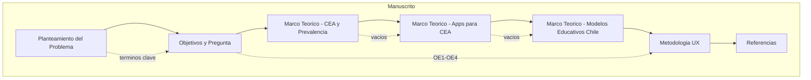
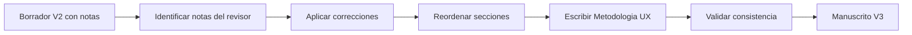

# Design Document: habitar-autorregulacion-cea

## Overview

**Purpose**: Este diseño define la arquitectura de producción del manuscrito "HabiTAR" — un paper de postulación de proyecto de investigación que explora el impacto de tecnologías móviles en la autorregulación emocional de estudiantes universitarios con CEA. El manuscrito parte de un borrador V2 con correcciones del revisor experto y debe producir una versión V3 lista para evaluación.

**Users**: El investigador principal (autor) y el revisor/tutor como evaluador intermedio.

**Impact**: Transforma el borrador V2 (con notas `($)` del revisor) en un manuscrito cohesivo, sin negaciones, con terminología consistente, estructura reordenada y sección metodológica nueva.

### Goals
- Producir manuscrito V3 con todas las correcciones del revisor integradas
- Desarrollar sección de Metodología UX participativa con respaldo bibliográfico
- Mantener coherencia terminológica y argumentativa en todo el documento
- Cerrar cada sección teórica con vinculación explícita a la propuesta

### Non-Goals
- Prototipado o desarrollo de la app (fuera del alcance del paper)
- Validación empírica de la metodología (es una propuesta, no ejecución)
- Formato LaTeX o submission-ready (se trabaja en Markdown/Quarto)
- Búsqueda exhaustiva de nuevas fuentes (se usan las existentes + complementos puntuales)

## Architecture

### Architecture Pattern & Boundary Map

El manuscrito se organiza como un pipeline secuencial de componentes textuales, donde cada sección es un módulo con dependencias definidas.

**Architecture Integration**:
- Selected pattern: Pipeline secuencial con dependencias terminológicas transversales
- Domain boundaries: Cada sección es un componente autónomo con entrada (sección previa) y salida (transición a siguiente)
- Existing patterns preserved: Estructura IMRaD adaptada a postulación de proyecto
- New components: Sección Metodología UX (completamente nueva)
- Steering compliance: Flujo SDD spec → draft → validación → merge

### Technology Stack

| Layer | Choice / Version | Role in Feature | Notes |
|-------|------------------|-----------------|-------|
| Escritura | Markdown (.md) | Formato del manuscrito | Compatible con Quarto |
| Build | Quarto | Compilación a HTML/PDF/DOCX | `./scripts/build-book.sh` |
| Referencias | BibTeX (.bib) | Gestión bibliográfica | `references/references.bib` |
| Validación | Scripts custom | Checks automáticos | `scripts/` |
| Búsqueda | `/paper:cite` | Citaciones verificadas | CrossRef/Semantic Scholar |

## System Flows

**Key decisions**: Las correcciones del revisor se aplican antes del reordenamiento para evitar pérdida de contexto de las notas `($)`.

## Requirements Traceability

| Requirement | Summary | Componente | Validación |
|-------------|---------|------------|------------|
| 1.1–1.10 | Planteamiento del problema | PP | Ausencia de negaciones, objetivos tempranos, foco universitario |
| 2.1–2.7 | Pregunta y objetivos | OBJ | Pregunta única, verbos correctos, consistencia |
| 3.1–3.6 | Marco teórico CEA | MT1 | Sin deficitarismo, cierre con vacíos, sin negritas |
| 4.1–4.5 | Modelos educativos Chile | MT3 | Posición final, sin negritas, cierre vinculado |
| 5.1–5.7 | Apps para CEA | MT2 | Ciclo vital, sin "revisiones", cierre con vacíos |
| 6.1–6.7 | Metodología UX | MET | Fases alineadas a OE, prosa fluida, citas |
| 7.1–7.8 | Consistencia y estilo | Transversal | Aplicable a todos los componentes |
| 8.1–8.5 | Referencias | REF | APA 7, completitud, verificación cruzada |

## Components and Interfaces

| Componente | Dominio | Intent | Req Coverage | Dependencias | Output |
|------------|---------|--------|--------------|--------------|--------|
| PP | Introducción | Presentar problema, vacío y propuesta | 1.1–1.10, 7.1–7.8 | temp_context (input) | `paper/01-planteamiento.md` |
| OBJ | Introducción | Pregunta + OG + OE alineados | 2.1–2.7 | PP (términos clave) | `paper/02-objetivos.md` |
| MT1 | Marco Teórico | CEA, prevalencia, contexto regional | 3.1–3.6, 7.1–7.8 | OBJ (alcance) | `paper/03-cea-prevalencia.md` |
| MT2 | Marco Teórico | Estado del arte en apps/tecnología para CEA | 5.1–5.7, 7.1–7.8 | MT1 (vacíos) | `paper/04-apps-cea.md` |
| MT3 | Marco Teórico | Modelos educativos chilenos y brechas | 4.1–4.5, 7.1–7.8 | MT2 (contexto tecnológico) | `paper/05-modelos-chile.md` |
| MET | Metodología | Diseño UX participativo | 6.1–6.7 | OBJ (OE1-OE4) | `paper/06-metodologia.md` |
| REF | Referencias | Aparato bibliográfico completo | 8.1–8.5 | Todos | `references/references.bib` |

### Introducción

#### PP — Planteamiento del Problema

| Field | Detail |
|-------|--------|
| Intent | Presentar la transición TEA→CEA, el vacío investigativo y la propuesta en prosa fluida sin negaciones |
| Requirements | 1.1, 1.2, 1.3, 1.4, 1.5, 1.6, 1.7, 1.8, 1.9, 1.10 |

**Responsabilidades & Restricciones**
- Reformular toda construcción negativa en positivo
- Presentar objetivo general después del segundo párrafo
- Usar negritas solo para: **tecnologías móviles**, **estudiantes universitarios CEA**, **autorregulación emocional**
- Vincular párrafos con transiciones explícitas
- Presentar revisiones como hallazgos de autores, no como "revisiones sistemáticas"
- Foco en universitarios; adolescencia solo como parte breve del ciclo vital

**Dependencias**
- Inbound: `temp_context/Copia de EA + Marco teórico V2 + CF.docx.md` — texto fuente (P0)
- Inbound: `temp_context/Nota de Revisor -3 SESIÓN_.md` — correcciones (P0)
- Outbound: OBJ — provee términos clave y contexto (P0)

#### OBJ — Pregunta de Investigación y Objetivos

| Field | Detail |
|-------|--------|
| Intent | Formular pregunta única y 4 OE con verbos apropiados y terminología consistente |
| Requirements | 2.1, 2.2, 2.3, 2.4, 2.5, 2.6, 2.7 |

**Responsabilidades & Restricciones**
- Una sola pregunta de investigación (eliminar segunda sobre estrés)
- OG con verbo "explorar"
- OE: caracterizar, categorizar, identificar, evaluar
- Sin menciones a metodología en los objetivos
- Terminología idéntica al resto del documento

### Marco Teórico

#### MT1 — CEA y Prevalencia

| Field | Detail |
|-------|--------|
| Intent | Definir CEA sin lenguaje deficitario, presentar prevalencia global y regional, situar caso chileno |
| Requirements | 3.1, 3.2, 3.3, 3.4, 3.5, 3.6 |

**Responsabilidades & Restricciones**
- Definir CEA como variación natural del neurodesarrollo
- Datos de prevalencia con metaanálisis recientes
- "Trabajos situados en Latinoamérica" (no "regionales")
- Caso chileno con datos cuantitativos de subregistro
- Cerrar con párrafo de vinculación a la propuesta
- Sin negritas

#### MT2 — Uso de Apps para Personas CEA

| Field | Detail |
|-------|--------|
| Intent | Evidenciar estado del arte en tecnologías digitales para CEA, identificando vacíos en población universitaria |
| Requirements | 5.1, 5.2, 5.3, 5.4, 5.5, 5.6, 5.7 |

**Responsabilidades & Restricciones**
- Organizar por ciclo vital: niños → adolescentes → universitarios (mostrando escasez)
- Presentar como hallazgos de autores (nunca "una revisión sistemática mostró")
- Reformular negaciones en positivo
- Reducir peso de adolescencia
- Cerrar con vacío: ausencia de estudios en universitarios hispanohablantes
- Sin negritas

#### MT3 — Modelos Educativos en Chile

| Field | Detail |
|-------|--------|
| Intent | Contextualizar brechas del sistema educativo chileno que justifican herramientas tecnológicas complementarias |
| Requirements | 4.1, 4.2, 4.3, 4.4, 4.5 |

**Responsabilidades & Restricciones**
- Posición: última sección del marco teórico
- Usar "en las últimas dos décadas" (no referencia histórica explícita)
- Cubrir Decreto 170, Ley Inclusión Escolar, Ley 21.545
- Cerrar vinculando brechas con la propuesta
- Sin negritas

### Metodología

#### MET — Metodología UX Participativa

| Field | Detail |
|-------|--------|
| Intent | Definir enfoque metodológico UX con fases alineadas a los OE y respaldo bibliográfico |
| Requirements | 6.1, 6.2, 6.3, 6.4, 6.5, 6.6, 6.7 |

**Responsabilidades & Restricciones**
- Ubicación: inmediatamente después de los objetivos específicos
- Fases: Descubrimiento (OE1) → Análisis (OE2) → Co-diseño (OE3) → Evaluación (OE4)
- Herramientas: entrevistas contextuales, user journey maps, card sorting, evaluación heurística, juicio de expertos
- Justificar enfoque UX para población neurodivergente
- Prosa académica fluida (sin bullets en texto final)
- Citas APA para cada herramienta/enfoque

**Dependencias**
- Inbound: OBJ — objetivos específicos definen las fases (P0)
- External: Literatura UX/Design Research — fundamentación (P1)

## Testing Strategy

### Validaciones Automáticas (Hard)
- Ausencia de construcciones "no X, sino Y" en todo el manuscrito
- Uso consistente de "CEA" (verificar con grep que no aparezca "TEA" fuera de citas directas)
- Ausencia de negritas fuera de la introducción (3 términos clave)
- Toda afirmación sustantiva tiene cita [Autor, año]
- Referencias citadas en texto ↔ lista de referencias (correspondencia bidirecional)
- Formato APA 7 en todas las citas

### Validaciones de Revisión (Soft)
- Cada sección teórica cierra con párrafo que vincule a la propuesta
- Transiciones explícitas entre párrafos y secciones
- Foco poblacional en universitarios (adolescencia solo breve)
- Prosa fluida sin listas con viñetas en el cuerpo del manuscrito
- Consistencia terminológica (mismos términos clave en todo el documento)

### Validación de Completitud
- Planteamiento: ~1.5 páginas
- Marco teórico CEA: ~1 página
- Apps para CEA: ~1 página
- Modelos educativos Chile: ~0.5 página
- Metodología UX: proporcional a los 4 OE
