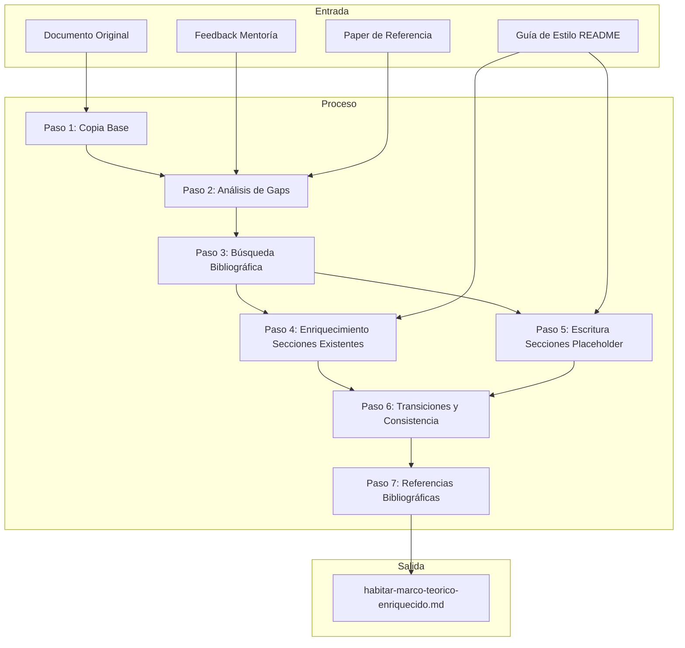
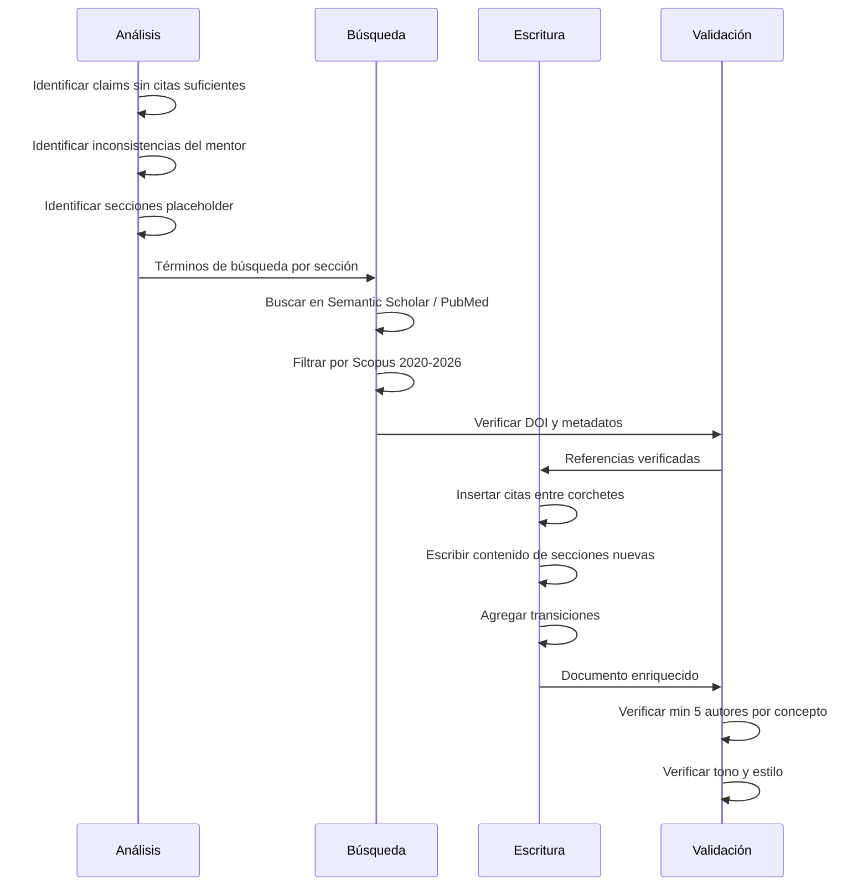

# Design Document — habitar-marco-teorico

## Overview

**Purpose**: Este feature produce un documento Markdown enriquecido (`paper/habitar-marco-teorico-enriquecido.md`) que replica el marco teórico original del paper HabiTAR e inserta mejoras académicas entre corchetes `[ ]`. Las mejoras incluyen densificación bibliográfica, corrección de inconsistencias, completación de secciones placeholder y uniformización del tono académico.

**Users**: El investigador principal utiliza el documento enriquecido como borrador de trabajo para integrar las mejoras sugeridas en la versión final del marco teórico.

**Impact**: Transforma un borrador con ~15 referencias y 2 secciones incompletas en un documento con ~50+ referencias Scopus 2020–2026, secciones completas y narrativa coherente, sin alterar el archivo fuente.

### Goals
- Producir un documento nuevo que preserve íntegramente el texto original con mejoras claramente delimitadas entre `[ ]`
- Alcanzar mínimo 5 autores Scopus 2020–2026 por cada concepto o afirmación teórica
- Resolver todas las inconsistencias documentadas en la sesión de mentoría
- Completar las secciones "Modelos educativos en Chile" y "Uso de apps para TEA"

### Non-Goals
- No se modifica el documento original en `temp_context/`
- No se escribe el paper completo (solo marco teórico y planteamiento del problema)
- No se genera archivo `.bib` separado (las referencias van dentro del Markdown)
- No se realiza la integración final de las mejoras (el investigador decide qué aceptar)
- No se aborda la sección de metodología, resultados ni discusión

## Architecture

### Architecture Pattern & Boundary Map

**Architecture Integration**:
- Patrón seleccionado: Pipeline secuencial de transformación de contenido
- Fronteras de dominio: cada paso opera sobre una sección temática específica del documento
- Patrones existentes preservados: formato Markdown Quarto, estructura de directorios del proyecto
- Componentes nuevos: un solo archivo de salida en `paper/`

### Technology Stack

| Layer | Choice / Version | Role in Feature | Notes |
|-------|------------------|-----------------|-------|
| Búsqueda académica | `research-lookup` skill | Encontrar referencias Scopus 2020–2026 | Semantic Scholar, PubMed como backends |
| Validación de citas | `citation-management` skill | Verificar DOIs y metadatos | CrossRef como fuente de verdad |
| Formato de salida | Markdown / Quarto | Documento compatible con pipeline de build | Extensión `.md` |
| Verificación web | `WebFetch` | Confirmar accesibilidad de DOIs | Verificación de enlaces |

## System Flows

### Flujo de enriquecimiento por sección

## Requirements Traceability

| Requirement | Summary | Components | Paso |
|-------------|---------|------------|------|
| 1.1 | Crear documento nuevo en `paper/` | Paso 1 | Copia Base |
| 1.2 | Texto original intacto, mejoras en `[ ]` | Todos los pasos | Transversal |
| 1.3 | No modificar `temp_context/` | Paso 1 | Copia Base |
| 1.4 | Formato `[texto nuevo]` para adiciones | Todos los pasos | Transversal |
| 2.1 | Mínimo 5 citas por concepto | Paso 3, 4 | Búsqueda + Enriquecimiento |
| 2.2 | Solo revistas Scopus 2020–2026 | Paso 3 | Búsqueda |
| 2.3 | Formato APA 7ª edición | Paso 4, 5, 7 | Enriquecimiento + Refs |
| 2.4 | Entrada bibliográfica completa al final | Paso 7 | Referencias |
| 2.5 | Plural respaldado por citas plurales | Paso 4 | Enriquecimiento |
| 3.1 | Corregir plural con cita singular | Paso 4, 6 | Enriquecimiento + Consistencia |
| 3.2 | Respaldar frases fuertes | Paso 4 | Enriquecimiento |
| 3.3 | Insertar transiciones en quiebres | Paso 6 | Transiciones |
| 3.4 | Reformular "ingresos" → "regiones" | Paso 6 | Consistencia |
| 3.5 | Mínimo 3 citas para opiniones sin apoyo | Paso 4 | Enriquecimiento |
| 4.1 | Completar "Modelos educativos Chile" | Paso 5 | Escritura Placeholder |
| 4.2 | Completar "Uso de apps para TEA" | Paso 5 | Escritura Placeholder |
| 4.3 | Misma densidad que secciones existentes | Paso 5 | Escritura Placeholder |
| 4.4 | Transiciones coherentes en secciones nuevas | Paso 5, 6 | Escritura + Transiciones |
| 5.1 | Prosa continua sin guiones ni viñetas | Paso 4, 5 | Estilo |
| 5.2 | Conectores lógicos académicos | Paso 4, 5, 6 | Estilo |
| 5.3 | Negrita para conceptos clave | Paso 4, 5 | Estilo |
| 5.4 | Cursiva para términos en inglés | Paso 4, 5 | Estilo |
| 5.5 | Tono formal y científico | Paso 4, 5 | Estilo |
| 5.6 | Notas al pie para aclaraciones | Paso 4, 5 | Estilo |
| 6.1 | Estructura de secciones del original | Paso 1 | Copia Base |
| 6.2 | Formato Markdown Quarto | Paso 1 | Copia Base |
| 6.3 | Orden alfabético de referencias | Paso 7 | Referencias |
| 6.4 | DOI con enlace activo | Paso 7 | Referencias |

## Components and Interfaces

| Componente | Dominio | Intent | Req Coverage | Dependencias | Contratos |
|------------|---------|--------|--------------|--------------|-----------|
| Paso 1: Copia Base | Documento | Crear archivo nuevo replicando original | 1.1, 1.3, 6.1, 6.2 | Documento original (P0) | Archivo |
| Paso 2: Análisis de Gaps | Análisis | Identificar todas las inserciones necesarias | 2.1, 3.1–3.5 | Mentoría (P0), Original (P0) | Lista de gaps |
| Paso 3: Búsqueda Bibliográfica | Investigación | Encontrar referencias Scopus verificadas | 2.1, 2.2, 2.3 | research-lookup (P0) | Referencias verificadas |
| Paso 4: Enriquecimiento Secciones | Escritura | Insertar citas y contenido en secciones existentes | 2.1–2.5, 3.1–3.2, 3.5, 5.1–5.6 | Paso 3 (P0), Estilo (P1) | Texto con `[ ]` |
| Paso 5: Escritura Placeholder | Escritura | Desarrollar secciones incompletas | 4.1–4.4, 5.1–5.6 | Paso 3 (P0), Estilo (P1) | Texto con `[ ]` |
| Paso 6: Transiciones y Consistencia | Edición | Corregir quiebres y reformulaciones | 3.3, 3.4, 4.4 | Paso 4 (P0), Paso 5 (P0) | Texto con `[ ]` |
| Paso 7: Referencias Bibliográficas | Formato | Compilar sección de referencias completa | 2.4, 6.3, 6.4 | citation-management (P1) | Lista APA |

### Documento

#### Paso 1: Copia Base

| Field | Detail |
|-------|--------|
| Intent | Crear `paper/habitar-marco-teorico-enriquecido.md` con copia íntegra del original |
| Requirements | 1.1, 1.3, 6.1, 6.2 |

**Responsibilities & Constraints**
- Copiar el contenido completo de `temp_context/Marco teórico - Tea Tecnologia + CF.docx.md` al nuevo archivo
- No alterar ni un carácter del texto original durante la copia
- Verificar que el archivo fuente no sea modificado después de la operación

**Implementation Notes**
- Operación atómica: leer fuente → escribir destino → verificar integridad
- El archivo debe crearse en `paper/habitar-marco-teorico-enriquecido.md`

#### Paso 2: Análisis de Gaps

| Field | Detail |
|-------|--------|
| Intent | Producir inventario exhaustivo de todas las inserciones requeridas |
| Requirements | 2.1, 3.1, 3.2, 3.3, 3.4, 3.5 |

**Responsibilities & Constraints**
- Recorrer cada párrafo del documento e identificar: claims con <5 citas, plurales con cita singular, frases fuertes sin respaldo, quiebres temáticos, secciones placeholder
- Cruzar hallazgos con feedback de la sesión de mentoría
- Producir lista priorizada de intervenciones por sección

**Inventario esperado de gaps** (basado en lectura del documento original):

1. **Planteamiento del problema**:
   - Párrafo 1: "modelos pedagógicos tradicionales" — frase fuerte sin cita múltiple (3.2)
   - Párrafo 1: "Las revisiones sobre educación inclusiva" — plural con 1 sola cita (3.1)
   - Párrafo 1: "Es importante señalar que Modelos tradicionales..." — opinión sin cita (3.5)
   - Párrafo 2: Transición abrupta a "Este patrón excluyente se agudiza" (3.3)
   - Párrafo 3: "Ensayos controlados" → transición abrupta a "las tecnologías tipo app" (3.3)
   - Párrafo 4: "países de ingresos bajos y medios" → reformular a regiones (3.4)

2. **Adolescentes TEA**:
   - Definición TEA: solo 1 cita (Lord et al., 2020) — necesita 4+ más (2.1)
   - "Los niños TEA suelen presentar dificultades...": 1 cita — necesita 4+ (2.1)
   - "razón entre niños y niñas cercana a tres a uno": sin cita directa (3.2)
   - "Las distintas estimaciones documentan...revelan vacíos persistentes": frase fuerte sin cita (3.2)
   - Prevalencia en Latinoamérica: "Trabajos regionales muestran..." — plural con referencia limitada (3.1)

3. **Modelos educativos en Chile**: sección placeholder completa (4.1)
4. **Uso de apps para TEA**: sección placeholder completa (4.2)

#### Paso 3: Búsqueda Bibliográfica

| Field | Detail |
|-------|--------|
| Intent | Encontrar y verificar ~35-50 referencias Scopus 2020–2026 organizadas por área temática |
| Requirements | 2.1, 2.2, 2.3 |

**Responsibilities & Constraints**
- Buscar por áreas temáticas alineadas con las secciones del documento
- Filtrar exclusivamente por publicaciones 2020–2026 en revistas Scopus
- Verificar cada referencia (DOI válido, metadatos correctos, accesibilidad del enlace)

**Áreas de búsqueda y estimación de referencias necesarias**:

| Área temática | Términos de búsqueda | Refs estimadas |
|---------------|----------------------|----------------|
| Definición y características TEA | "autism spectrum disorder" AND "definition" OR "characteristics" | 5–8 |
| Prevalencia TEA global y Latinoamérica | "autism prevalence" AND ("Latin America" OR "global") | 5–8 |
| TEA en adolescentes y transición | "autism" AND "adolescent" AND ("transition" OR "university") | 5–8 |
| Modelos educativos Chile + inclusión TEA | "inclusive education" AND ("Chile" OR "Latin America") AND "autism" | 5–8 |
| Apps y tecnologías digitales para TEA | "mobile app" OR "digital intervention" AND "autism" AND "adolescent" | 8–12 |
| Autorregulación emocional + TEA | "emotional regulation" AND "autism" AND "technology" | 5–8 |

**Total estimado**: 35–50 referencias nuevas

#### Paso 4: Enriquecimiento de Secciones Existentes

| Field | Detail |
|-------|--------|
| Intent | Insertar citas adicionales y correcciones en secciones ya desarrolladas |
| Requirements | 2.1–2.5, 3.1–3.2, 3.5, 5.1–5.6 |

**Responsibilities & Constraints**
- Insertar citas entre corchetes sin alterar el texto original circundante
- Formato de inserción para citas adicionales: `[; Autor1, Año; Autor2, Año; Autor3, Año]`
- Formato para frases sin respaldo: `[Según Autor (Año), Autor (Año) y Autor (Año), esta afirmación se sustenta en...]`
- Formato para correcciones: `[CORRECCIÓN: cambiar "texto original" por "texto sugerido"]`
- Respetar reglas de estilo (5.1–5.6) en todo texto nuevo

#### Paso 5: Escritura de Secciones Placeholder

| Field | Detail |
|-------|--------|
| Intent | Desarrollar contenido completo para las 2 secciones incompletas |
| Requirements | 4.1–4.4, 5.1–5.6 |

**Responsibilities & Constraints**
- **Modelos educativos en Chile** (4.1): 250–350 palabras, mínimo 5 refs Scopus 2020–2026. Cubrir: evolución del modelo educativo chileno, Ley de Inclusión, Decreto 170, PIE, desafíos para estudiantes TEA
- **Uso de apps para TEA** (4.2): 500–700 palabras, mínimo 5 refs por subsección. Cubrir: (a) panorama general de apps para TEA (todas las edades), (b) apps específicas para adolescentes TEA, conectando con autorregulación emocional
- Todo el contenido nuevo va entre `[` y `]`
- Mantener densidad narrativa equivalente a la sección "Adolescentes TEA" (~5 párrafos por página)
- Integrar transiciones con párrafos anterior y posterior

#### Paso 6: Transiciones y Consistencia

| Field | Detail |
|-------|--------|
| Intent | Resolver quiebres temáticos y reformulaciones de consistencia |
| Requirements | 3.3, 3.4, 4.4 |

**Responsibilities & Constraints**
- Insertar oraciones de transición entre corchetes en los quiebres identificados en Paso 2
- Las transiciones deben usar conectores académicos (5.2) y sentirse naturales en el flujo
- Reformular "países de ingresos bajos y medios" → referencia regional (3.4)
- Verificar que las secciones nuevas (Paso 5) tengan transiciones coherentes con el contexto

#### Paso 7: Compilación de Referencias

| Field | Detail |
|-------|--------|
| Intent | Producir sección de referencias completa, verificada y en orden alfabético |
| Requirements | 2.4, 6.3, 6.4 |

**Responsibilities & Constraints**
- Mantener todas las referencias originales intactas
- Agregar las nuevas referencias entre corchetes `[entrada nueva]`
- Formato APA 7ª edición con DOI como enlace activo: `[https://doi.org/10.XXXX/XXXXX](https://doi.org/10.XXXX/XXXXX)`
- Orden alfabético por apellido del primer autor
- Verificar que cada referencia citada en el texto tenga su entrada y viceversa

## Testing Strategy

### Validación de contenido
- Verificar que cada concepto/afirmación tenga ≥5 citas distintas (2.1)
- Verificar que todas las citas sean de revistas Scopus 2020–2026 (2.2)
- Verificar formato APA 7ª edición en cada cita in-text y entrada bibliográfica (2.3)
- Contar palabras de secciones placeholder: "Modelos educativos" 250–350, "Apps TEA" 500–700 (4.1, 4.2)

### Validación de integridad
- Comparar texto fuera de corchetes con documento original — debe ser idéntico (1.2)
- Verificar que `temp_context/` no fue modificado (1.3)
- Verificar que toda referencia citada en texto tiene entrada en sección de referencias (2.4)
- Verificar DOIs accesibles con WebFetch (6.4)

### Validación de estilo
- Verificar ausencia de guiones (-) y viñetas dentro de párrafos (5.1)
- Verificar presencia de conectores académicos en párrafos nuevos (5.2)
- Verificar uso de **negrita** y *cursiva* según reglas (5.3, 5.4)
- Verificar tono formal sin lenguaje coloquial (5.5)

### Validación de estructura
- Verificar orden de secciones: Planteamiento → Marco teórico → Referencias (6.1)
- Verificar formato Markdown válido para Quarto (6.2)
- Verificar orden alfabético de referencias (6.3)
