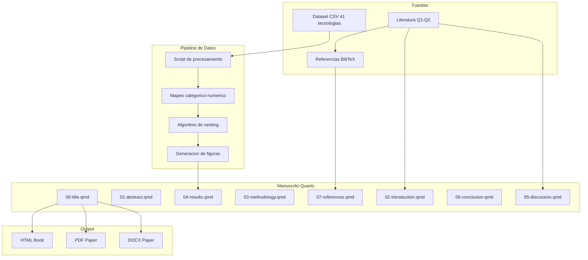
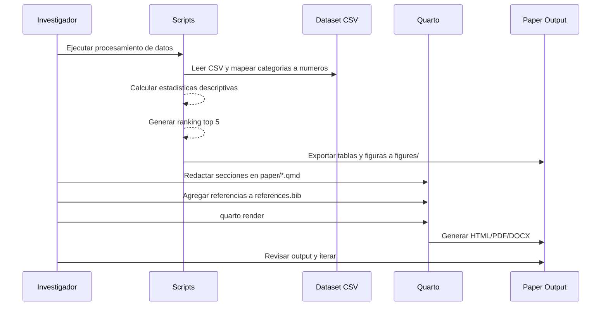
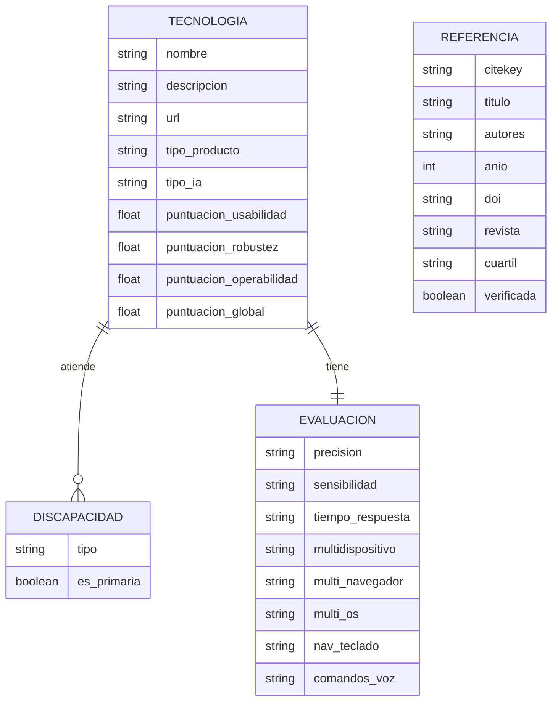

# Design Document — ia-accesibilidad-wcag

## Overview

**Purpose**: Este paper categoriza 41 tecnologías de IA según su utilidad para la accesibilidad web bajo WCAG 2.2, evaluando usabilidad, robustez y operabilidad por tipo de discapacidad. El manuscrito identifica las 5 mejores tecnologías como buenas prácticas y debate sobre el vacío de conocimiento teórico-práctico en la intersección IA-accesibilidad web.

**Users**: Investigadores en accesibilidad web, desarrolladores de tecnologías asistivas, organismos de estandarización y formuladores de políticas públicas de inclusión digital.

**Impact**: Contribuye un marco evaluativo original que vincula capacidades de IA con principios WCAG 2.2, identificando brechas en discapacidad auditiva y proponiendo líneas de investigación futura.

### Goals
- Producir un manuscrito IMRaD completo y listo para sometimiento a revista indexada
- Categorizar las 41 tecnologías por tipo de discapacidad con evidencia cuantitativa
- Fundamentar teóricamente con ≥30 referencias Q1-Q2 (2021-2026)
- Identificar top 5 tecnologías y debatir vacío de conocimiento

### Non-Goals
- Evaluación empírica con usuarios reales (el estudio es documental-descriptivo)
- Desarrollo de software o herramienta de evaluación automatizada
- Pruebas de usabilidad ni experimentos controlados
- Análisis de tecnologías fuera del dataset existente (41 tecnologías fijas)
- Producción de múltiples versiones del paper para diferentes revistas

## Architecture

### Architecture Pattern & Boundary Map



**Architecture Integration**:
- Selected pattern: Multi-archivo Quarto con pipeline de datos separado (ver `research.md` para alternativas evaluadas)
- Domain boundaries: datos (scripts/) | manuscrito (paper/) | referencias (references/) | figuras (figures/)
- Existing patterns preserved: convenciones de directorio del proyecto, build scripts, screenshot pipeline
- New components: script de procesamiento CSV, archivos .qmd del paper, figuras generadas
- Steering compliance: estructura IMRaD, archivos en `paper/`, referencias en `references/references.bib`

### Technology Stack

| Layer | Choice / Version | Role in Feature | Notes |
|-------|------------------|-----------------|-------|
| Publicación | Quarto ≥1.4 | Compilación multi-formato del manuscrito | Ya instalado en el proyecto |
| Datos | Python 3.10+ / pandas | Procesamiento CSV, estadística descriptiva, ranking | Script en `scripts/` |
| Visualización | matplotlib + seaborn | Generación de figuras académicas 300 DPI | Estilo consistente vía configuración |
| Referencias | BibTeX + CrossRef API | Gestión y verificación de citas | Archivo `references/references.bib` |
| Contenido | Quarto Markdown (.qmd) | Redacción de secciones del paper | Un archivo por sección IMRaD |

## System Flows



## Requirements Traceability

| Requirement | Summary | Components | Interfaces | Flows |
|-------------|---------|------------|------------|-------|
| 1.1-1.5 | Marco teórico con refs Q1-Q2 | IntroductionSection, LiteratureManager | BibTeX, CrossRef API | Búsqueda → verificación → inserción |
| 2.1-2.6 | Metodología reproducible | MethodologySection, DataProcessor | CSV input, mapeo categórico | CSV → transformación → documentación |
| 3.1-3.5 | Categorización por discapacidad | DataProcessor, ResultsSection | Matriz tecnología-discapacidad | Análisis → tablas → figuras |
| 4.1-4.5 | Top 5 tecnologías | RankingEngine, ResultsSection | Algoritmo ranking, tabla comparativa | Puntuación → ranking → selección |
| 5.1-5.5 | Visualización de datos | VisualizationPipeline, ResultsSection | matplotlib/seaborn → PNG 300 DPI | Datos → figuras → inserción en texto |
| 6.1-6.6 | Vacío de conocimiento | DiscussionSection | Referencias cruzadas | Hallazgos → contraste literatura → debate |
| 7.1-7.7 | Estructura IMRaD y formato | QuartoConfig, todas las secciones | _quarto.yml, archivos .qmd | Redacción → build → validación |
| 8.1-8.6 | Calidad bibliográfica | LiteratureManager | CrossRef/DOI verification | Búsqueda → verificación → inclusión |

## Components and Interfaces

| Component | Domain/Layer | Intent | Req Coverage | Key Dependencies | Contracts |
|-----------|-------------|--------|--------------|------------------|-----------|
| DataProcessor | Datos | Transforma CSV categórico a datos numéricos analizables | 2, 3, 4 | pandas, CSV fuente (P0) | Service |
| RankingEngine | Datos | Calcula ranking ponderado de tecnologías | 4 | DataProcessor (P0) | Service |
| VisualizationPipeline | Datos | Genera figuras académicas 300 DPI | 5 | DataProcessor (P0), matplotlib (P0) | Service |
| LiteratureManager | Referencias | Búsqueda, verificación y gestión de citas BibTeX | 1, 8 | CrossRef API (P1), Semantic Scholar (P1) | Service |
| IntroductionSection | Manuscrito | Sección de introducción con marco teórico | 1 | LiteratureManager (P0) | State |
| MethodologySection | Manuscrito | Descripción del diseño metodológico | 2 | DataProcessor (P1) | State |
| ResultsSection | Manuscrito | Presentación de hallazgos con tablas y figuras | 3, 4, 5 | RankingEngine (P0), VisualizationPipeline (P0) | State |
| DiscussionSection | Manuscrito | Debate del vacío de conocimiento | 6 | LiteratureManager (P1) | State |
| QuartoConfig | Build | Configuración de compilación multi-formato | 7 | Quarto (P0) | State |

### Datos

#### DataProcessor

| Field | Detail |
|-------|--------|
| Intent | Transforma el CSV de 41 tecnologías con variables categóricas a un dataframe numérico analizable |
| Requirements | 2.1-2.6, 3.1-3.5 |

**Responsibilities & Constraints**
- Lectura y limpieza del CSV fuente desde `temp_context/`
- Mapeo de variables categóricas a escala numérica según tabla de conversión definida
- Cálculo de estadísticas descriptivas (media, mediana, desviación estándar) por dimensión
- Generación de la matriz tecnología-discapacidad
- Los datos de entrada son fijos (41 tecnologías, no se agregan nuevas)

**Dependencies**
- Inbound: CSV fuente en `temp_context/` — datos de evaluación (P0)
- External: pandas — manipulación de dataframes (P0)
- External: numpy — cálculos estadísticos (P1)

**Contracts**: Service [x]

##### Service Interface
```python
class DataProcessor:
    def load_csv(self, path: str) -> pd.DataFrame:
        """Lee el CSV y retorna dataframe limpio."""
        ...

    def map_categorical_to_numeric(self, df: pd.DataFrame) -> pd.DataFrame:
        """Aplica mapeo categórico → numérico según tabla de conversión."""
        ...

    def compute_descriptive_stats(self, df: pd.DataFrame) -> dict[str, float]:
        """Calcula media, mediana, SD por dimensión."""
        ...

    def generate_disability_matrix(self, df: pd.DataFrame) -> pd.DataFrame:
        """Genera matriz cruzada tecnología × tipo de discapacidad."""
        ...
```

**Tabla de mapeo categórico → numérico**:

| Variable | Valor categórico | Valor numérico |
|----------|-----------------|----------------|
| Precisión/Sensibilidad | Baja | 1 |
| Precisión/Sensibilidad | Media | 3 |
| Precisión/Sensibilidad | Alta | 5 |
| Tiempo de respuesta | Lento | 1 |
| Tiempo de respuesta | Moderado | 3 |
| Tiempo de respuesta | Rápido | 5 |
| Navegación por teclado | No compatible | 0 |
| Navegación por teclado | Parcial | 3 |
| Navegación por teclado | Total | 5 |
| Comandos de voz | No | 0 |
| Comandos de voz | Parcial | 3 |
| Comandos de voz | Sí | 5 |

**Implementation Notes**
- Integration: El script se ejecuta desde `scripts/` y exporta resultados a `paper/data/`
- Validation: Verificar que las 41 tecnologías se carguen completas; alertar si hay valores faltantes
- Risks: El CSV tiene formato irregular (filas de encabezado múltiples); requiere limpieza manual de las primeras filas

#### RankingEngine

| Field | Detail |
|-------|--------|
| Intent | Calcula un ranking ponderado para identificar las top 5 tecnologías |
| Requirements | 4.1-4.5 |

**Responsibilities & Constraints**
- Cálculo de puntuación global por tecnología usando pesos por dimensión
- Ordenamiento y selección de top 5
- Aplicación de criterios de desempate documentados
- Los pesos deben ser justificados en la sección de Metodología del paper

**Dependencies**
- Inbound: DataProcessor — dataframe numérico (P0)

**Contracts**: Service [x]

##### Service Interface
```python
class RankingEngine:
    WEIGHTS: dict[str, float] = {
        "usabilidad": 0.40,   # precisión + sensibilidad + tiempo respuesta
        "robustez": 0.30,     # multidispositivo + multi-navegador + multi-OS
        "operabilidad": 0.30  # nav. teclado + comandos de voz
    }

    def compute_scores(self, df: pd.DataFrame) -> pd.DataFrame:
        """Calcula puntuación global ponderada por tecnología."""
        ...

    def get_top_n(self, df: pd.DataFrame, n: int = 5) -> pd.DataFrame:
        """Retorna las top N tecnologías ordenadas por puntuación."""
        ...

    def apply_tiebreaker(self, tied: pd.DataFrame) -> pd.DataFrame:
        """Desempata por: cobertura de discapacidades > gratuidad > disponibilidad API."""
        ...
```

**Implementation Notes**
- Validation: Los pesos deben sumar 1.0; documentar justificación en Metodología
- Risks: Pesos arbitrarios → documentar como decisión metodológica con sensibilidad al cambio

#### VisualizationPipeline

| Field | Detail |
|-------|--------|
| Intent | Genera figuras académicas de alta calidad para el paper |
| Requirements | 5.1-5.5 |

**Responsibilities & Constraints**
- Genera mínimo 3 figuras: distribución por discapacidad, comparativa por dimensión, ranking top 5
- Genera mínimo 2 tablas: matriz tecnología-discapacidad, comparativa top 5
- Todas las figuras a 300 DPI mínimo con estilo académico consistente
- Exporta a `figures/` en formato PNG

**Dependencies**
- Inbound: DataProcessor — datos procesados (P0)
- Inbound: RankingEngine — ranking calculado (P0)
- External: matplotlib + seaborn — visualización (P0)

**Contracts**: Service [x]

##### Service Interface
```python
class VisualizationPipeline:
    DPI: int = 300
    STYLE: str = "seaborn-v0_8-whitegrid"

    def plot_disability_distribution(self, df: pd.DataFrame) -> Path:
        """Genera gráfico de barras: tecnologías por tipo de discapacidad."""
        ...

    def plot_dimension_comparison(self, df: pd.DataFrame) -> Path:
        """Genera gráfico comparativo de puntuaciones por dimensión evaluada."""
        ...

    def plot_top5_ranking(self, top5: pd.DataFrame) -> Path:
        """Genera gráfico de ranking de las 5 mejores tecnologías."""
        ...

    def export_table_disability_matrix(self, matrix: pd.DataFrame) -> Path:
        """Exporta tabla de matriz tecnología × discapacidad en formato Markdown."""
        ...

    def export_table_top5_comparison(self, top5: pd.DataFrame) -> Path:
        """Exporta tabla comparativa de top 5 en formato Markdown."""
        ...
```

### Referencias

#### LiteratureManager

| Field | Detail |
|-------|--------|
| Intent | Gestiona búsqueda, verificación e inserción de referencias bibliográficas |
| Requirements | 1.1-1.5, 8.1-8.6 |

**Responsibilities & Constraints**
- Búsqueda de literatura en bases académicas (Scopus, WoS, Semantic Scholar)
- Verificación de existencia de DOI/CrossRef para cada referencia
- Generación de entradas BibTeX válidas
- Mínimo 30 referencias, ≥60% de 2021-2026, foco en Q1-Q2
- Evitar fuentes no académicas excepto documentación técnica oficial (W3C, WAI)

**Dependencies**
- External: CrossRef API — verificación DOI (P1)
- External: Semantic Scholar API — búsqueda académica (P1)
- External: Skills del proyecto (citation-management, research-lookup) (P0)

**Contracts**: Service [x]

##### Service Interface
```python
class LiteratureManager:
    def search_papers(self, query: str, year_range: tuple[int, int], quartile: list[str]) -> list[dict]:
        """Busca papers en bases académicas con filtros de año y cuartil."""
        ...

    def verify_doi(self, doi: str) -> bool:
        """Verifica existencia del DOI en CrossRef."""
        ...

    def generate_bibtex(self, paper: dict) -> str:
        """Genera entrada BibTeX válida a partir de metadata del paper."""
        ...

    def audit_references(self, bib_path: str) -> dict[str, list]:
        """Audita references.bib: verifica DOIs, cuenta por año, identifica no verificables."""
        ...
```

### Manuscrito

Las secciones del manuscrito son componentes de tipo State que representan archivos .qmd individuales. Cada uno sigue la convención del proyecto (`paper/`).

#### Estructura de archivos del paper

| Archivo | Sección IMRaD | Requirements | Contenido principal |
|---------|--------------|--------------|---------------------|
| `paper/00-title.qmd` | Portada | 7.1 | Título, autores, afiliación, keywords |
| `paper/01-abstract.qmd` | Abstract | 7.2, 7.3 | Resumen ≤250 palabras, keywords ES/EN |
| `paper/02-introduction.qmd` | Introduction | 1.1-1.5 | Marco teórico, estado del arte, gap, hipótesis |
| `paper/03-methodology.qmd` | Methodology | 2.1-2.6 | Diseño, muestra, dimensiones, escala, procedimiento |
| `paper/04-results.qmd` | Results | 3.1-3.5, 4.1-4.5, 5.1-5.5 | Categorización, ranking, figuras, tablas |
| `paper/05-discussion.qmd` | Discussion | 6.1-6.6 | Contraste con literatura, vacío, limitaciones, ODS |
| `paper/06-conclusion.qmd` | Conclusion | 6.5 | Síntesis, contribución, líneas futuras |
| `paper/07-references.qmd` | References | 8.1-8.6 | Lista de referencias (generada desde .bib) |

### Build

#### QuartoConfig

| Field | Detail |
|-------|--------|
| Intent | Configuración de compilación Quarto para el paper |
| Requirements | 7.1, 7.5, 7.7 |

**Responsibilities & Constraints**
- Configuración de `_quarto.yml` con los archivos del paper
- Formato de citas (CSL) según revista objetivo
- Output multi-formato (HTML, PDF, DOCX)
- Integración con `references/references.bib`

**State Management**
- State model: archivo `_quarto.yml` en raíz del proyecto
- Persistence: versionado en git
- Formato de citas configurable vía CSL

## Data Models

### Domain Model



**Invariantes**:
- Cada tecnología tiene exactamente una evaluación
- Cada tecnología atiende al menos un tipo de discapacidad
- Las puntuaciones globales se calculan a partir de las dimensionales con pesos fijos
- Las referencias con `verificada=false` se marcan para revisión manual

### Logical Data Model

**Estructura de datos procesados** (exportados a `paper/data/`):
- `tecnologias_procesadas.csv` — dataset con mapeo numérico aplicado
- `matriz_discapacidad.csv` — tabla cruzada tecnología × discapacidad
- `ranking_global.csv` — ranking ordenado con puntuaciones por dimensión
- `estadisticas_descriptivas.json` — media, mediana, SD por dimensión

## Testing Strategy

- **Validación de datos**: Verificar que las 41 tecnologías se cargan correctamente, sin valores nulos en campos críticos
- **Validación de mapeo**: Confirmar que la tabla de conversión categórico → numérico se aplica sin errores
- **Validación de ranking**: Verificar que los pesos suman 1.0 y que el top 5 es consistente
- **Validación de manuscrito**: Ejecutar `/paper:validate` para verificar estructura IMRaD, citas, referencias, figuras
- **Validación de referencias**: Auditar `references.bib` con verificación DOI/CrossRef (≥30 refs, ≥60% recientes)
- **Validación visual**: Revisión de figuras generadas a 300 DPI con estilo consistente
