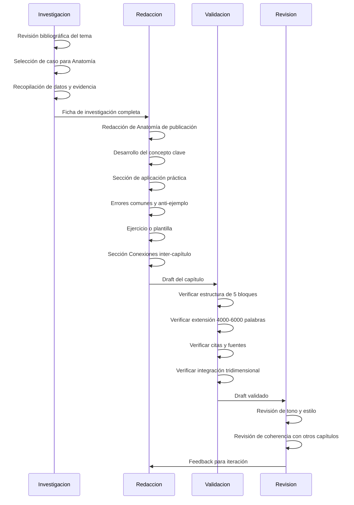
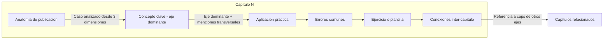
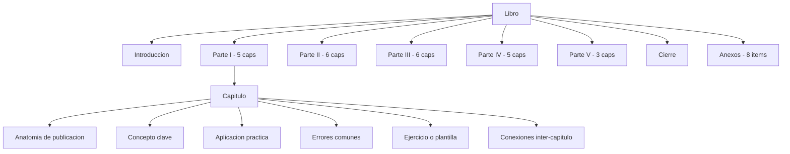

# Design Document — libro-marketing-creadores

## Overview

**Purpose**: Este proyecto editorial produce un libro de marketing digital de nivel intermedio titulado *"La Moneda Emocional"*, diseñado como guía estratégica integral para creadores de contenido que buscan profesionalizar su operación. El libro integra tres dimensiones (psicología de audiencias, ingeniería de distribución y monetización) en un marco tridimensional unificado.

**Users**: Creadores de contenido con 6-24 meses de actividad consistente que necesitan un marco estratégico para superar el estancamiento. Perfil secundario: profesionales de marketing, emprendedores digitales y community managers.

**Impact**: Crea un recurso editorial sin competidor directo en el mercado hispanohablante que combina las tres dimensiones de la creación de contenido profesional.

### Goals

- Producir un manuscrito de 25 capítulos (100.000-150.000 palabras) con estructura de 5 partes progresivas.
- Garantizar integración tridimensional (psicología + estrategia + negocio) en cada capítulo mediante recurso narrativo y conexiones explícitas.
- Fundamentar todo el contenido en investigación verificable (fuentes académicas y profesionales).
- Incluir recursos prácticos aplicables (plantillas, checklists, frameworks) como anexos y kit digital.
- Completar el ciclo editorial completo: investigación → diseño → redacción → revisión → producción.

### Non-Goals

- No es un manual de principiante sobre redes sociales (no explica qué es un reel o cómo crear una cuenta).
- No es un tratado académico sobre comunicación digital (evita academicismo excesivo).
- No es una guía táctica de plataforma específica (prioriza principios sobre tácticas efímeras).
- No incluye desarrollo de software, aplicación web ni plataforma digital (es un producto editorial).
- No cubre aspectos legales en profundidad (se mencionan como área de consulta, no como contenido central).

---

## Architecture

### Architecture Pattern & Boundary Map

Se adopta una **arquitectura editorial híbrida progresiva**: 5 partes como fases secuenciales con integración transversal mediante recurso narrativo ("Anatomía de una publicación") y sistema de conexiones inter-capítulo.

```mermaid
graph TB
    subgraph Introduccion[Introduccion - Marco general]
        INTRO[El creador como arquitecto de experiencias]
    end

    subgraph ParteI[Parte I - COMPRENDER]
        C1[Cap 1 Neurobiologia del scroll]
        C2[Cap 2 Confianza y sesgos]
        C3[Cap 3 Emociones que mueven]
        C4[Cap 4 Ventaja del contenido emocional]
        C5[Cap 5 Investigar a tu audiencia]
    end

    subgraph ParteII[Parte II - CONECTAR]
        C6[Cap 6 Identidad emocional]
        C7[Cap 7 Marca personal como sistema]
        C8[Cap 8 Autenticidad]
        C9[Cap 9 Storytelling]
        C10[Cap 10 El gancho]
        C11[Cap 11 Tono y ritmo]
    end

    subgraph ParteIII[Parte III - DISTRIBUIR]
        C12[Cap 12 Algoritmos]
        C13[Cap 13 SEO semantico]
        C14[Cap 14 Viralidad]
        C15[Cap 15 Multiplataforma]
        C16[Cap 16 Formatos]
        C17[Cap 17 Sistema de produccion]
    end

    subgraph ParteIV[Parte IV - CONVERTIR]
        C18[Cap 18 Creador como negocio]
        C19[Cap 19 Fuentes de ingreso]
        C20[Cap 20 Funnels]
        C21[Cap 21 Venta etica]
        C22[Cap 22 Metricas]
    end

    subgraph ParteV[Parte V - ESCALAR]
        C23[Cap 23 Comunidad]
        C24[Cap 24 Delegacion e IA]
        C25[Cap 25 Sostenibilidad]
    end

    subgraph Cierre[Cierre y Anexos]
        CLOSE[El contenido que deja huella]
        ANNEX[Anexos y kit digital]
    end

    INTRO --> ParteI
    ParteI --> ParteII
    ParteII --> ParteIII
    ParteIII --> ParteIV
    ParteIV --> ParteV
    ParteV --> Cierre
```



**Architecture Integration**:
- **Patrón seleccionado**: Híbrido progresivo — combina la secuencia lineal del esquema 2 con la profundidad modular del esquema 1 (ver `research.md`, Architecture Pattern Evaluation).
- **Boundaries editoriales**: Cada parte es una unidad temática autónoma con un eje dominante; los capítulos dentro de cada parte pueden leerse de forma no lineal.
- **Mecanismo de integración transversal**: Recurso "Anatomía de una publicación" + sección "Conexiones" al final de cada capítulo + casos compartidos entre partes.
- **Separación principios/datos**: Parte III aplica separación explícita entre principios estables y datos específicos fechados.

### Technology Stack

| Capa | Elección | Rol en el proyecto | Notas |
|------|----------|-------------------|-------|
| Formato de manuscrito | Markdown | Redacción, versionado y revisión de capítulos | Compatible con el framework SDD del repositorio |
| Control de versiones | Git | Versionado de drafts, colaboración y trazabilidad de cambios | Rama `motor/paper-book-software` |
| Gestión bibliográfica | BibTeX (references.bib) | Almacenamiento y validación de referencias | Validable contra CrossRef/DOI |
| Investigación | Skills del framework (research-lookup, literature-review, citation-management) | Búsqueda y verificación de fuentes | Integrados en el repositorio |
| Validación | Scripts de validación del framework | Verificación de estructura, citas y completitud | Adaptados a contexto editorial |
| Producción final | LaTeX o procesador editorial | Maquetación y diseño final del libro | Fase 5 del roadmap |

---

## System Flows

### Flujo editorial por capítulo



### Flujo de integración tridimensional



---

## Requirements Traceability

| Requirement | Summary | Componentes editoriales | Mecanismo | Flujo |
|-------------|---------|------------------------|-----------|-------|
| 1.1 | Presentar cada concepto desde tres dimensiones | Todos los capítulos | Estructura de Anatomía + sección Conexiones | Flujo de integración tridimensional |
| 1.2 | Cinco ejes progresivos | Partes I-V | Arquitectura de 5 partes | Flujo editorial completo |
| 1.3 | 23-27 capítulos en 5 partes | 25 capítulos | Estructura general del libro | — |
| 1.4 | Concepto emocional incluye aplicación estratégica | Capítulos Parte I y II | Bloques de aplicación práctica | Flujo por capítulo |
| 1.5 | Táctica incluye fundamento psicológico | Capítulos Parte III y IV | Apertura con Anatomía + referencia a Parte I | Flujo de integración |
| 2.1 | Asumir conocimiento básico del lector | Todos los capítulos | Guía de estilo editorial | — |
| 2.2 | Evitar explicaciones introductorias básicas | Todos los capítulos | Guía de estilo + validación | Flujo de validación |
| 2.3 | Básicos integrados como contexto, no sección aparte | Todos los capítulos | Estructura de capítulo | Flujo de redacción |
| 3.1-3.7 | Eje Comprender completo | Capítulos 1-5 (Parte I) | Contenido específico por capítulo | Flujo editorial |
| 4.1-4.8 | Eje Conectar completo | Capítulos 6-11 (Parte II) | Contenido específico por capítulo | Flujo editorial |
| 5.1-5.9 | Eje Distribuir completo | Capítulos 12-17 (Parte III) | Contenido específico + separación principios/datos | Flujo editorial |
| 6.1-6.9 | Eje Convertir completo | Capítulos 18-22 (Parte IV) | Contenido específico por capítulo | Flujo editorial |
| 7.1-7.9 | Eje Escalar completo | Capítulos 23-25 (Parte V) | Contenido específico por capítulo | Flujo editorial |
| 8.1 | Anatomía de una publicación por capítulo | Todos los capítulos | Recurso narrativo estandarizado | Flujo por capítulo, bloque 1 |
| 8.2 | Estructura de 5 bloques consistente | Todos los capítulos | Template de capítulo | Flujo por capítulo |
| 8.3 | Dato verificable por capítulo | Todos los capítulos | Investigación + validación | Flujo editorial |
| 8.4 | Anti-ejemplo por capítulo | Todos los capítulos | Bloque "Errores comunes" | Flujo por capítulo, bloque 4 |
| 8.5 | Contexto de caso de estudio | Todos los capítulos | Metadatos del caso (plataforma, nicho) | Flujo por capítulo, bloque 1 |
| 9.1-9.8 | Recursos prácticos y anexos | Módulo de Anexos | Plantillas, checklists, glosario, tech stack | Post-redacción |
| 10.1-10.7 | Investigación y fundamentación | Proceso editorial (Fase 1) | Métodos de investigación | Flujo editorial, fase investigación |
| 11.1-11.6 | Tono, estilo y experiencia | Guía de estilo editorial | Definición pre-redacción + validación | Flujo de validación |
| 12.1-12.7 | Control de calidad | Proceso editorial (Fases 4-5) | Lectores beta, revisión profesional, validación | Flujo de revisión |

---

## Components and Interfaces

### Resumen de componentes

| Componente | Dominio | Intent | Cobertura Req | Dependencias clave | Contratos |
|-----------|---------|--------|---------------|-------------------|-----------|
| Parte I: Comprender | Contenido | Fundamentación psicológica y neurocientífica | 3.1-3.7, 1.1, 1.5 | Investigación bibliográfica (P0) | Estructura de capítulo |
| Parte II: Conectar | Contenido | Identidad, storytelling y marca emocional | 4.1-4.8, 1.1, 1.4 | Parte I como base conceptual (P0) | Estructura de capítulo |
| Parte III: Distribuir | Contenido | Algoritmos, SEO y estrategia multiplataforma | 5.1-5.9, 1.1, 1.5 | Investigación de plataformas (P0) | Estructura de capítulo + separación principios/datos |
| Parte IV: Convertir | Contenido | Monetización, funnels y métricas | 6.1-6.9, 1.1, 1.4 | Partes I-III como base (P0) | Estructura de capítulo |
| Parte V: Escalar | Contenido | Comunidad, IA y sostenibilidad | 7.1-7.9, 1.1 | Partes I-IV como base (P1) | Estructura de capítulo |
| Módulo Introducción/Cierre | Contenido | Marco general y cierre reflexivo | 1.2, 2.4 | Manuscrito completo (P0) | Formato libre |
| Módulo de Anexos | Recursos | Plantillas, checklists, glosario, tech stack | 9.1-9.8 | Contenido de todos los capítulos (P0) | Formatos de plantilla |
| Guía de estilo editorial | Proceso | Definición de tono, voz y convenciones | 11.1-11.6 | Spec y requirements (P0) | Documento normativo |
| Proceso de investigación | Proceso | Revisión bibliográfica, casos, benchmarking | 10.1-10.7 | Fuentes externas (P0) | Fichas de investigación |
| Proceso de validación | Proceso | QA del manuscrito | 12.1-12.7 | Manuscrito completo (P0) | Checklists de validación |

---

### Contenido editorial

#### Parte I: Comprender — El algoritmo humano (Capítulos 1-5)

| Field | Detail |
|-------|--------|
| Intent | Establecer los fundamentos psicológicos y neurocientíficos del consumo de contenido digital |
| Requirements | 3.1, 3.2, 3.3, 3.4, 3.5, 3.6, 3.7, 1.1, 1.5 |

**Responsibilities & Constraints**
- Eje dominante: psicológico. Conexiones transversales: estratégico (cómo aplicar) y negocio (impacto en métricas).
- Extensión: 5 capítulos × 4.000-6.000 palabras = 20.000-30.000 palabras.
- Fundamentación: cada afirmación neurocientífica o psicológica requiere fuente verificable.

**Distribución de contenido por capítulo**

| Capítulo | Título | Req principales | Contenido clave |
|----------|--------|----------------|-----------------|
| 1 | Neurobiología del scroll | 3.1, 3.2 | Dopamina, sistema de recompensa, economía de la atención |
| 2 | Por qué las personas siguen, confían y compran | 3.3, 3.4 | Relaciones parasociales, sesgos cognitivos (min. 5) |
| 3 | Las emociones que mueven audiencias | 3.5 | Mapa emocional (8 emociones), correlación emoción-acción |
| 4 | La ventaja del contenido que hace sentir | 3.7 | Evidencia emocional vs. informativo, retención y conversión |
| 5 | Cómo piensa tu audiencia | 3.6 | Mapa emocional de audiencia, escucha digital, herramientas |

**Dependencies**
- Inbound: Investigación bibliográfica en neurociencia y psicología social — fundamentación (P0)
- Outbound: Parte II utiliza conceptos de emociones y sesgos como base (P0)
- External: Papers académicos, libros de referencia (Kahneman, Cialdini, Berger) (P1)

---

#### Parte II: Conectar — Identidad, storytelling y marca emocional (Capítulos 6-11)

| Field | Detail |
|-------|--------|
| Intent | Construir la identidad emocional del creador y dominar las herramientas narrativas de conexión |
| Requirements | 4.1, 4.2, 4.3, 4.4, 4.5, 4.6, 4.7, 4.8, 1.1, 1.4 |

**Responsibilities & Constraints**
- Eje dominante: emocional-estratégico. Conexiones: psicológico (por qué funciona) y negocio (impacto en posicionamiento).
- Extensión: 6 capítulos × 4.000-6.000 palabras = 24.000-36.000 palabras.
- Cada capítulo incluye framework o herramienta aplicable.

**Distribución de contenido por capítulo**

| Capítulo | Título | Req principales | Contenido clave |
|----------|--------|----------------|-----------------|
| 6 | Identidad emocional del creador | 4.1, 4.2 | Diagnóstico emocional, emoción central de marca (6 opciones) |
| 7 | Marca personal como sistema | 4.3, 4.4 | Tono, postura, valores; posicionamiento de nicho; diferenciación |
| 8 | Autenticidad y vulnerabilidad estratégica | 4.5 | Criterios de exposición: cuándo, cómo, cuánto |
| 9 | Storytelling para creadores | 4.6 | Min. 3 estructuras narrativas para formatos cortos; arco del creador |
| 10 | El gancho: los primeros 3 segundos | 4.7 | Ingeniería del hook, fundamento cognitivo, hooks visuales |
| 11 | Tono, lenguaje y ritmo emocional | 4.8 | Escritura para oído/ojo, estética sensorial, coherencia |

**Dependencies**
- Inbound: Parte I — conceptos de emociones, sesgos y relaciones parasociales (P0)
- Outbound: Parte III utiliza storytelling y hooks; Parte IV utiliza marca personal para venta (P1)

---

#### Parte III: Distribuir — Visibilidad, algoritmos y estrategia (Capítulos 12-17)

| Field | Detail |
|-------|--------|
| Intent | Dominar los mecanismos de distribución algorítmica y diseñar estrategia de contenido multiplataforma |
| Requirements | 5.1, 5.2, 5.3, 5.4, 5.5, 5.6, 5.7, 5.8, 5.9, 1.1, 1.5 |

**Responsibilities & Constraints**
- Eje dominante: estratégico-técnico. Conexiones: psicológico (señales que los algoritmos premian) y negocio (distribución como prerequisito de conversión).
- Extensión: 6 capítulos × 4.000-6.000 palabras = 24.000-36.000 palabras.
- **Constraint especial**: separación principios estables / datos específicos fechados (ver `research.md`, Decision: Separación principios vs. datos).
- Toda mención de datos de algoritmos incluye fecha de referencia (5.9).

**Distribución de contenido por capítulo**

| Capítulo | Título | Req principales | Contenido clave |
|----------|--------|----------------|-----------------|
| 12 | Cómo funcionan los algoritmos | 5.1, 5.2, 5.9 | Señales de ranking (4 plataformas), min. 5 mitos desmontados |
| 13 | SEO semántico para creadores | 5.3 | YouTube y TikTok como buscadores, keywords, evergreen vs. tendencia |
| 14 | Ingeniería de la viralidad | 5.4 | Patrones de viralidad, replicable vs. circunstancial, edición psicológica |
| 15 | Estrategia multiplataforma | 5.5, 5.6 | Framework adaptar vs. resubir, arquitectura de presencia digital |
| 16 | Contenido por formato | 5.7 | Min. 5 formatos con análisis (reels, carruseles, stories, lives, newsletters) |
| 17 | Planificación y sistema de producción | 5.8 | Calendarios, batching, pilares de contenido, mínimo viable |

**Dependencies**
- Inbound: Parte I — psicología de atención; Parte II — hooks y storytelling (P0)
- Outbound: Parte IV usa distribución como prerequisito de funnels (P1)
- External: Documentación oficial de plataformas, reportes de industria (P0)

---

#### Parte IV: Convertir — Monetización, métricas y negocio (Capítulos 18-22)

| Field | Detail |
|-------|--------|
| Intent | Transformar engagement en ingresos sostenibles con métricas de negocio reales |
| Requirements | 6.1, 6.2, 6.3, 6.4, 6.5, 6.6, 6.7, 6.8, 6.9, 1.1, 1.4 |

**Responsibilities & Constraints**
- Eje dominante: negocio. Conexiones: psicológico (emoción en venta) y estratégico (funnel como extensión de distribución).
- Extensión: 5 capítulos × 4.000-6.000 palabras = 20.000-30.000 palabras.
- Los modelos de monetización incluyen criterios de selección por fase del creador (6.2).

**Distribución de contenido por capítulo**

| Capítulo | Título | Req principales | Contenido clave |
|----------|--------|----------------|-----------------|
| 18 | El creador como negocio | 6.1, 6.2 | Mentalidad solopreneur, panorama de modelos, criterios de selección |
| 19 | Más allá del AdSense | 6.1, 6.2 | Patrocinios, afiliados, productos propios, servicios, social selling |
| 20 | Funnels de conversión para creadores | 6.3, 6.4 | Seguidor a cliente, lead magnets, email, nurturing |
| 21 | Vender sin sonar frío | 6.5, 6.6 | Venta ética, persuasión responsable, contenido para lanzamientos |
| 22 | Métricas que importan | 6.7, 6.8, 6.9 | LTV, CAC, conversión; vanidad vs. negocio; lectura emocional+estratégica |

**Dependencies**
- Inbound: Parte I (psicología de decisión), Parte II (marca y confianza), Parte III (distribución) — todas P0
- Outbound: Parte V escala lo construido aquí (P1)

---

#### Parte V: Escalar — Comunidad, sistemas y sostenibilidad (Capítulos 23-25)

| Field | Detail |
|-------|--------|
| Intent | Construir sistemas sostenibles más allá del creador individual |
| Requirements | 7.1, 7.2, 7.3, 7.4, 7.5, 7.6, 7.7, 7.8, 7.9, 1.1 |

**Responsibilities & Constraints**
- Eje dominante: sistémico. Conexiones: psicológico (pertenencia, burnout), estratégico (comunidad como activo), negocio (delegación y escalabilidad).
- Extensión: 3 capítulos × 5.000-7.000 palabras = 15.000-21.000 palabras (capítulos más densos por comprimir más temas).

**Distribución de contenido por capítulo**

| Capítulo | Título | Req principales | Contenido clave |
|----------|--------|----------------|-----------------|
| 23 | De seguidores a comunidad | 7.1, 7.2, 7.3 | Pertenencia, gestión de comunidad, confianza digital |
| 24 | Delegación, herramientas e IA | 7.4, 7.5, 7.6 | Criterios de delegación, tech stack, IA estratégica |
| 25 | Sostenibilidad y visión a largo plazo | 7.7, 7.8, 7.9 | Burnout, saturación, ética, futuro del creador |

**Dependencies**
- Inbound: Todo el contenido previo (Partes I-IV) como base acumulativa (P1)

---

### Proceso editorial

#### Guía de estilo editorial

| Field | Detail |
|-------|--------|
| Intent | Definir tono, voz, convenciones y formato antes de iniciar redacción |
| Requirements | 11.1, 11.2, 11.3, 11.4, 11.5, 11.6 |

**Responsibilities & Constraints**
- Se produce durante la Fase 2 (Diseño editorial) del roadmap.
- Aplica a todo el manuscrito; es documento normativo vinculante.

**Contrato de la guía de estilo**

La guía de estilo define:

| Aspecto | Especificación |
|---------|---------------|
| Tono general | Estratégico, cercano, profesional |
| Nivel de lenguaje | Intermedio; evitar academicismo y superficialidad |
| Anglicismos | Usar naturalmente los de uso común (hook, funnel, engagement); definir en primera aparición |
| Ejemplos | Del ecosistema de creadores, nunca de marketing corporativo genérico |
| Orientación | Cada concepto acompañado de aplicación práctica |
| Persona narrativa | Segunda persona (tú) para cercanía; tercera persona para casos |
| Extensión por capítulo | 4.000-6.000 palabras (Partes I-IV), 5.000-7.000 (Parte V) |

---

#### Template de capítulo

| Field | Detail |
|-------|--------|
| Intent | Estructura estandarizada que garantiza consistencia en los 25 capítulos |
| Requirements | 8.1, 8.2, 8.3, 8.4, 8.5 |

**Contrato de estructura**

Todo capítulo sigue esta secuencia:

| Bloque | Contenido | Extensión orientativa | Requirement |
|--------|-----------|----------------------|-------------|
| 1. Anatomía de una publicación | Caso real o ficticio desmontado; incluye plataforma, nicho y contexto | 500-800 palabras | 8.1, 8.5 |
| 2. Concepto clave | Desarrollo del tema central del capítulo con dato verificable | 1.500-2.500 palabras | 8.3 |
| 3. Aplicación para creadores | Cómo implementar el concepto; frameworks, pasos, ejemplos adicionales | 1.000-1.500 palabras | 1.4, 1.5 |
| 4. Errores comunes | Anti-ejemplo documentado + errores frecuentes | 500-800 palabras | 8.4 |
| 5. Ejercicio o plantilla | Actividad aplicable o herramienta descargable | 300-500 palabras | 9.x |
| 6. Conexiones | 2-3 bullets enlazando con capítulos de otros ejes | 100-200 palabras | 1.1 |

---

#### Proceso de investigación

| Field | Detail |
|-------|--------|
| Intent | Fundamentar el contenido del libro con investigación verificable |
| Requirements | 10.1, 10.2, 10.3, 10.4, 10.5, 10.6, 10.7 |

**Contrato de investigación**

| Entregable | Especificación | Criterio de completitud |
|-----------|---------------|------------------------|
| Revisión bibliográfica | Min. 4 áreas: psicología del consumo, neurociencia de la atención, marketing digital, economía del creador | Fichas por área con hallazgos clave |
| Análisis de contenido | Min. 30 publicaciones de alto engagement en múltiples plataformas | Patrones documentados con datos |
| Casos de estudio | 10-15 creadores en distintos nichos y plataformas | Ficha estandarizada por creador |
| Fuentes LATAM | Búsqueda específica de datos del ecosistema hispanohablante | Al menos 5 fuentes regionales |
| Análisis competitivo | Min. 5 libros competidores directos | Matriz de comparación con vacíos identificados |
| Vigencia de datos | Datos > 18 meses verificados o fechados | Registro de fechas de referencia |

---

#### Módulo de Anexos

| Field | Detail |
|-------|--------|
| Intent | Recursos prácticos aplicables que complementan la lectura |
| Requirements | 9.1, 9.2, 9.3, 9.4, 9.5, 9.6, 9.7, 9.8 |

**Inventario de anexos**

| # | Anexo | Tipo | Req |
|---|-------|------|-----|
| A1 | Glosario de marketing digital y emocional | Referencia | 9.1 |
| A2 | Plantilla de mapa emocional de audiencia | Herramienta | 9.2 |
| A3 | Plantilla para diseñar contenido emocional | Herramienta | 9.3 |
| A4 | Plantilla de funnel de conversión | Herramienta | 9.4 |
| A5 | Checklists por formato (captions, reels, carruseles, newsletters) | Herramienta | 9.5 |
| A6 | Estructuras de guión (video corto, carrusel, newsletter) | Template | 9.6 |
| A7 | Tech stack por fase del creador | Referencia | 9.7 |
| A8 | Ejercicios de análisis de contenido viral | Actividad | 9.8 |

---

#### Proceso de validación y QA

| Field | Detail |
|-------|--------|
| Intent | Garantizar calidad del manuscrito antes de publicación |
| Requirements | 12.1, 12.2, 12.3, 12.4, 12.5, 12.6, 12.7 |

**Contrato de validación**

| Validación | Método | Criterio de aceptación | Fase del roadmap |
|-----------|--------|----------------------|-----------------|
| Estructura por capítulo | Checklist automatizado | 25/25 capítulos con 5 bloques completos | Fase 3 (post-redacción) |
| Fuentes verificables | Revisión de citas | 100% de afirmaciones cuantitativas con fuente | Fase 4 |
| Coherencia inter-partes | Revisión editorial | Conexiones transversales funcionales y orgánicas | Fase 4 |
| Nivel intermedio | Lectores beta (min. 3) | Ningún capítulo reportado como "básico" o "demasiado avanzado" | Fase 4 |
| Tono y estilo | Revisión editorial profesional | Conformidad con guía de estilo | Fase 4 |
| Integración tridimensional | Revisión de secciones Conexiones | Cada capítulo referencia al menos 2 capítulos de otros ejes | Fase 4 |

---

## Data Models

### Domain Model — Estructura del manuscrito



**Entidades y reglas**:
- **Libro**: contiene exactamente 1 introducción, 5 partes, 1 cierre, 1 módulo de anexos.
- **Parte**: contiene 3-6 capítulos; tiene un eje temático dominante.
- **Capítulo**: contiene exactamente 6 bloques en orden fijo; extensión 4.000-7.000 palabras.
- **Anatomía de publicación**: incluye metadatos obligatorios (plataforma, nicho, contexto).
- **Concepto clave**: incluye al menos 1 dato o hallazgo verificable con fuente.
- **Errores comunes**: incluye al menos 1 anti-ejemplo documentado.
- **Conexiones**: incluye 2-3 referencias a capítulos de ejes diferentes.

### Modelo de archivos

```
paper/
├── 00-introduccion.md
├── parte-i/
│   ├── 01-neurobiologia-scroll.md
│   ├── 02-confianza-sesgos.md
│   ├── 03-emociones-audiencias.md
│   ├── 04-ventaja-contenido-emocional.md
│   └── 05-investigar-audiencia.md
├── parte-ii/
│   ├── 06-identidad-emocional.md
│   ├── 07-marca-personal-sistema.md
│   ├── 08-autenticidad.md
│   ├── 09-storytelling.md
│   ├── 10-gancho.md
│   └── 11-tono-ritmo.md
├── parte-iii/
│   ├── 12-algoritmos.md
│   ├── 13-seo-semantico.md
│   ├── 14-viralidad.md
│   ├── 15-multiplataforma.md
│   ├── 16-formatos.md
│   └── 17-sistema-produccion.md
├── parte-iv/
│   ├── 18-creador-negocio.md
│   ├── 19-fuentes-ingreso.md
│   ├── 20-funnels.md
│   ├── 21-venta-etica.md
│   └── 22-metricas.md
├── parte-v/
│   ├── 23-comunidad.md
│   ├── 24-delegacion-ia.md
│   └── 25-sostenibilidad.md
├── 26-cierre.md
└── anexos/
    ├── glosario.md
    ├── plantilla-mapa-emocional.md
    ├── plantilla-contenido-emocional.md
    ├── plantilla-funnel.md
    ├── checklists-formato.md
    ├── estructuras-guion.md
    ├── tech-stack.md
    └── ejercicios-viralidad.md
```

---

## Error Handling

### Estrategia editorial de manejo de problemas

| Problema | Categoría | Respuesta |
|----------|-----------|-----------|
| Dato sin fuente verificable | Calidad de contenido | No incluir; buscar fuente alternativa o reformular como opinión del autor |
| Capítulo excede extensión máxima | Estructura | Dividir en subcapítulos o mover contenido a anexos |
| Capítulo reportado como "básico" por lector beta | Nivel | Elevar profundidad; reescribir con lente estratégica |
| Dato de algoritmo obsoleto pre-publicación | Vigencia | Actualizar o eliminar; verificar separación principios/datos |
| Caso de Anatomía no resulta convincente | Recurso narrativo | Sustituir por caso más representativo del banco de casos |
| Conexiones inter-capítulo se sienten forzadas | Integración | Reescribir como orgánicas o eliminar; agregar caso compartido como alternativa |
| Falta de fuentes para mercado LATAM | Investigación | Documentar la limitación explícitamente; considerar datos propios o regionales |

---

## Testing Strategy

### Validación de estructura (automatizable)

1. Verificar que cada capítulo contiene los 6 bloques en orden correcto.
2. Verificar extensión por capítulo (4.000-7.000 palabras).
3. Verificar que cada capítulo de Parte III separa principios de datos fechados.
4. Verificar presencia de sección "Conexiones" en todos los capítulos.
5. Verificar que el módulo de Anexos contiene los 8 items especificados.

### Validación de contenido (requiere revisión humana)

1. Cada "Anatomía de publicación" incluye plataforma, nicho y contexto.
2. Cada concepto clave tiene al menos 1 dato verificable con fuente.
3. Cada capítulo incluye al menos 1 anti-ejemplo.
4. Las conexiones inter-capítulo son orgánicas y aportan valor.
5. El tono es consistente con la guía de estilo en todos los capítulos.

### Validación por lectores beta

1. Min. 3 lectores del perfil objetivo (creadores nivel intermedio).
2. Cuestionario por capítulo: nivel (básico/intermedio/avanzado), claridad, utilidad, engagement.
3. Ningún capítulo reportado mayoritariamente como "básico" o "demasiado avanzado".
4. Feedback consolidado con plan de acción antes de revisión editorial final.

### Validación de fuentes

1. 100% de afirmaciones cuantitativas con fuente identificable.
2. Datos > 18 meses verificados contra fuentes actualizadas.
3. Referencias cruzadas contra `references/references.bib`.
4. Fuentes LATAM: min. 5 identificadas y citadas.

---

## Extensión estimada del manuscrito

| Sección | Capítulos | Palabras estimadas |
|---------|-----------|-------------------|
| Introducción | 1 | 3.000-5.000 |
| Parte I: Comprender | 5 | 20.000-30.000 |
| Parte II: Conectar | 6 | 24.000-36.000 |
| Parte III: Distribuir | 6 | 24.000-36.000 |
| Parte IV: Convertir | 5 | 20.000-30.000 |
| Parte V: Escalar | 3 | 15.000-21.000 |
| Cierre | 1 | 2.000-3.000 |
| Anexos | 8 items | 8.000-12.000 |
| **Total** | **25 + intro + cierre + anexos** | **116.000-173.000** |

Rango objetivo recomendado: **120.000-150.000 palabras** (equivalente a 350-450 páginas impresas).
