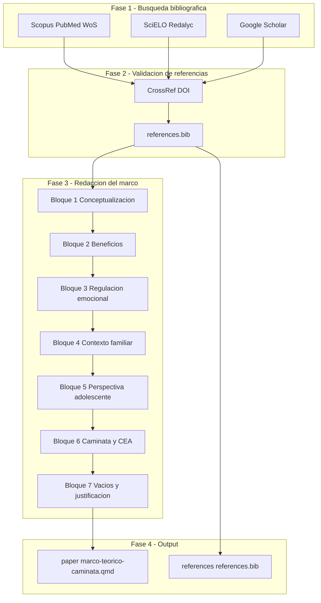
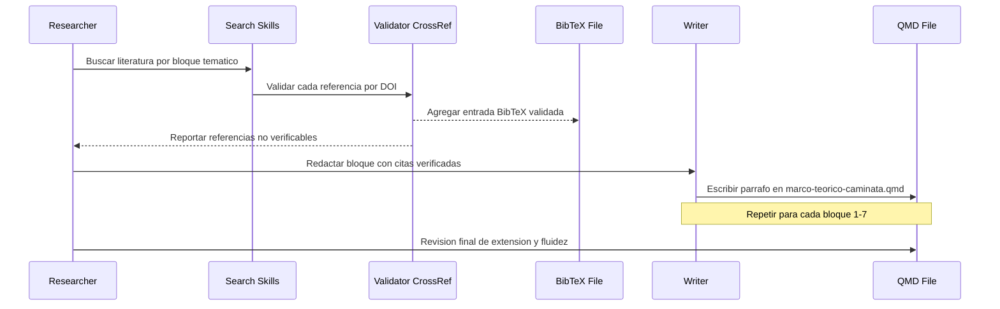

# Design Document — Marco Teórico Caminata

## Overview
**Purpose**: Este marco teórico articula la caminata como práctica corporal y recurso de regulación emocional en adolescentes con CEA, fundamentando teóricamente el estudio HabiTAR. El texto opera como sección del manuscrito científico, no como módulo de software.

**Users**: Investigadores del estudio HabiTAR, revisores del manuscrito y lectores académicos del campo de neurodesarrollo y prácticas corporales.

**Impact**: Crea la sección de marco teórico sobre caminata dentro del paper, poblando `paper/` con un archivo `.qmd` y `references/references.bib` con 12-18 entradas verificadas.

### Goals
- Redactar un marco teórico de 1.500-1.800 palabras con progresión acumulativa de lo global a lo específico
- Integrar 12-18 referencias verificadas por DOI/CrossRef (2020-2026, con excepciones seminales)
- Identificar vacíos empíricos y conceptuales que justifiquen HabiTAR
- Producir prosa académica natural sin marcas de generación automática

### Non-Goals
- No se redacta metodología, resultados ni discusión
- No se incluyen citas verbatim de participantes ni elementos de resultados
- No se crea una sección geográfica separada (el eje geográfico es transversal)
- No se genera el `_quarto.yml` completo del libro (solo se verifica que exista o se documenta la necesidad)

## Architecture

### Architecture Pattern & Boundary Map



**Architecture Integration**:
- Patrón seleccionado: pipeline secuencial de 4 fases (búsqueda → validación → redacción → salida)
- Límites de dominio: la búsqueda bibliográfica y la redacción son fases independientes; la validación es el gate entre ambas
- Patrones existentes preservados: estructura de directorios del proyecto (`paper/`, `references/`), pipeline Quarto
- Steering compliance: proceso iterativo spec → draft → validación → revisión → merge

### Technology Stack

| Capa | Herramienta / Versión | Rol en la feature | Notas |
|------|----------------------|-------------------|-------|
| Búsqueda bibliográfica | `research-lookup`, `citation-management` skills | Localizar y verificar referencias | Usa PubMed, Semantic Scholar, Google Scholar |
| Validación de citas | CrossRef API, DOI resolver | Verificar existencia y metadatos de cada referencia | Req 8.4, 8.6 |
| Formato de citas | BibTeX + CSL (APA 7th) | Generar bibliografía formateada | Integración con Quarto |
| Redacción | Markdown / Quarto `.qmd` | Formato del archivo de salida | Sintaxis `@citekey` y `[@citekey]` |
| Compilación | Quarto + `build-book.sh` | Renderizar HTML/PDF/DOCX | Verificar instalación antes de compilar |

## System Flows

### Flujo de redacción por bloques



## Requirements Traceability

| Requirement | Resumen | Componentes | Interfaces | Flujo |
|-------------|---------|-------------|------------|-------|
| 1.1, 1.2, 1.3, 1.4 | Estructura de 7 bloques con lógica acumulativa | Todos los bloques (B1-B7) | Conectores entre párrafos | Redacción secuencial |
| 2.1, 2.2, 2.3, 2.4, 2.5 | Extensión 1.500-1.800 palabras, párrafos 8-15 líneas | Archivo `.qmd` completo | Formato Quarto | Revisión final |
| 3.1, 3.2, 3.3 | Conceptualización de la caminata | B1 | Definiciones afirmativas | Bloque 1 |
| 4.1, 4.2, 4.3, 4.4 | Beneficios y regulación emocional | B2, B3 | Citas APA por afirmación | Bloques 2-3 |
| 5.1, 5.2, 5.3 | Contexto familiar y perspectiva adolescente | B4, B5 | Contraste geográfico | Bloques 4-5 |
| 6.1, 6.2, 6.3 | Caminata y CEA | B6 | Perspectiva autista, glosario | Bloque 6 |
| 7.1, 7.2, 7.3, 7.4 | Vacíos y justificación HabiTAR | B7 | Transición a pregunta de investigación | Bloque 7 |
| 8.1-8.6 | Fuentes y citación | `references.bib`, todos los bloques | CrossRef, DOI, APA | Búsqueda + Validación |
| 9.1, 9.2, 9.3 | Eje geográfico transversal | Todos los bloques | Contraste internacional/regional | Transversal |
| 10.1-10.6 | Tono y estilo académico | Archivo `.qmd` completo | Formato visual (negrita, cursiva, notas) | Revisión final |

## Components and Interfaces

| Componente | Dominio | Intención | Cobertura Req | Dependencias clave | Contratos |
|-----------|---------|-----------|---------------|-------------------|-----------|
| BúsquedaBibliográfica | Investigación | Localizar 12-18 refs verificadas | 8.1, 8.2, 8.3 | Skills research-lookup, citation-management (P0) | Service |
| ValidaciónReferencias | Calidad | Verificar DOI/CrossRef de cada referencia | 8.4, 8.6 | CrossRef API (P0) | Service |
| ArchivoReferenciasBib | Datos | Almacenar entradas BibTeX validadas | 8.1, 8.4, 8.5 | ValidaciónReferencias (P0) | State |
| BloquesTemáticos | Redacción | 7 bloques de prosa académica acumulativa | 1-7, 9, 10 | ArchivoReferenciasBib (P0) | State |
| ArchivoQMD | Salida | Archivo `.qmd` final con frontmatter | 2.1, 10.1-10.6 | BloquesTemáticos (P0), Quarto (P1) | State |

### Investigación

#### BúsquedaBibliográfica

| Campo | Detalle |
|-------|---------|
| Intent | Localizar referencias revisadas por pares en bases de datos académicas |
| Requirements | 8.1, 8.2, 8.3 |

**Responsabilidades y restricciones**
- Ejecutar búsquedas en Scopus, PubMed, Web of Science (internacional) y SciELO, Redalyc (regional)
- Priorizar publicaciones 2020-2026; admitir obras seminales anteriores solo con justificación
- Distribuir las referencias encontradas entre los 7 bloques temáticos
- Mínimo 12, máximo 18 referencias; al menos 2-3 de fuentes regionales

**Dependencies**
- External: skill `research-lookup` — búsqueda en bases académicas (P0)
- External: skill `citation-management` — generación de entradas BibTeX (P0)
- Outbound: ValidaciónReferencias — cada referencia pasa por validación DOI (P0)

**Contracts**: Service [x]

##### Service Interface
```
Entrada: { query: string, bases: string[], ventana_temporal: "2020-2026", max_resultados: number }
Salida: { referencias: Array<{ autores, titulo, año, doi, revista, abstract }> }
Errores: Sin resultados para la consulta | Base de datos no disponible
```
- Precondiciones: términos de búsqueda definidos por bloque temático (ver `research.md`)
- Postcondiciones: cada referencia incluye DOI o identificador único verificable

#### ValidaciónReferencias

| Campo | Detalle |
|-------|---------|
| Intent | Verificar existencia y metadatos de cada referencia mediante CrossRef/DOI |
| Requirements | 8.4, 8.6 |

**Responsabilidades y restricciones**
- Verificar cada referencia contra CrossRef o resolver su DOI
- Excluir referencias no verificables (Req 8.6)
- Generar entrada BibTeX correcta con todos los campos obligatorios

**Dependencies**
- Inbound: BúsquedaBibliográfica — recibe referencias candidatas (P0)
- External: CrossRef API — verificación de DOI y metadatos (P0)
- Outbound: ArchivoReferenciasBib — escribe entradas validadas (P0)

**Contracts**: Service [x]

##### Service Interface
```
Entrada: { doi: string } | { titulo: string, autores: string[] }
Salida: { válida: boolean, bibtex: string, metadatos: object }
Errores: DOI no encontrado | Metadatos incompletos
```
- Precondiciones: la referencia tiene DOI o datos suficientes para búsqueda por título
- Postcondiciones: solo las referencias con `válida: true` se agregan al `.bib`

### Datos

#### ArchivoReferenciasBib

| Campo | Detalle |
|-------|---------|
| Intent | Almacenar todas las entradas BibTeX validadas para el marco teórico |
| Requirements | 8.1, 8.4, 8.5 |

**Responsabilidades y restricciones**
- Mantener formato BibTeX estándar en `references/references.bib`
- Preservar entradas existentes (actualmente: `bachelard1957`)
- Cada entrada usa un citekey consistente: `apellido_principal + año` (e.g., `gross2015`)

**Contracts**: State [x]

##### State Management
- Ubicación: `references/references.bib`
- Formato: BibTeX estándar
- Estrategia de concurrencia: append-only durante la fase de búsqueda; edición controlada en revisión

### Redacción

#### BloquesTemáticos

| Campo | Detalle |
|-------|---------|
| Intent | Redactar 7 bloques de prosa académica con lógica acumulativa y eje geográfico |
| Requirements | 1.1-1.4, 3.1-3.3, 4.1-4.4, 5.1-5.3, 6.1-6.3, 7.1-7.4, 9.1-9.3, 10.1-10.6 |

**Responsabilidades y restricciones**
- Cada bloque agota una idea en un párrafo extenso (8-15 líneas)
- Conectores académicos entre párrafos para mantener fluidez
- Eje geográfico integrado dentro de cada bloque, no en sección separada
- Definiciones afirmativas; perspectiva autista; vocabulario del glosario HabiTAR
- Sin guiones, viñetas, listas ni disrupciones dentro de párrafos
- Negrita solo para conceptos clave; cursiva para tecnicismos en inglés
- Citas APA (narrativas y parentéticas) usando sintaxis Quarto (`@citekey`, `[@citekey]`)

**Dependencies**
- Inbound: ArchivoReferenciasBib — referencias verificadas disponibles (P0)

**Contracts**: State [x]

##### State Management
- Cada bloque se redacta en secuencia, integrando citas del `.bib`
- Distribución de palabras estimada (ver `research.md`): B1 ~200, B2 ~250, B3 ~280, B4 ~220, B5 ~220, B6 ~280, B7 ~200
- Validación post-redacción: conteo de palabras total entre 1.500-1.800

**Especificación por bloque**:

| Bloque | Tema | Contenido clave | Refs estimadas |
|--------|------|----------------|---------------|
| B1 | Conceptualización de la caminata | Actividad física + práctica social + experiencia situada | 2-3 |
| B2 | Beneficios documentados | Físicos, psicológicos, emocionales en población general | 2-3 |
| B3 | Regulación emocional | Marcha rítmica, atención, sensorialidad, reducción de estrés, *embodied cognition* | 3-4 |
| B4 | Contexto familiar | Práctica vincular cuidadores-hijos, énfasis adolescencia | 2-3 |
| B5 | Perspectiva adolescente | Apropiación, motivación, significados atribuidos | 2-3 |
| B6 | Caminata y CEA | Articulación con espectro autista, autorregulación, perspectiva autista | 3-4 |
| B7 | Vacíos y justificación | Vacío empírico + vacío conceptual → pregunta de investigación HabiTAR | 1-2 |

### Salida

#### ArchivoQMD

| Campo | Detalle |
|-------|---------|
| Intent | Archivo Quarto final con el marco teórico completo |
| Requirements | 2.1, 10.1-10.6 |

**Responsabilidades y restricciones**
- Ubicación: `paper/marco-teorico-caminata.qmd`
- Incluye frontmatter YAML mínimo (title, bibliography, csl)
- Contiene los 7 bloques como prosa continua sin encabezados internos de subsección
- Formato de citas Quarto: `@citekey` (narrativo), `[@citekey]` (parentético)

**Contracts**: State [x]

##### State Management
- Estructura del archivo:
  ```yaml
  ---
  title: "Marco teórico: La caminata como práctica corporal y recurso de regulación emocional"
  bibliography: ../references/references.bib
  csl: apa.csl
  ---
  ```
  Seguido de prosa continua (7 bloques en párrafos extensos)

## Testing Strategy

### Validación de contenido (equivalente a unit tests)
- Conteo de palabras: verificar rango 1.500-1.800
- Conteo de referencias únicas citadas: verificar rango 12-18
- Presencia de los 7 bloques temáticos en secuencia lógica
- Ausencia de guiones, viñetas o listas dentro de párrafos

### Validación de referencias (equivalente a integration tests)
- Cada `@citekey` en el `.qmd` tiene su entrada correspondiente en `references.bib`
- Cada entrada en `references.bib` tiene DOI verificable o justificación de obra seminal
- Formato BibTeX correcto (campos obligatorios: author, title, year, journal/booktitle)

### Validación de estilo (equivalente a e2e tests)
- Párrafos de 8-15 líneas
- Conectores académicos al inicio de párrafos
- Uso correcto de negrita (conceptos clave) y cursiva (tecnicismos)
- Ausencia de marcadores de generación automática
- Perspectiva autista consistente (sin "trastorno", "déficit", formulaciones por negación)

### Validación de compilación
- `quarto render paper/marco-teorico-caminata.qmd --to html` ejecuta sin errores
- Bibliografía generada en formato APA 7th edition
- Notas al pie renderizadas correctamente
