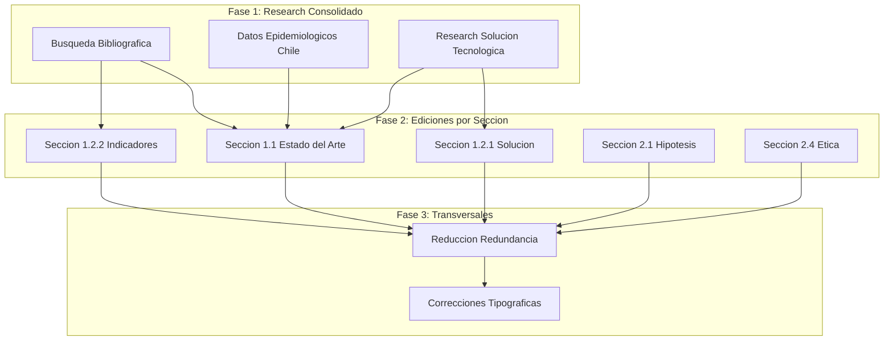
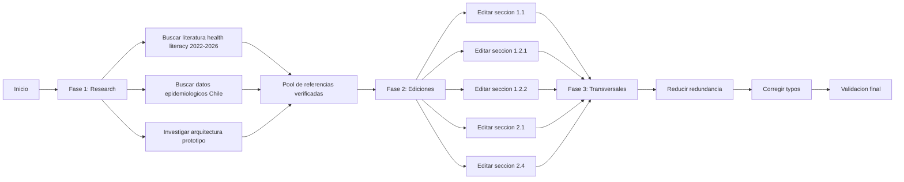

# Design Document — mejora-postulacion-fonis

## Overview

**Purpose**: Esta feature mejora el contenido editorial del formulario de postulación FONIS 2026 (`temp_context/Formulario_Postulacion_2026.docx.md`), abordando 9 falencias identificadas en auditoría que pueden resolverse sin decisiones del equipo investigador.

**Users**: El equipo investigador (postulantes) y los evaluadores FONIS son los beneficiarios directos. El documento mejorado fortalece la competitividad de la propuesta.

**Impact**: Modifica secciones específicas del formulario existente: estado del arte (1.1), solución (1.2.1), resultados tecnológicos (1.2.2), hipótesis (2.1), ética (2.4), y redacción transversal.

### Goals
- Actualizar el estado del arte con ≥10 referencias de 2022-2026
- Detallar la solución tecnológica con arquitectura y flujo concretos
- Incorporar datos epidemiológicos chilenos con cifras específicas
- Fortalecer hipótesis con cuantificación y variables moderadoras
- Ampliar sección de ética con protección de datos
- Reducir redundancia y corregir errores

### Non-Goals
- Modificar el diseño metodológico (tamaño muestral, instrumentos, diseño cuasi-experimental) — requiere decisión del equipo (ver backlog)
- Cambiar la composición del equipo investigador
- ~~Alterar el presupuesto o plan de trabajo~~ → Se incorporó Fase 4 de auditoría de planilla de costos (desglose de operación, corrección de ANTECEDENTES, ajuste de overhead)
- Modificar secciones que no presenten falencias

## Architecture

### Existing Architecture Analysis

El documento fuente es un markdown de ~400 líneas con estructura IMRaD adaptada al formato FONIS:

| Sección | Líneas | Estado | Intervención requerida |
|---------|--------|--------|----------------------|
| 1.1 Planteamiento y estado del arte | 29–47 | Desactualizado | R1, R3, R6 |
| 1.2.1 Solución | 49–65 | Genérico | R2 |
| 1.2.2 Resultados (tablas) | 68–144 | Indicadores sin justificar | R7 |
| 2.1 Hipótesis | 166–182 | Débil/tautológica | R4 |
| 2.4 Ética | 297–316 | Incompleta | R5 |
| Transversal | Todo el doc | Redundante | R8, R9 |

### Architecture Pattern & Boundary Map

**Architecture Integration**:
- **Patrón seleccionado**: Pipeline de 3 fases (research → edición por sección → transversales). Cada fase produce outputs que alimentan la siguiente.
- **Boundaries**: Cada sección del formulario es una unidad de edición independiente dentro de su fase. Las fases son secuenciales.
- **Rationale**: Evita retrabajo al consolidar la búsqueda bibliográfica antes de editar, y deja la homogeneización para el final.

### Technology Stack

| Capa | Herramienta | Rol en feature | Notas |
|------|-------------|----------------|-------|
| Búsqueda bibliográfica | `research-lookup`, `citation-management` skills | Encontrar y validar referencias 2022-2026 | PubMed, Semantic Scholar, Google Scholar |
| Datos epidemiológicos | `WebFetch`, `WebSearch` | Obtener cifras INE, CASEN, DEIS | Fuentes gubernamentales chilenas |
| Edición de documento | `Edit` tool | Modificar secciones específicas del formulario | Ediciones quirúrgicas preservando estructura |
| Validación de citas | `citation-management` skill | Verificar DOI y metadatos de referencias | CrossRef, Semantic Scholar |

## System Flows

### Flujo principal de ejecución

## Requirements Traceability

| Requirement | Summary | Componente | Fase | Dependencias |
|-------------|---------|------------|------|-------------|
| 1.1–1.6 | Literatura reciente 2022-2026 | Sección 1.1 | F1→F2 | Búsqueda bibliográfica |
| 2.1–2.5 | Detalle solución tecnológica | Sección 1.2.1 | F1→F2 | Research arquitectura |
| 3.1–3.3 | Tabla comparativa soluciones | Sección 1.1 | F2 | R1, R2 |
| 4.1–4.4 | Hipótesis falsificable | Sección 2.1 | F2 | R7 (efecto esperado) |
| 5.1–5.4 | Ética y protección de datos | Sección 2.4 | F2 | Independiente |
| 6.1–6.4 | Datos epidemiológicos Chile | Sección 1.1 | F1→F2 | WebFetch fuentes GOB |
| 7.1–7.3 | Justificación indicadores | Sección 1.2.2 | F2 | R1 (literatura) |
| 8.1–8.4 | Reducción redundancia | Transversal | F3 | Todas las ediciones F2 |
| 9.1–9.3 | Correcciones tipográficas | Transversal | F3 | R8 completado |

## Components and Interfaces

| Componente | Dominio | Intent | Req Coverage | Dependencias | Fase |
|-----------|---------|--------|-------------|-------------|------|
| ResearchBibliografico | Fase 1 | Buscar y validar ≥10 refs 2022-2026 | 1.1–1.4, 1.6 | citation-management, research-lookup | F1 |
| ResearchEpidemiologico | Fase 1 | Obtener cifras chilenas actualizadas | 6.1–6.4 | WebFetch, WebSearch | F1 |
| ResearchTecnologico | Fase 1 | Definir arquitectura propuesta para prototipo | 2.1–2.5 | WebSearch | F1 |
| EditorEstadoArte | Fase 2 | Reescribir sección 1.1 con nuevas refs y datos | 1.1–1.6, 3.1–3.3, 6.1–6.4 | F1 outputs | F2 |
| EditorSolucion | Fase 2 | Detallar sección 1.2.1 con arquitectura concreta | 2.1–2.5 | ResearchTecnologico | F2 |
| EditorIndicadores | Fase 2 | Justificar umbrales en tablas de resultado tecnológico | 7.1–7.3 | ResearchBibliografico | F2 |
| EditorHipotesis | Fase 2 | Fortalecer sección 2.1 con cuantificación | 4.1–4.4 | EditorIndicadores | F2 |
| EditorEtica | Fase 2 | Ampliar sección 2.4 con protección de datos | 5.1–5.4 | Independiente | F2 |
| HomogeneizadorRedundancia | Fase 3 | Reducir repeticiones y sustituir frases genéricas | 8.1–8.4 | Todas F2 | F3 |
| CorrectorConsistencia | Fase 3 | Corregir typos y unificar nomenclatura | 9.1–9.3 | HomogeneizadorRedundancia | F3 |

### Fase 1: Research

#### ResearchBibliografico

| Campo | Detalle |
|-------|---------|
| Intent | Buscar, seleccionar y validar ≥10 referencias 2022-2026 en health literacy, NLP en salud y salud digital LATAM |
| Requirements | 1.1, 1.2, 1.3, 1.4, 1.6 |

**Responsabilidades y restricciones**
- Buscar en PubMed, Semantic Scholar y Google Scholar con términos: "health literacy" AND ("older adults" OR "elderly") AND "digital", "NLP" AND "health information" AND "simplification", "salud digital" AND "Chile" OR "Latin America"
- Seleccionar referencias que cumplan: (a) publicadas 2022-2026, (b) relevantes al proyecto, (c) verificables vía DOI
- Validar cada referencia con citation-management (DOI, metadatos)
- Producir lista formateada con autor, año, título, revista, DOI

**Output esperado**: Archivo `temp_context/research_refs_fonis.md` con ≥10 referencias agrupadas por temática (health literacy digital, NLP/IA en salud, salud digital LATAM/Chile).

#### ResearchEpidemiologico

| Campo | Detalle |
|-------|---------|
| Intent | Obtener datos numéricos actualizados sobre envejecimiento y health literacy en Chile |
| Requirements | 6.1, 6.2, 6.3, 6.4 |

**Responsabilidades y restricciones**
- Buscar en fuentes oficiales: INE (Censo 2017, proyecciones), CASEN 2022, DEIS-MINSAL, reportes SENAMA
- Obtener: (a) proporción y número absoluto de personas ≥60 años, (b) inscritos en APS, (c) prevalencia de baja health literacy (si existe dato chileno; sino, LATAM)
- Citar fuente exacta para cada dato

**Output esperado**: Datos numéricos con cita para insertar en sección 1.1.

#### ResearchTecnologico

| Campo | Detalle |
|-------|---------|
| Intent | Definir una propuesta técnica concreta para el prototipo funcional |
| Requirements | 2.1, 2.2, 2.3, 2.4, 2.5 |

**Responsabilidades y restricciones**
- Proponer arquitectura web coherente con el equipo (Boris Bustos: Node.js, React, APIs RESTful, ML)
- Describir flujo de procesamiento: ingreso documento → preprocesamiento → simplificación NLP/LLM → generación de versión accesible → visualización
- Diferenciar componentes: módulo de ingreso (estándar), módulo de procesamiento (innovador: NLP + reglas de accesibilidad cognitiva), interfaces (frontend accesible)
- Mantener coherencia con lo ya declarado en el formulario

**Output esperado**: Descripción técnica para insertar en sección 1.2.1 y tabla de resultado tecnológico.

### Fase 2: Ediciones por sección

#### EditorEstadoArte

| Campo | Detalle |
|-------|---------|
| Intent | Reescribir sección 1.1 integrando nueva literatura, datos epidemiológicos y tabla comparativa |
| Requirements | 1.1–1.6, 3.1–3.3, 6.1–6.4 |

**Responsabilidades y restricciones**
- Preservar las referencias existentes (Berkman, Nutbeam, Sørensen, WHO, MINSAL, SENAMA)
- Integrar ≥10 nuevas referencias del pool bibliográfico
- Insertar datos epidemiológicos chilenos con cifras concretas
- Agregar tabla comparativa de ≥4 soluciones existentes
- Incluir breve estrategia de búsqueda bibliográfica
- Reemplazar frases genéricas por afirmaciones cuantificadas
- Editar líneas 29–47 del formulario

#### EditorSolucion

| Campo | Detalle |
|-------|---------|
| Intent | Detallar la descripción tecnológica del prototipo en sección 1.2.1 |
| Requirements | 2.1–2.5 |

**Responsabilidades y restricciones**
- Especificar: aplicación web, frontend React accesible, backend Node.js, módulo NLP/LLM para simplificación
- Describir flujo de procesamiento de documentos en 4-5 etapas
- Diferenciar componentes por nivel de innovación
- Reemplazar términos genéricos ("procesamiento", "adaptación") por técnicas concretas
- Editar líneas 49–65 y celdas relevantes de tablas líneas 106–124

#### EditorIndicadores

| Campo | Detalle |
|-------|---------|
| Intent | Justificar umbrales de éxito (≥20% comprensión, ≥70 SUS, ≥70% valoración) con literatura |
| Requirements | 7.1–7.3 |

**Responsabilidades y restricciones**
- Citar estudios comparables para el 20% de mejora en comprensión
- Referenciar interpretación estándar de SUS (Bangor et al., 2009; Lewis & Sauro, 2018)
- Especificar instrumento para medir valoración positiva
- Editar celdas de indicadores en tablas de resultado tecnológico (líneas 112, 114)

#### EditorHipotesis

| Campo | Detalle |
|-------|---------|
| Intent | Reformular hipótesis para que sea específica, cuantificada y falsificable |
| Requirements | 4.1–4.4 |

**Responsabilidades y restricciones**
- Incluir magnitud del efecto esperado (derivado de R7)
- Agregar al menos una variable moderadora (nivel educativo o tipo de documento)
- Reformular supuestos que son preguntas de investigación como tales
- Mantener coherencia con pregunta de investigación y metodología
- Editar líneas 166–182

#### EditorEtica

| Campo | Detalle |
|-------|---------|
| Intent | Ampliar sección 2.4 con protección de datos personales y seguridad de información clínica |
| Requirements | 5.1–5.4 |

**Responsabilidades y restricciones**
- Mencionar Ley 19.628 y Ley 21.719 (protección de datos personales)
- Describir medidas de seguridad para documentos clínicos en el sistema
- Abordar riesgo de distorsión de sentido médico en simplificación automática
- Describir anonimización/pseudonimización de datos de participantes
- Editar líneas 297–316

### Fase 3: Transversales

#### HomogeneizadorRedundancia

| Campo | Detalle |
|-------|---------|
| Intent | Reducir repeticiones y sustituir frases genéricas en todo el documento |
| Requirements | 8.1–8.4 |

**Responsabilidades y restricciones**
- Buscar y contar frases repetidas clave
- Reducir "intervención digital accesible, materializada en un prototipo funcional" a ≤3 apariciones
- Reducir "accesibilidad cognitiva, lenguaje claro y diseño centrado en el usuario" a ≤3 apariciones
- Usar variaciones, abreviaciones o referencias cruzadas en las demás
- Sustituir frases genéricas restantes por datos concretos donde sea posible
- Ejecutar después de todas las ediciones de F2 para incluir texto nuevo

#### CorrectorConsistencia

| Campo | Detalle |
|-------|---------|
| Intent | Corregir errores tipográficos y unificar nomenclatura |
| Requirements | 9.1–9.3 |

**Responsabilidades y restricciones**
- Corregir "Fundación Comunida" → verificar nombre real antes de corregir
- Unificar nombres de instituciones, personas y componentes del sistema
- Verificar consistencia terminológica entre secciones editadas y no editadas
- Ejecutar como último paso

## Testing Strategy

### Validación por requerimiento
- **R1**: Contar referencias 2022-2026 en el documento final (≥10)
- **R2**: Verificar que la sección 1.2.1 nombre tecnologías y flujo concretos
- **R3**: Verificar presencia de tabla comparativa con ≥4 soluciones y 5 dimensiones
- **R4**: Verificar que hipótesis incluya cuantificación y variable moderadora
- **R5**: Verificar mención de Ley 19.628/21.719, medidas de seguridad y riesgo de distorsión
- **R6**: Verificar presencia de ≥3 datos numéricos con fuente
- **R7**: Verificar que cada indicador tenga cita o justificación técnica
- **R8**: Contar apariciones de frases clave (≤3 cada una)
- **R9**: Buscar "Comunida" y verificar consistencia de nombres

### Validación transversal
- Verificar que las referencias existentes no hayan sido eliminadas
- Verificar que las tablas markdown mantengan formato correcto
- Verificar coherencia entre secciones editadas (mismas citas, mismos datos)
