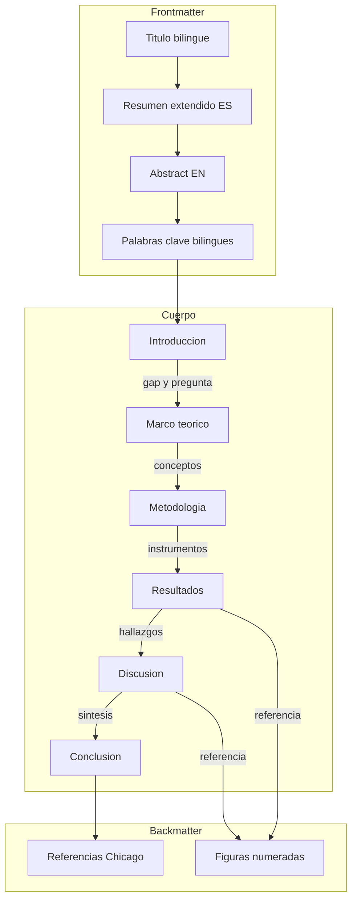

# Design Document — memorias-casas-con-piernas

## Overview

**Purpose**: Este diseño estructura el artículo "Memorias de casas con piernas" como manuscrito académico para la RES #100, transformando un borrador inicial de ~2.500 palabras en un artículo completo de 7.000-10.000 palabras con estructura IMRaD adaptada a investigación-creación.

**Users**: Evaluadores pares (doble ciego), comité editorial RES, lectores de ciencias sociales transdisciplinares.

**Impact**: Reestructura completamente el borrador existente (`temp_context/paper_Erwin_23_Junio_2025.md`), separando Marco teórico de Introducción, reordenando Resultados antes de Discusión, expandiendo los arquetipos de casas narrativas, y convirtiendo todas las citas a Chicago Author-Date.

### Goals
- Producir un manuscrito que cumpla al 100% las normas editoriales de la RES (Req 1)
- Articular una estructura argumentativa coherente de IMRaD adaptada a investigación-creación (Req 11)
- Integrar la obra visual (dibujos) como componente argumentativo, no decorativo (Req 10)
- Alcanzar 25+ referencias verificables en Chicago Author-Date (Req 9)

### Non-Goals
- No se produce el archivo Word final de entrega (conversión Markdown → Word es tarea de exportación posterior)
- No se digitalizan las imágenes (responsabilidad del autor; el diseño define los requisitos técnicos)
- No se redacta en inglés (solo el resumen y palabras clave tienen versión en inglés)
- No se genera la carta de presentación ni los datos de autores (archivo aparte requerido por la RES)

## Architecture

### Existing Architecture Analysis

El borrador existente presenta las siguientes restricciones y oportunidades:

| Aspecto | Estado actual | Acción requerida |
|---------|--------------|------------------|
| Estructura | Intro → Metodología → Discusión → Resultados → Conclusión | Reordenar a IMRaD; separar Marco teórico |
| Extensión | ~2.500 palabras | Expandir a ~8.800 palabras |
| Citas | 7 referencias en APA 7 | Convertir a Chicago Author-Date; expandir a 25+ |
| Resumen | ~150 palabras, solo español | Expandir a 250-300; agregar versión inglés |
| Figuras | No referenciadas en texto | Integrar con notación `[Insertar Imagen N aquí]` |
| Arquetipos | 5 listados sin desarrollo | Expandir cada uno con ~350 palabras |

### Architecture Pattern & Boundary Map



**Patrón seleccionado**: IMRaD adaptado con Marco teórico expandido como sección independiente (ver `research.md` — Decision: Estructura IMRaD adaptada).

**Límites de dominio**: Cada sección es un componente independiente con responsabilidad única, pero con interfaces de entrada/salida definidas (conceptos que recibe de la sección anterior y entrega a la siguiente).

**Compliance con steering**: Alineado con `structure.md` (IMRaD adaptado), `tech.md` (Chicago Author-Date, Markdown → Word), `product.md` (ejes de migración y metodologías emergentes).

### Technology Stack

| Capa | Elección / Versión | Rol | Notas |
|------|-------------------|-----|-------|
| Escritura | Markdown | Drafts de cada sección | Versionado con git |
| Metadatos | YAML (`metadata.yaml`) | Configuración del paper | Fuente de verdad para keywords, autores, formato |
| Referencias | BibTeX (`.bib`) | Gestión bibliográfica | Validación contra CrossRef/DOI |
| Figuras | JPG/TIFF 300 dpi | Material visual del paper | Archivo aparte según normas RES |
| Validación | Scripts (`scripts/`) | Verificación automática | Conteo de palabras, formato citas, estructura |
| Exportación | Pandoc / Word | Entrega final | Conversión Markdown → Word con template RES |

## System Flows

### Flujo argumentativo del manuscrito

```mermaid
graph LR
    subgraph Introduccion
        CTX[Contexto migracion AL]
        GAP[Gap en literatura]
        PRG[Pregunta investigacion]
        MET[Metafora casas con piernas]
    end

    subgraph Marco Teorico
        ANT[Antropologia del habitar]
        MIG[Estudios migracion y afecto]
        MEM[Memoria archivo performance]
        IC[Investigacion-creacion]
    end

    subgraph Metodologia
        ENF[Enfoque IC cualitativa]
        BIT[60 bitacoras]
        ENT[Entrevistas sensibles]
        DIB[Dibujo proyectivo]
        ANA[Analisis ensamblaje simbolico]
    end

    subgraph Resultados
        CP[Casa Posguerra]
        CE[Casa Espiritus]
        CC[Casa Contemporanea]
        CPM[Casa Padre-Madre]
        CUP[Casa Universo Paralelo]
        HT[Hallazgos transversales]
    end

    subgraph Discusion
        TSM[Tecnologias sensibles memoria]
        MI[Migraciones invisibles]
        OOA[Objetos orientacion afectiva]
        LIM[Limitaciones]
    end

    CTX --> GAP --> PRG --> MET
    MET --> ANT
    ANT --> MIG --> MEM --> IC
    IC --> ENF
    ENF --> BIT --> ENT --> DIB --> ANA
    ANA --> CP & CE & CC & CPM & CUP
    CP & CE & CC & CPM & CUP --> HT
    HT --> TSM --> MI --> OOA --> LIM
```



**Decisiones clave del flujo**:
- La metáfora de "casas con piernas" (Introducción) funciona como hilo conductor que atraviesa todas las secciones
- El Marco teórico provee los lentes analíticos que se activan en la Discusión (simetría argumentativa)
- Los Resultados integran texto + imagen como dato complementario (no ilustrativo)

## Requirements Traceability

| Requirement | Resumen | Componentes | Interfaces | Flujo |
|-------------|---------|------------|------------|-------|
| 1.1-1.11 | Conformidad editorial RES | Todos | Formato Chicago, Word limits | Validación transversal |
| 2.1-2.5 | Resumen extendido | `abstract.md` | Frontmatter → Introducción | Síntesis del paper |
| 3.1-3.7 | Introducción | `introduction.md` | → Marco teórico | Gap → Pregunta → Contribuciones |
| 4.1-4.6 | Marco teórico | `related-work.md` | Introducción → Metodología | Tres campos disciplinares |
| 5.1-5.8 | Metodología | `methodology.md` | Marco teórico → Resultados | Instrumentos → Análisis |
| 6.1-6.6 | Resultados | `results.md` | Metodología → Discusión, Figuras | 5 arquetipos + transversales |
| 7.1-7.7 | Discusión | `discussion.md` | Resultados → Conclusión | Interpretación + limitaciones |
| 8.1-8.5 | Conclusión | `conclusion.md` | Discusión → fin | Síntesis + implicaciones |
| 9.1-9.7 | Referencias | `references.bib` | Transversal (todas las secciones) | Validación DOI/CrossRef |
| 10.1-10.6 | Material visual | `figures/` | Resultados, Discusión | Dibujos como dato |
| 11.1-11.5 | Coherencia y convocatoria | Transversal | Todas las secciones | Hilo argumentativo |

## Components and Interfaces

| Componente | Dominio | Responsabilidad | Req Coverage | Dependencias clave | Contratos |
|-----------|---------|----------------|-------------|-------------------|-----------|
| abstract.md | Frontmatter | Resumen extendido bilingüe | 1.3, 2.1-2.5 | Todas las secciones (síntesis) | Formato, Word count |
| introduction.md | Cuerpo | Gap, pregunta, contribuciones | 1.5, 3.1-3.7, 11.6 | Marco teórico (→), references.bib | Citas Chicago |
| related-work.md | Cuerpo | Marco teórico tripartito | 4.1-4.6, 9.6 | Introducción (←), Metodología (→), references.bib | Citas Chicago, 15+ refs |
| methodology.md | Cuerpo | Instrumentos y análisis | 5.1-5.8 | Marco teórico (←), Resultados (→), references.bib | Citas Chicago |
| results.md | Cuerpo | 5 casas narrativas + obra visual | 6.1-6.6, 10.1-10.4 | Metodología (←), Discusión (→), figures/ | Citas, Figuras |
| discussion.md | Cuerpo | Interpretación y limitaciones | 7.1-7.7, 11.5 | Resultados (←), Marco teórico (←), Conclusión (→) | Citas Chicago |
| conclusion.md | Cuerpo | Síntesis e implicaciones | 8.1-8.5 | Discusión (←) | ~400 palabras, sin citas nuevas |
| references.bib | Backmatter | 25+ referencias Chicago Author-Date | 9.1-9.7, 1.5-1.8 | CrossRef/DOI (externo) | BibTeX, Chicago format |
| figures/ | Backmatter | Dibujos participantes + investigador | 10.1-10.6 | results.md, discussion.md | JPG/TIFF 300 dpi |

### Frontmatter

#### abstract.md — Resumen extendido

| Campo | Detalle |
|-------|--------|
| Responsabilidad | Sintetizar el paper completo en 250-300 palabras (ES + EN) |
| Requirements | 1.3, 2.1, 2.2, 2.3, 2.4, 2.5 |

**Responsabilidades y restricciones**
- Producir dos versiones (español e inglés) con estructura idéntica
- Secuencia obligatoria: objetivo/contexto → metodología → conclusiones → originalidad
- Prohibido: citaciones, abreviaciones, siglas
- Debe comunicar la metáfora "casas con piernas" sin tecnicismos excesivos

**Dependencias**
- Inbound: Todas las secciones del cuerpo — material a sintetizar (P0)
- Nota: Se escribe al final, después de todas las secciones del cuerpo

**Contratos**: Formato [x]

**Contrato de formato**
- Extensión: 250-300 palabras por versión
- Estructura: 4 bloques (objetivo, metodología, conclusiones, originalidad)
- Idiomas: español (original) + inglés (traducción verificada)
- Validación: sin citas, sin abreviaciones, dentro del rango de palabras

### Cuerpo — Secciones principales

#### introduction.md — Introducción

| Campo | Detalle |
|-------|--------|
| Responsabilidad | Establecer contexto, gap, pregunta, metáfora central y contribuciones |
| Requirements | 3.1, 3.2, 3.3, 3.4, 3.5, 3.6, 3.7 |

**Responsabilidades y restricciones**
- Contextualizar migración en América Latina/Chile como fenómeno afectivo-simbólico (3.1)
- Identificar gap: insuficiencia de aproximaciones artísticas al habitar migrante (3.2)
- Formular pregunta de investigación explícita (3.3)
- Introducir metáfora "casas con piernas" con Bachelard y Bajani (3.4)
- Enunciar 3 contribuciones: metodología sensible, arquetipos, obra visual (3.5)
- Posicionar en convocatoria RES #100 (3.6)
- Todas las afirmaciones teóricas con cita verificable (3.7)

**Dependencias**
- Outbound: related-work.md — entrega conceptos clave a desarrollar (P0)
- External: references.bib — citas Chicago Author-Date (P0)

**Contratos**: Formato [x]

**Contrato de formato**
- Extensión: ~1.200 palabras
- Citas: Chicago Author-Date, mínimo 5-7 referencias
- Estructura interna: contexto → gap → pregunta → metáfora → contribuciones → posicionamiento RES

**Notas de implementación**
- Reutilizar contenido conceptual del borrador original (párrafos 1-2 de la Introducción existente)
- Expandir con datos estadísticos de migración en Chile y América Latina
- Agregar posicionamiento explícito en la convocatoria (ausente en borrador)

#### related-work.md — Marco teórico y estado del arte

| Campo | Detalle |
|-------|--------|
| Responsabilidad | Articular marco teórico tripartito y posicionar el artículo |
| Requirements | 4.1, 4.2, 4.3, 4.4, 4.5, 4.6 |

**Responsabilidades y restricciones**
- Tres campos disciplinares obligatorios: (a) antropología del habitar, (b) migración y afecto, (c) memoria/archivo/performance (4.1)
- Incluir investigación-creación como metodología reconocida en LATAM (4.2)
- Situar ética del cuidado como marco para testimonios (4.3)
- Posicionar en intersección arte-antropología-narrativa visual (4.4)
- Mínimo 15 referencias verificables con balance geográfico (4.5)
- Relación 1:1 citas-bibliografía (4.6)

**Dependencias**
- Inbound: introduction.md — conceptos clave introducidos (P0)
- Outbound: methodology.md — fundamentación de instrumentos (P0)
- External: references.bib — concentra la mayor carga bibliográfica (P0)

**Contratos**: Formato [x]

**Contrato de formato**
- Extensión: ~1.500 palabras
- Estructura interna: 3 subsecciones por campo disciplinar + 1 de investigación-creación + 1 de posicionamiento
- Citas: concentra ~15 de las 25+ referencias totales

**Notas de implementación**
- No existe sección equivalente en el borrador; se construye desde cero
- Los autores del borrador (Bachelard, Bajani, Ahmed, De Certeau/Giard, Taylor, Sturken, Tronto) se redistribuyen aquí
- Requiere búsqueda bibliográfica adicional: autores LATAM de investigación-creación, estudios de migración en Chile

#### methodology.md — Metodología

| Campo | Detalle |
|-------|--------|
| Responsabilidad | Describir enfoque, instrumentos, análisis y ética |
| Requirements | 5.1, 5.2, 5.3, 5.4, 5.5, 5.6, 5.7, 5.8 |

**Responsabilidades y restricciones**
- Enfoque: investigación-creación + cualitativa mixta (5.1)
- Muestra: 60 migrantes, diversas procedencias, Santiago de Chile (5.2)
- 3 instrumentos: bitácoras (5 preguntas), entrevistas sensibles, dibujo proyectivo (5.3, 5.4)
- Análisis: ensamblaje simbólico, cartografía afectiva (5.5)
- Ética: consentimiento informado, ética del cuidado (5.6)
- Rol investigador: artista-participante con posición reflexiva (5.7)
- Fundamentación teórica de cada instrumento (5.8)

**Dependencias**
- Inbound: related-work.md — marco conceptual que justifica instrumentos (P0)
- Outbound: results.md — los instrumentos producen los datos que se analizan (P0)
- External: references.bib (P1)

**Contratos**: Formato [x]

**Contrato de formato**
- Extensión: ~1.200 palabras
- Las 5 preguntas de la bitácora deben aparecer textualmente
- Estructura interna: enfoque → muestra → instrumentos (3) → análisis → ética → rol investigador

**Notas de implementación**
- Sección existente en borrador (~300 palabras) es buena base pero necesita 4x de expansión
- Integrar las 5 preguntas que aparecen en las bitácoras reales (verificado en Casa de paso 1)
- Agregar consideraciones éticas (ausentes en borrador)

#### results.md — Resultados

| Campo | Detalle |
|-------|--------|
| Responsabilidad | Presentar los 5 arquetipos de casas narrativas y hallazgos transversales |
| Requirements | 6.1, 6.2, 6.3, 6.4, 6.5, 6.6, 10.1, 10.2, 10.3 |

**Responsabilidades y restricciones**
- 5 casas narrativas: Posguerra, Espíritus, Contemporánea, Padre/Madre, Universo Paralelo (6.1)
- Cada arquetipo: descripción + tipo de migración + ejemplos de bitácoras/dibujos (6.2)
- Hallazgos transversales: patrones comunes, tensiones, recurrencias (6.3)
- Obra visual como dato, no ilustración (6.4)
- Relación tripartita palabra-dibujo-memoria (6.5)
- Figuras referenciadas con `[Insertar Imagen N aquí]` (6.6)

**Dependencias**
- Inbound: methodology.md — los instrumentos producen los datos (P0)
- Outbound: discussion.md — hallazgos a interpretar (P0)
- Inbound: figures/ — dibujos de participantes e investigador (P0)

**Contratos**: Formato [x] / Figuras [x]

**Contrato de formato**
- Extensión: ~1.800 palabras (sección más larga)
- ~350 palabras por arquetipo × 5 = ~1.750 + ~50 para hallazgos transversales introductorios
- Cada arquetipo incluye: nombre, descripción, tipo de migración, ejemplo concreto, referencia a figura

**Contrato de figuras**
- 3-5 figuras seleccionadas de las bitácoras
- Cada figura: numerada, con `[Insertar Imagen N aquí]` en texto, descripción contextual
- Formato técnico: JPG/TIFF 300 dpi, 240 px, archivo aparte

**Notas de implementación**
- Los 5 arquetipos existen en el borrador pero como lista, sin desarrollo
- Vincular ejemplos concretos de las bitácoras (Casa de paso 1-5 como punto de partida)
- Esta sección define la contribución original del paper; requiere la mayor inversión de escritura

#### discussion.md — Discusión

| Campo | Detalle |
|-------|--------|
| Responsabilidad | Interpretar resultados en diálogo con marco teórico; limitaciones y trabajo futuro |
| Requirements | 7.1, 7.2, 7.3, 7.4, 7.5, 7.6, 7.7 |

**Responsabilidades y restricciones**
- Interpretar casas narrativas como "tecnologías sensibles de memoria" (Sturken, Taylor) (7.1)
- Abordar migraciones invisibles como hallazgo emergente (7.2)
- Analizar "objetos de orientación afectiva" (Ahmed) en bitácoras y dibujos (7.3)
- Articular arte como espacio de archivo, cura y denuncia (7.4)
- Contribuciones a ciencias sociales LATAM, enfoque transdisciplinar (7.5)
- Limitaciones explícitas (7.6)
- Trabajo futuro (7.7)

**Dependencias**
- Inbound: results.md — hallazgos a interpretar (P0)
- Inbound: related-work.md — conceptos teóricos a retomar (P0)
- Outbound: conclusion.md — síntesis final (P1)
- External: references.bib (P1)

**Contratos**: Formato [x]

**Contrato de formato**
- Extensión: ~1.200 palabras
- Estructura interna: interpretación (3 lentes teóricos) → contribuciones LATAM → limitaciones → trabajo futuro
- Simetría con Marco teórico: retoma los 3 campos disciplinares

**Notas de implementación**
- La Discusión del borrador contiene material valioso (Ahmed, De Certeau/Giard, Sturken) pero mezcla con resultados
- Separar limpiamente: lo descriptivo va a Resultados, lo interpretativo queda aquí
- Agregar limitaciones y trabajo futuro (ausentes en borrador)

#### conclusion.md — Conclusión

| Campo | Detalle |
|-------|--------|
| Responsabilidad | Sintetizar tesis, contribución metodológica e implicaciones |
| Requirements | 8.1, 8.2, 8.3, 8.4, 8.5 |

**Responsabilidades y restricciones**
- Tesis central: migrar = transformación del habitar (8.1)
- Contribución metodológica: investigación-creación sensible (8.2)
- Implicaciones para comunidades, educadores, terapeutas, artistas (8.3)
- No introducir información nueva ni citas no presentadas (8.4)
- ~400 palabras (8.5)

**Dependencias**
- Inbound: discussion.md — material a sintetizar (P0)

**Contratos**: Formato [x]

**Contrato de formato**
- Extensión: ~400 palabras
- Sin citas nuevas (puede retomar citas ya presentadas)
- Estructura: tesis → contribución → implicaciones → cierre

### Backmatter

#### references.bib — Referencias bibliográficas

| Campo | Detalle |
|-------|--------|
| Responsabilidad | Gestionar 25+ referencias verificables en Chicago Author-Date |
| Requirements | 1.5, 1.6, 1.7, 1.8, 9.1, 9.2, 9.3, 9.4, 9.5, 9.6, 9.7 |

**Responsabilidades y restricciones**
- Mínimo 25 referencias (9.1)
- Relación 1:1 con citas en texto (9.2)
- Chicago Author-Date, orden alfabético (9.3)
- Nombres completos obligatorios (9.4)
- DOI cuando exista (9.5)
- Balance geográfico: LATAM + internacional (9.6)
- Verificable contra CrossRef/Semantic Scholar (9.7)

**Dependencias**
- Inbound: Todas las secciones del cuerpo — cada cita genera una entrada (P0)
- External: CrossRef API — validación de DOI (P1)
- External: Semantic Scholar API — verificación de existencia (P1)

**Contratos**: Formato [x] / Validación [x]

**Contrato de formato**
```bibtex
@book{Bachelard_1957,
  author = {Gaston Bachelard},
  title = {La poétique de l'espace},
  year = {1957},
  publisher = {Presses Universitaires de France},
  address = {Paris}
}
```
- Clave: `Apellido_año` (e.g., `Bachelard_1957`)
- Campos obligatorios: author (nombre completo), title, year, publisher/journal
- DOI como campo adicional cuando exista

**Contrato de validación**
- Toda entrada tiene al menos una cita en el texto
- Toda cita en el texto tiene entrada en .bib
- DOI resuelve correctamente en CrossRef (cuando existe)
- No se usa op. cit., ibid., ibidem

#### figures/ — Material visual

| Campo | Detalle |
|-------|--------|
| Responsabilidad | Almacenar dibujos de participantes e investigador para el manuscrito |
| Requirements | 10.1, 10.2, 10.3, 10.4, 10.5, 10.6 |

**Responsabilidades y restricciones**
- Dibujos proyectivos de participantes: casa antes / casa soñada (10.1)
- Dibujos del investigador: "casas con piernas" (10.2)
- Referenciados en texto con `[Insertar Imagen N aquí]` (10.3)
- Formato: JPG o TIFF, 300 dpi, 240 px, archivo aparte (10.4)
- Consentimientos informados verificados (10.5)
- Selección moderada: 4-6 figuras máximo (10.6)

**Notas de implementación**
- Los originales están en `temp_context/Dibujos casas/` como PDF
- Requieren conversión a JPG/TIFF 300 dpi
- Sugerencia de selección: 1 bitácora escrita + 2-3 dibujos de participantes + 1-2 dibujos del investigador

## Data Models

### Modelo de dominio: Presupuesto de palabras

| Sección | Target | Mín | Máx | Req |
|---------|--------|-----|-----|-----|
| Resumen ES | 275 | 250 | 300 | 2.1 |
| Resumen EN | 275 | 250 | 300 | 2.2 |
| Palabras clave | 50 | 30 | 70 | 1.4 |
| Introducción | 1.200 | 1.000 | 1.400 | 3.x |
| Marco teórico | 1.500 | 1.300 | 1.700 | 4.x |
| Metodología | 1.200 | 1.000 | 1.400 | 5.x |
| Resultados | 1.800 | 1.600 | 2.000 | 6.x |
| Discusión | 1.200 | 1.000 | 1.400 | 7.x |
| Conclusión | 400 | 350 | 500 | 8.x |
| Referencias (~30) | 800 | 600 | 1.000 | 9.x |
| **Total** | **8.750** | **7.380** | **10.070** | 1.1 |

### Modelo de dominio: Distribución de referencias por sección

| Sección | Refs estimadas | Función |
|---------|---------------|---------|
| Introducción | 5-7 | Contextualizar, citar metáfora |
| Marco teórico | 12-15 | Carga principal de revisión |
| Metodología | 4-6 | Fundamentar instrumentos |
| Resultados | 2-3 | Citas puntuales de apoyo |
| Discusión | 6-8 | Retomar marco teórico |
| Conclusión | 0 | Sin citas nuevas |
| **Total estimado** | **25-35** | Relación 1:1 con .bib |

## Testing Strategy

### Validación estructural (automatizable)
- Conteo de palabras por sección (dentro de rangos del presupuesto)
- Conteo total de palabras (7.000-10.000)
- Relación 1:1 citas en texto ↔ entradas en .bib
- Formato Chicago Author-Date correcto
- Presencia de DOI en referencias que lo tienen
- Ausencia de op. cit., ibid., ibidem
- Presencia de `[Insertar Imagen N aquí]` para cada figura
- Título bilingüe presente
- Palabras clave: 4-6 en español + 4-6 en inglés

### Validación de contenido (requiere revisión humana)
- Coherencia argumentativa entre secciones (11.4)
- Gap claramente articulado (3.2)
- Pregunta de investigación explícita (3.3)
- 5 arquetipos desarrollados con ejemplos (6.1, 6.2)
- Limitaciones presentes en Discusión (7.6)
- Posicionamiento en convocatoria RES #100 (3.6, 11.1, 11.2)
- Consistencia terminológica: hogar/habitar/casa/migración/archivo/memoria (11.5)

### Validación de referencias (semi-automatizable)
- Verificación de DOI contra CrossRef
- Verificación de existencia en Semantic Scholar
- Balance geográfico: al menos 40% autores LATAM (9.6)
- Nombres completos de autores (9.4)

## Optional Sections

### Consideraciones éticas
- Consentimiento informado de los 60 participantes para uso de bitácoras y dibujos
- Consentimiento específico para publicación de imágenes (requerido por RES para "series fotográficas que incluyan personas con rostros identificables")
- Constancia de protocolo ético de la investigación
- Nota: Los dibujos de casas no incluyen rostros identificables, pero las bitácoras incluyen nombres (Zubeida Girón, Norma Romero) que requieren autorización o anonimización
