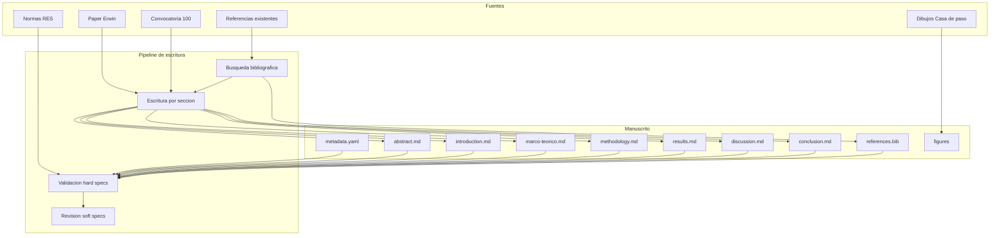
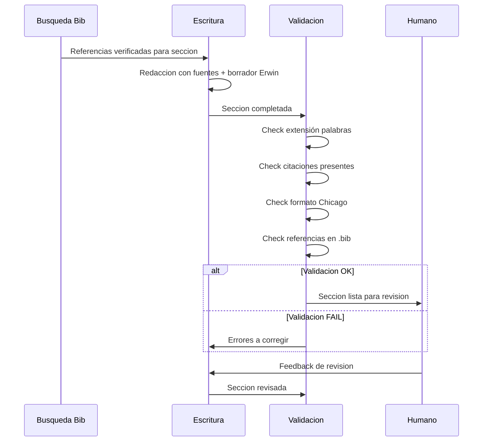
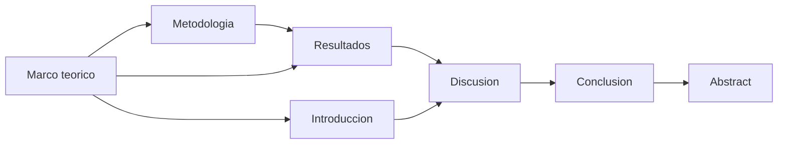
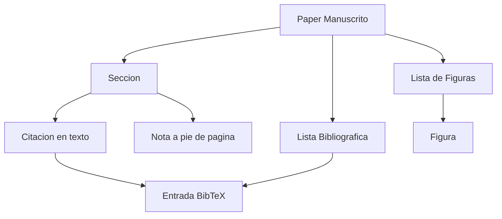

# Design Document — Memorias de casas con piernas

## Overview

Este diseño define la arquitectura editorial del manuscrito **"Memorias de casas con piernas: voces de los que se fueron, voces de los que llegaron"** para la Revista de Estudios Sociales (RES) #100. El paper transforma un borrador narrativo de ~1.500 palabras en un artículo académico completo de investigación-creación (7.000-10.000 palabras) que cumple estrictamente las normas editoriales de la RES y el formato Chicago Author-Date.

**Usuarios**: El autor (Erwin) como investigador-creador, los evaluadores de doble ciego de la RES, y la comunidad académica de ciencias sociales latinoamericanas.

**Impacto**: Genera un manuscrito publicable que posiciona la investigación-creación como metodología legítima en ciencias sociales, dialogando con la convocatoria "Hacer ciencias sociales desde América Latina y el Caribe".

### Goals
- Producir un manuscrito que cumpla al 100% las normas editoriales RES (formato, extensión, citación)
- Mantener la voz artístico-poética del borrador original dentro de una estructura IMRaD rigurosa
- Fundamentar toda afirmación con citaciones verificables en formato Chicago Author-Date
- Integrar la obra visual (dibujos "Casa de paso") como parte constitutiva del argumento
- Vincular explícitamente con al menos dos ejes de la convocatoria RES #100

### Non-Goals
- Generar datos nuevos de investigación (los 60 bitácoras ya existen)
- Producir la versión final diagramada en Word/PDF (se genera en Markdown, la conversión es posterior)
- Gestionar la plataforma OJS de envío
- Obtener consentimientos informados (responsabilidad del autor)
- Convertir las figuras PDF a JPG/TIFF (paso técnico posterior)

## Architecture

### Existing Architecture Analysis

El repositorio tiene una estructura de paper ya scaffoldeada:

- `paper/metadata.yaml`: configuración editorial completa
- `paper/outline.md`: outline detallado con checklist por sección
- `paper/sections/`: 7 archivos .md vacíos (abstract, introduction, marco-teorico, methodology, results, discussion, conclusion)
- `references/references.bib`: 7 entradas bibliográficas base
- `temp_context/`: material fuente (borrador Erwin, normas, convocatoria, dibujos)

**Patrones existentes a respetar**:
- Cada sección es un archivo Markdown independiente
- Metadatos editoriales centralizados en metadata.yaml
- Referencias en formato BibTeX centralizado
- Comentarios HTML para tracking de estado y conteo de palabras

### Architecture Pattern & Boundary Map



**Architecture Integration**:
- Patrón seleccionado: **IMRaD adaptado con voz artística** — estructura académica estándar que incorpora registro poético en puntos estratégicos
- Límites de dominio: cada sección es una unidad atómica de escritura con dependencias explícitas
- Patrones existentes preservados: archivos .md por sección, metadata.yaml centralizado, .bib unificado
- Pipeline: búsqueda bibliográfica → escritura sección por sección → validación automática → revisión humana

### Technology Stack

| Capa | Elección / Versión | Rol | Notas |
|------|-------------------|-----|-------|
| Formato de escritura | Markdown + HTML comments | Secciones del paper con tracking de estado | Conversión final a Word para envío OJS |
| Metadatos | YAML | Configuración editorial centralizada | metadata.yaml |
| Bibliografía | BibTeX (.bib) | Referencias verificables | Validable contra CrossRef/DOI |
| Figuras | PDF → JPG/TIFF 300dpi | Material visual integrado | Conversión pendiente como paso posterior |
| Citación | Chicago Author-Date | Formato exigido por RES | (Apellido año, página) en texto |
| Validación | Scripts de validación | Hard specs automáticas | `scripts/` (a implementar) |

## System Flows

### Flujo de escritura por sección



### Orden de escritura (dependencias entre secciones)



El marco teórico se escribe primero porque establece los conceptos que todas las demás secciones referencian. El abstract se escribe al final porque sintetiza el paper completo.

## Requirements Traceability

| Requirement | Resumen | Componentes | Interfaces | Flujo |
|-------------|---------|-------------|------------|-------|
| 1.1-1.8 | Formato editorial RES | Todas las secciones, metadata.yaml | Validación de formato | Validación global |
| 2.1-2.5 | Resumen bilingüe | abstract.md | — | Se escribe último |
| 3.1-3.8 | Introducción | introduction.md | Cita conceptos de marco-teorico | Después de marco teórico |
| 4.1-4.8 | Marco teórico | marco-teorico.md, references.bib | Fundamenta todas las secciones | Se escribe primero |
| 5.1-5.8 | Metodología | methodology.md, references.bib | Referencia instrumentos de results | Después de marco teórico |
| 6.1-6.5 | Resultados | results.md, figures/ | Fragmentos bitácoras, figuras | Después de metodología |
| 7.1-7.7 | Discusión | discussion.md, references.bib | Interpreta results con marco teórico | Después de resultados |
| 8.1-8.5 | Conclusión | conclusion.md | Sintetiza discussion | Después de discusión |
| 9.1-9.10 | Referencias Chicago | references.bib, todas las secciones | Formato Chicago Author-Date | Continuo |
| 10.1-10.6 | Figuras | figures/, results.md, discussion.md | [Insertar Figura N aquí] | Paralelo a results |
| 11.1-11.5 | Alineación convocatoria | introduction.md, discussion.md | Ejes de convocatoria | Transversal |
| 12.1-12.6 | Coherencia argumentativa | Todas las secciones | Hilo argumental, glosario | Validación final |

## Components and Interfaces

| Componente | Dominio | Intent | Req Coverage | Dependencias Clave | Contratos |
|-----------|---------|--------|-------------|-------------------|-----------|
| metadata.yaml | Config | Centralizar parámetros editoriales | 1.1-1.8 | — | State |
| marco-teorico.md | Sección | Fundamentar conceptualmente la investigación | 4.1-4.8, 9.1-9.10 | references.bib (P0) | Service |
| introduction.md | Sección | Posicionar el paper y establecer contribución | 3.1-3.8, 11.1-11.5 | marco-teorico.md (P0), convocatoria (P1) | Service |
| methodology.md | Sección | Describir enfoque de investigación-creación | 5.1-5.8 | references.bib (P0), marco-teorico.md (P1) | Service |
| results.md | Sección | Presentar arquetipos con evidencia | 6.1-6.5, 10.1-10.6 | methodology.md (P0), figures/ (P0) | Service |
| discussion.md | Sección | Interpretar resultados y dialogar con teoría | 7.1-7.7, 11.1-11.5 | results.md (P0), marco-teorico.md (P0) | Service |
| conclusion.md | Sección | Sintetizar contribución e implicaciones | 8.1-8.5 | discussion.md (P0) | Service |
| abstract.md | Sección | Resumen bilingüe del paper completo | 2.1-2.5 | Todas las secciones (P0) | Service |
| references.bib | Datos | Bibliografía verificable Chicago Author-Date | 9.1-9.10 | CrossRef/DOI (P0) | State |
| figures/ | Datos | Dibujos "Casa de paso" como figuras formales | 10.1-10.6 | temp_context/Dibujos casas (P0) | — |

### Dominio: Secciones del manuscrito

#### marco-teorico.md

| Campo | Detalle |
|-------|---------|
| Intent | Fundamentar la investigación en literatura de fenomenología del habitar, migración y afecto, arte como archivo, e investigación-creación |
| Requirements | 4.1, 4.2, 4.3, 4.4, 4.5, 4.6, 4.7, 4.8 |

**Responsabilidades y restricciones**
- Abordar 5 ejes temáticos: fenomenología del habitar, migración y afecto, prácticas cotidianas y espacio, arte como archivo/repertorio, investigación-creación como metodología
- Mínimo 15 referencias distintas
- Identificar explícitamente el vacío que la investigación llena
- Todas las citas en formato Chicago Author-Date (Apellido año, página)

**Dependencias**
- Outbound: references.bib — todas las citas del marco (P0)
- External: Bases de datos académicas — búsqueda de referencias adicionales (P0)

**Contratos**: Service [x]

##### Service Interface

```
Entradas:
  - Borrador Erwin (sección Introducción + Discusión como fuente de conceptos)
  - Referencias existentes en .bib
  - Nuevas referencias encontradas por búsqueda bibliográfica

Salidas:
  - Texto de ~1.500 palabras en español
  - Mínimo 15 citas distintas en formato (Apellido año, página)
  - Conceptos clave definidos para uso en secciones posteriores
  - Nuevas entradas .bib para referencias añadidas

Precondiciones:
  - Búsqueda bibliográfica completada para los 5 ejes temáticos
  - Referencias verificadas contra CrossRef/DOI

Postcondiciones:
  - Toda cita en texto tiene entrada correspondiente en .bib
  - Vacío de investigación claramente articulado
  - Conceptos de Bachelard, Ahmed, Bajani, De Certeau/Giard, Taylor fundamentados

Invariantes:
  - Formato Chicago Author-Date en todas las citas
  - Extensión 1.200-1.800 palabras
  - Sin secciones vacías
```

**Implementation Notes**
- Integración: Los conceptos definidos aquí (casa como cuerpo vivo, objetos de orientación afectiva, casas con piernas como dispositivo) son el vocabulario compartido de todo el paper
- Validación: Verificar que cada autor citado tiene entrada completa en .bib con nombres completos
- Riesgos: La amplitud temática (5 ejes) puede diluir la profundidad; priorizar los ejes directamente vinculados al argumento central

#### introduction.md

| Campo | Detalle |
|-------|---------|
| Intent | Posicionar el paper dentro de la convocatoria RES #100 y establecer pregunta de investigación, marco conceptual y contribución |
| Requirements | 3.1, 3.2, 3.3, 3.4, 3.5, 3.6, 3.7, 3.8 |

**Responsabilidades y restricciones**
- Presentar contexto migratorio latinoamericano
- Formular pregunta: ¿Qué se pierde y qué permanece cuando migra una casa?
- Establecer "casas con piernas" como metáfora central / dispositivo artístico-antropológico
- Vincular con al menos un eje de la convocatoria RES #100
- Incluir estructura del artículo al final

**Dependencias**
- Inbound: marco-teorico.md — conceptos teóricos ya definidos (P0)
- Outbound: references.bib — citas de conceptos mencionados (P0)
- External: Convocatoria RES #100 — ejes temáticos (P1)

**Contratos**: Service [x]

##### Service Interface

```
Entradas:
  - Borrador Erwin (sección Introducción como fuente principal)
  - Conceptos del marco teórico
  - Ejes de la convocatoria RES #100

Salidas:
  - Texto de ~1.500 palabras en español
  - Pregunta de investigación formulada explícitamente
  - Metáfora "casas con piernas" definida
  - Vinculación con convocatoria articulada
  - Roadmap del artículo (último párrafo)

Precondiciones:
  - Marco teórico completado (conceptos disponibles)

Postcondiciones:
  - Toda mención teórica tiene citación Chicago Author-Date
  - La contribución del paper está claramente articulada
  - Al menos un eje de convocatoria vinculado explícitamente

Invariantes:
  - Extensión 1.200-1.800 palabras
  - Tono: académico con registro poético en la apertura
```

**Implementation Notes**
- Integración: La apertura puede usar fragmentos poéticos del borrador de Erwin ("Cuando una persona migra, también migra una casa") adaptados al registro académico
- Riesgos: No sobrecargar con teoría (eso va en marco teórico); la introducción presenta, no profundiza

#### methodology.md

| Campo | Detalle |
|-------|---------|
| Intent | Describir el enfoque de investigación-creación cualitativa con suficiente detalle para reproducibilidad |
| Requirements | 5.1, 5.2, 5.3, 5.4, 5.5, 5.6, 5.7, 5.8 |

**Responsabilidades y restricciones**
- Definir enfoque como investigación-creación cualitativa
- Describir: 60 participantes, 3 instrumentos (bitácora, diálogo simbólico, dibujo proyectivo), 5 preguntas de la bitácora
- Método de análisis: ensamblaje simbólico y sensible (cartografía afectiva)
- Consideraciones éticas y limitaciones explícitas
- Fundamentar técnicas con citaciones

**Dependencias**
- Inbound: marco-teorico.md — fundamentos de investigación-creación (P1)
- Outbound: references.bib — citas metodológicas (P0)
- Outbound: results.md — los instrumentos producen los datos de resultados (P0)

**Contratos**: Service [x]

##### Service Interface

```
Entradas:
  - Borrador Erwin (sección Metodología como fuente principal)
  - Conceptos metodológicos del marco teórico

Salidas:
  - Texto de ~1.500 palabras en español
  - Las 5 preguntas de la bitácora listadas
  - Consideraciones éticas documentadas
  - Limitaciones reconocidas

Precondiciones:
  - Marco teórico completado (investigación-creación fundamentada)

Postcondiciones:
  - Cada técnica (bitácora, diálogo, dibujo) tiene citación de respaldo
  - Taylor (2003) y Tronto (1993) citados como mínimo

Invariantes:
  - Extensión 1.200-1.800 palabras
  - Detalle suficiente para que un par evaluador valore el rigor
```

**Implementation Notes**
- Integración: Las 5 preguntas exactas del borrador de Erwin se mantienen tal cual (son dato empírico)
- Validación: Verificar que la descripción de participantes es suficientemente detallada sin comprometer anonimato
- Riesgos: "Ensamblaje simbólico y sensible" necesita fundamentación adicional para no parecer vago a evaluadores cuantitativos

#### results.md

| Campo | Detalle |
|-------|---------|
| Intent | Presentar los 5 arquetipos de casas narrativas con evidencia textual y visual |
| Requirements | 6.1, 6.2, 6.3, 6.4, 6.5, 10.1, 10.3, 10.5, 10.6 |

**Responsabilidades y restricciones**
- Presentar al menos 5 casas narrativas: Posguerra, Espíritus, Contemporánea, Padre/Madre, Universo Paralelo
- Incluir fragmentos textuales de bitácoras como evidencia
- Referenciar dibujos con [Insertar Figura N aquí]
- Análisis transversal de patrones y divergencias
- Dibujos como parte constitutiva, no ilustración

**Dependencias**
- Inbound: methodology.md — instrumentos que generaron los datos (P0)
- Inbound: marco-teorico.md — conceptos para interpretar arquetipos (P0)
- Outbound: figures/ — figuras referenciadas (P0)
- Outbound: discussion.md — resultados a interpretar (P0)

**Contratos**: Service [x]

##### Service Interface

```
Entradas:
  - Borrador Erwin (sección Resultados esperados)
  - Fragmentos de bitácoras (proporcionados por el autor)
  - Dibujos "Casa de paso 1-5"

Salidas:
  - Texto de ~2.000 palabras en español
  - 5 arquetipos presentados con fragmentos textuales
  - Al menos 3 referencias a figuras: [Insertar Figura N aquí]
  - Análisis transversal al final de la sección

Precondiciones:
  - Metodología completada
  - Figuras disponibles y numeradas

Postcondiciones:
  - Cada arquetipo tiene al menos un fragmento de bitácora como evidencia
  - Toda figura referenciada en texto tiene archivo correspondiente
  - Análisis transversal identifica al menos 2 patrones comunes y 2 divergencias

Invariantes:
  - Extensión 1.600-2.400 palabras
  - Los fragmentos de bitácora se presentan como cita textual (cita larga si >4 líneas)
```

**Implementation Notes**
- Integración: Los 5 arquetipos del borrador de Erwin se mantienen; se expanden con evidencia textual real de las bitácoras
- Riesgos: Dependencia crítica del autor para proporcionar fragmentos reales de bitácoras (el borrador solo tiene descripciones generales)

#### discussion.md

| Campo | Detalle |
|-------|---------|
| Intent | Interpretar resultados a la luz de la teoría y dialogar con la convocatoria RES #100 |
| Requirements | 7.1, 7.2, 7.3, 7.4, 7.5, 7.6, 7.7, 11.1, 11.2, 11.3, 11.4, 11.5 |

**Responsabilidades y restricciones**
- Argumento central: migrar es transformación del habitar, no solo desplazamiento
- Abordar "migraciones invisibles"
- Interpretar dibujos como tecnologías sensibles de memoria (Sturken 1997)
- Vincular con eje convocatoria: hacer ciencias sociales desde América Latina
- Posicionar investigación-creación como producción legítima de conocimiento
- Limitaciones y trabajo futuro

**Dependencias**
- Inbound: results.md — arquetipos a interpretar (P0)
- Inbound: marco-teorico.md — teoría para dialogar (P0)
- Inbound: introduction.md — pregunta de investigación a responder (P1)
- Outbound: references.bib — citas interpretativas (P0)

**Contratos**: Service [x]

##### Service Interface

```
Entradas:
  - Resultados (arquetipos y análisis transversal)
  - Marco teórico (conceptos para interpretación)
  - Borrador Erwin (sección Discusión como fuente)
  - Ejes de convocatoria RES #100

Salidas:
  - Texto de ~1.500 palabras en español
  - Interpretación de cada arquetipo a la luz de la teoría
  - Concepto de "migraciones invisibles" desarrollado
  - Vinculación explícita con convocatoria
  - Limitaciones y líneas futuras

Precondiciones:
  - Resultados completados
  - Marco teórico disponible para diálogo

Postcondiciones:
  - La pregunta de investigación tiene respuesta argumentada
  - Al menos 2 ejes de convocatoria vinculados
  - Limitaciones reconocidas (mínimo 2)
  - Al menos 1 línea de trabajo futuro

Invariantes:
  - Extensión 1.200-1.800 palabras
  - No introduce datos nuevos no presentados en resultados
```

**Implementation Notes**
- Integración: El concepto de "migrante en su propio país" (borrador Erwin, caso de la madre de Daniel) es un hallazgo clave que debe desarrollarse
- Riesgos: La discusión debe evitar repetir resultados; debe interpretar, no redescribir

#### conclusion.md

| Campo | Detalle |
|-------|---------|
| Intent | Sintetizar contribución, implicaciones y reflexión final |
| Requirements | 8.1, 8.2, 8.3, 8.4, 8.5 |

**Responsabilidades y restricciones**
- Sintetizar: casa como archivo sensible, migración como creación simbólica
- Contribución al campo: arte + antropología + ciencias sociales
- Implicaciones prácticas
- Reflexión final sobre "casas con piernas"
- No introducir información nueva

**Dependencias**
- Inbound: discussion.md — argumentos a sintetizar (P0)

**Contratos**: Service [x]

##### Service Interface

```
Entradas:
  - Discusión completada
  - Argumento central del paper

Salidas:
  - Texto de ~500 palabras en español
  - Cierre con metáfora de casas con piernas

Precondiciones:
  - Discusión completada

Postcondiciones:
  - Toda información mencionada fue discutida previamente
  - Contribución claramente articulada

Invariantes:
  - Extensión 400-600 palabras
  - Tono: síntesis con registro poético en el cierre
```

#### abstract.md

| Campo | Detalle |
|-------|---------|
| Intent | Sintetizar el paper completo en resumen bilingüe |
| Requirements | 2.1, 2.2, 2.3, 2.4, 2.5 |

**Responsabilidades y restricciones**
- Resumen en español: 250-300 palabras con objetivo/contexto, metodología, conclusiones, originalidad
- Resumen en inglés: 250-300 palabras (mismos elementos)
- 4-6 palabras clave en español e inglés
- Sin citaciones ni abreviaciones

**Dependencias**
- Inbound: Todas las secciones (P0) — se escribe al final

**Contratos**: Service [x]

##### Service Interface

```
Entradas:
  - Paper completo (todas las secciones finalizadas)
  - Palabras clave de metadata.yaml

Salidas:
  - Resumen español 250-300 palabras
  - Resumen inglés 250-300 palabras
  - Palabras clave ES (4-6)
  - Palabras clave EN (4-6)

Precondiciones:
  - Todas las secciones del paper completadas y validadas

Postcondiciones:
  - Sin citaciones ni abreviaciones
  - Los 4 elementos presentes: objetivo, metodología, conclusiones, originalidad

Invariantes:
  - Extensión: 250-300 palabras por idioma (estrictamente)
```

### Dominio: Datos y referencias

#### references.bib

| Campo | Detalle |
|-------|---------|
| Intent | Centralizar todas las referencias bibliográficas en formato BibTeX verificable |
| Requirements | 9.1, 9.2, 9.3, 9.4, 9.5, 9.6, 9.7, 9.8, 9.9, 9.10 |

**Responsabilidades y restricciones**
- Formato Chicago Author-Date (BibTeX como almacenamiento, formato de salida Chicago)
- 20-30 referencias totales
- Nombres completos de autores
- DOI cuando disponible
- Relación 1:1 con citas en texto
- Orden alfabético
- Verificación contra CrossRef/DOI

**Dependencias**
- External: CrossRef/DOI — verificación de referencias (P0)
- External: Google Scholar, Semantic Scholar, PubMed — búsqueda de nuevas referencias (P1)

**Contratos**: State [x]

##### State Management

```
Estado actual: 7 entradas (ahmed1999, bachelard1957, bajani2022, decerteau1994, sturken1997, taylor2003, tronto1993)
Estado target: 20-30 entradas

Campos obligatorios por entrada:
  - author (nombres completos)
  - title
  - year
  - publisher / journal (según tipo)
  - doi (cuando disponible)
  - pages (cuando aplicable)
  - address (para libros)

Campos opcionales:
  - isbn, url, volume, number

Consistencia: toda entrada en .bib debe ser citada en alguna sección del paper, y viceversa
Verificación: cada entrada debe validarse contra CrossRef. Las no verificables se marcan con nota
```

**Implementation Notes**
- Integración: Cada sección que añade citas debe actualizar .bib simultáneamente
- Validación: Script de validación para verificar relación 1:1 y completitud de campos
- Riesgos: Algunas fuentes (Bajani 2022 — novela, no académico) pueden no tener DOI. Marcar para revisión manual

## Data Models

### Domain Model



**Entidades**:
- **Paper**: agregado raíz, contiene todas las secciones y listas
- **Section**: unidad atómica de escritura (abstract, introduction, etc.)
- **Citation**: referencia en texto formato (Apellido año, página)
- **BibEntry**: entrada completa en references.bib
- **Figure**: imagen con número secuencial, título y referencia en texto
- **FootNote**: nota a pie de página con formato TNR 10, espacio sencillo

**Invariantes**:
- Toda Citation tiene exactamente una BibEntry correspondiente
- Toda BibEntry tiene al menos una Citation en alguna Section
- Toda Figure tiene al menos una referencia [Insertar Figura N aquí] en alguna Section
- La suma de palabras de todas las Sections está entre 7.000 y 10.000

## Testing Strategy

### Validación automática (Hard Specs)
- **Conteo de palabras**: Total 7.000-10.000; abstract 250-300 por idioma; cada sección dentro de su rango target
- **Citaciones presentes**: Toda afirmación teórica/factual tiene (Apellido año) o (Apellido año, página)
- **Referencias 1:1**: Todo (Apellido año) en texto tiene entrada en .bib; toda entrada en .bib es citada
- **DOI verificable**: Cada entrada con DOI se valida contra CrossRef
- **Formato Chicago**: Citas en texto y bibliografía siguen el formato exacto documentado en normas.md
- **Figuras referenciadas**: Todo [Insertar Figura N aquí] tiene archivo correspondiente
- **Sin op. cit./ibid.**: Búsqueda negativa en todo el texto
- **Palabras clave**: 4-6 en español y en inglés
- **Título bilingüe**: Presente en español e inglés

### Validación de revisión (Soft Specs — requieren humano)
- **Coherencia argumentativa**: Hilo desde introducción hasta conclusión
- **Contribución clara**: ¿Se entiende qué aporta este paper?
- **Metodología reproducible**: ¿Un par evaluador puede evaluar el rigor?
- **Tono artístico-académico**: ¿El registro es coherente y apropiado?
- **Vinculación con convocatoria**: ¿Es explícita y convincente?

## Optional Sections

### Consideraciones éticas
- Consentimiento informado de los 60 participantes (responsabilidad del autor, no del manuscrito)
- Anonimización de fragmentos de bitácoras
- Permisos de publicación de dibujos
- Mención de aprobación ética en la sección de Metodología
