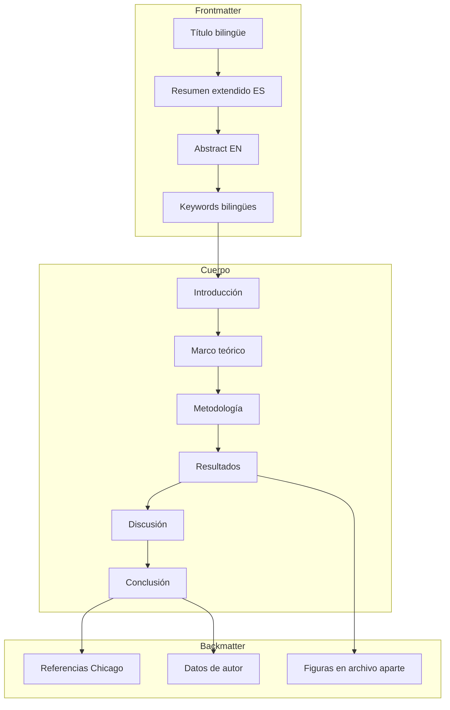
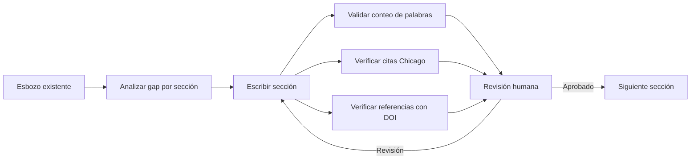
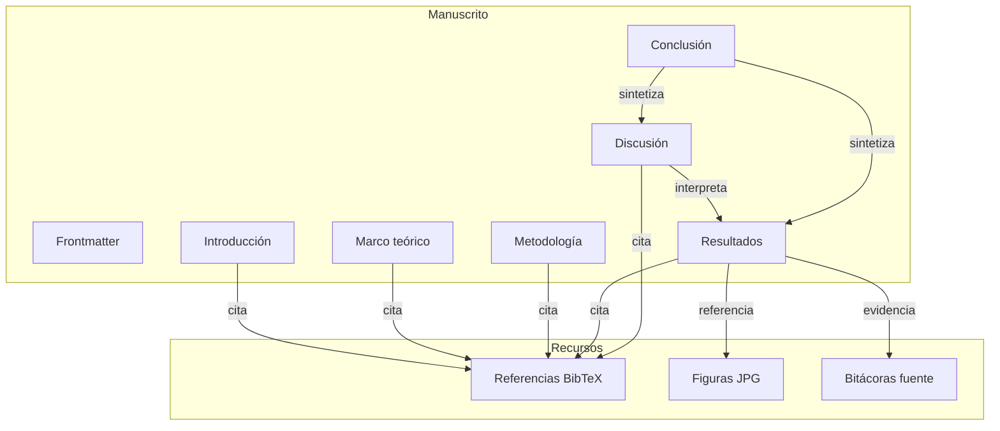

# Design Document: paper-memorias-casas-piernas-res100

## Overview

**Purpose**: Completar el manuscrito "Memorias de casas con piernas: voces de los que se fueron, voces de los que llegaron" para envío a la Revista de Estudios Sociales (RES) #100 de la Universidad de los Andes. El paper transforma un esbozo de ~1.200 palabras en un artículo completo de 7.000-10.000 palabras en estructura IMRaD extendida, cumpliendo todas las normas editoriales de la RES.

**Users**: El autor-investigador (Erwin) y los evaluadores de la RES (pares ciegos).

**Impact**: Transforma material disperso (esbozo, 60 bitácoras, dibujos, obras visuales) en un artículo académico publicable que posiciona la investigación-creación como metodología legítima en ciencias sociales latinoamericanas.

### Goals
- Manuscrito completo en estructura IMRaD extendida (7.000-10.000 palabras)
- Cumplimiento total de normas RES: Chicago autor-fecha, bilingüismo, formato
- Integración rigurosa de material visual (3-5 figuras con análisis)
- Alineación explícita con convocatoria RES #100 (migración desde América Latina)
- Al menos 20 referencias verificables con DOI cuando disponible

### Non-Goals
- Traducción completa del artículo al inglés o portugués (solo título, resumen y keywords bilingües)
- Publicación en otras revistas simultáneamente
- Análisis cuantitativo o estadístico de las bitácoras
- Creación de nuevas obras visuales; se trabaja con material existente
- Maquetación final (la RES se encarga de la diagramación)

## Architecture

### Análisis de la arquitectura existente

El esbozo actual (`temp_context/paper_Erwin_23_Junio_2025.md`) presenta:
- Estructura IMRaD incompleta: resumen breve, introducción, metodología, discusión, "resultados esperados", conclusión
- Marco teórico ausente como sección independiente
- Resultados etiquetados como "esperados (supuesto)" — no son resultados reales
- 7 referencias en formato APA (no Chicago)
- Sin elementos bilingües (título, resumen, keywords solo en español)
- Sin figuras integradas formalmente

### Patrón arquitectónico: IMRaD extendido

Se adopta la estructura IMRaD extendida con marco teórico como sección independiente. Esta variación es estándar en ciencias sociales y humanidades, donde la fundamentación conceptual requiere desarrollo propio.



**Decisiones de arquitectura**:
- Marco teórico separado entre introducción y metodología (ver `research.md`, Decisión: Estructura del manuscrito)
- Figuras numeradas en archivo aparte según normas RES, con marcadores [Insertar Figura N aquí] en el texto
- Referencias migradas de APA a Chicago autor-fecha

### Technology Stack

| Capa | Herramienta | Rol | Notas |
|------|-------------|-----|-------|
| Escritura | Markdown (.md) en `paper/` | Drafting y versionamiento | Se exporta a Word (.docx) para envío |
| Bibliografía | `references/references.bib` (BibTeX) | Gestión de referencias | Formato Chicago autor-fecha |
| Figuras | JPG/TIFF 300 DPI | Material visual | Archivos aparte en `figures/` |
| Validación | Scripts en `scripts/` | Conteo de palabras, verificación de citas | Validaciones hard del CLAUDE.md |
| Compilación | Quarto / Pandoc | Conversión Markdown → Word | Template RES si disponible |

## System Flows

### Flujo de escritura por sección



## Requirements Traceability

| Requirement | Resumen | Componente | Sección del manuscrito |
|-------------|---------|------------|----------------------|
| 1.1-1.7 | Formato y estructura general | Manuscrito completo | Todas las secciones |
| 2.1-2.3 | Título bilingüe | Frontmatter | Título |
| 3.1-3.4 | Resumen extendido bilingüe | Frontmatter | Resumen / Abstract |
| 4.1-4.3 | Palabras clave bilingües | Frontmatter | Keywords |
| 5.1-5.6 | Introducción con gap e hipótesis | Cuerpo | Introducción |
| 6.1-6.5 | Marco teórico | Cuerpo | Marco teórico |
| 7.1-7.7 | Metodología reproducible | Cuerpo | Metodología |
| 8.1-8.6 | Resultados con análisis riguroso | Cuerpo | Resultados |
| 9.1-9.6 | Discusión con limitaciones | Cuerpo | Discusión |
| 10.1-10.3 | Conclusión | Cuerpo | Conclusión |
| 11.1-11.8 | Referencias Chicago autor-fecha | Backmatter | Referencias |
| 12.1-12.6 | Material visual | Backmatter + Cuerpo | Figuras + marcadores en texto |
| 13.1-13.4 | Alineación convocatoria RES #100 | Transversal | Introducción, discusión, conclusión |
| 14.1-14.2 | Datos de autor | Backmatter | Archivo aparte |
| 15.1-15.4 | Consideraciones éticas | Cuerpo | Metodología |

## Components and Interfaces

| Componente | Dominio | Intent | Req Coverage | Dependencias | Archivo |
|-----------|---------|--------|--------------|-------------|---------|
| Frontmatter | Metadatos | Título, resúmenes y keywords bilingües | 2, 3, 4 | — | `paper/00-frontmatter.md` |
| Introducción | Cuerpo | Problema, gap, hipótesis, alcance | 5, 13 | Marco teórico | `paper/01-introduccion.md` |
| Marco teórico | Cuerpo | Fundamentación conceptual tripartita | 6 | Referencias | `paper/02-marco-teorico.md` |
| Metodología | Cuerpo | Diseño, participantes, técnicas, ética | 7, 15 | Marco teórico | `paper/03-metodologia.md` |
| Resultados | Cuerpo | Arquetipos, evidencia, figuras | 8, 12 | Bitácoras, dibujos | `paper/04-resultados.md` |
| Discusión | Cuerpo | Interpretación, limitaciones, futuro | 9, 13 | Marco teórico, resultados | `paper/05-discusion.md` |
| Conclusión | Cuerpo | Síntesis y contribución | 10, 13 | Resultados, discusión | `paper/06-conclusion.md` |
| Referencias | Backmatter | Bibliografía Chicago autor-fecha | 11 | Todas las secciones | `references/references.bib` |
| Figuras | Backmatter | Material visual con pies descriptivos | 12 | Resultados | `figures/` |
| Datos de autor | Backmatter | Información complementaria para envío | 14 | — | `paper/datos-autor.md` |

### Frontmatter

#### Componente: Frontmatter (00-frontmatter.md)

| Campo | Detalle |
|-------|--------|
| Intent | Contener título bilingüe, resúmenes extendidos (ES/EN) y palabras clave bilingües |
| Requirements | 2.1, 2.2, 2.3, 3.1, 3.2, 3.3, 3.4, 4.1, 4.2, 4.3 |

**Responsabilidades y restricciones**
- Título en español y en inglés, concisos y descriptivos
- Resumen extendido ES: 250-300 palabras con objetivo/contexto, metodología, conclusiones, originalidad
- Abstract EN: 250-300 palabras, traducción del resumen con los mismos 4 elementos
- Sin citaciones ni abreviaciones en los resúmenes
- 4-6 palabras clave en español y en inglés

**Estructura del contenido**:
```
Título en español
Title in English

Resumen (250-300 palabras)
[Objetivo/contexto] [Metodología] [Conclusiones] [Originalidad]

Palabras clave: migración; memoria; hogar; investigación-creación; dibujo proyectivo; Santiago de Chile

Abstract (250-300 words)
[Objective/context] [Methodology] [Conclusions] [Originality]

Keywords: migration; memory; home; research-creation; projective drawing; Santiago de Chile
```

### Cuerpo del manuscrito

#### Componente: Introducción (01-introduccion.md)

| Campo | Detalle |
|-------|--------|
| Intent | Establecer problema de investigación, gap, hipótesis y alcance |
| Requirements | 5.1, 5.2, 5.3, 5.4, 5.5, 5.6, 13.1, 13.4 |

**Responsabilidades y restricciones**
- Extensión objetivo: ~1.000 palabras
- Identificar el gap: escasez de enfoques artísticos-sensoriales en estudios migratorios latinoamericanos
- Hipótesis central: la casa como entidad viva que migra con la persona, portadora de memoria y afecto
- Alcance: 60 bitácoras + dibujos proyectivos en Santiago de Chile
- Contextualizar en la convocatoria RES #100: migración como problema contemporáneo desde ciencias sociales latinoamericanas
- Describir brevemente la estructura del artículo
- Mínimo 5 referencias verificables

**Estructura argumentativa**:
1. Apertura: contexto migratorio en Chile y América Latina
2. Problema: la migración vista solo como desplazamiento territorial, no como transformación del habitar
3. Gap: pocos estudios integran arte, memoria y migración desde una perspectiva sensorial-afectiva
4. Pregunta/hipótesis: ¿puede la personificación simbólica de la casa revelar dimensiones invisibles de la experiencia migratoria?
5. Objetivo y alcance de la investigación-creación
6. Contribución: la metáfora de "casas con piernas" como herramienta conceptual
7. Mapa del artículo

#### Componente: Marco teórico (02-marco-teorico.md)

| Campo | Detalle |
|-------|--------|
| Intent | Fundamentar conceptualmente la investigación en tres ejes |
| Requirements | 6.1, 6.2, 6.3, 6.4, 6.5 |

**Responsabilidades y restricciones**
- Extensión objetivo: ~1.500 palabras
- Tres ejes conceptuales obligatorios:
  - (a) Migración y desplazamiento: teorías de movilidad, experiencia migratoria en América Latina
  - (b) Memoria y habitar: Bachelard (poética del espacio), Ahmed (objetos de orientación afectiva), Bajani (casas que recuerdan), De Certeau (prácticas cotidianas)
  - (c) Investigación-creación / arte como archivo: Taylor (archivo y repertorio), Borgdorff (investigación artística), tradición latinoamericana de investigación-creación
- Mínimo 15 referencias verificables (con DOI o en bases de datos)
- Diálogo con autores latinoamericanos y del Sur Global (no solo tradición europea)
- Definir conceptos clave: "casa con piernas", investigación-creación, bitácora, dibujo proyectivo, cartografía afectiva

**Autores clave por eje**:
- Eje (a): Sayad, Sassen, Tijoux (Chile), Stefoni (Chile), Grimson
- Eje (b): Bachelard, Ahmed, Bajani, De Certeau y Giard, Heidegger (habitar), Sturken (memoria)
- Eje (c): Taylor, Borgdorff, Tronto (ética del cuidado), Hernández (investigación-creación en Colombia)

#### Componente: Metodología (03-metodologia.md)

| Campo | Detalle |
|-------|--------|
| Intent | Describir el diseño completo de la investigación-creación |
| Requirements | 7.1, 7.2, 7.3, 7.4, 7.5, 7.6, 7.7, 15.1, 15.2, 15.3, 15.4 |

**Responsabilidades y restricciones**
- Extensión objetivo: ~1.200 palabras
- Diseño: investigación-creación, enfoque cualitativo, paradigma interpretativo
- Participantes: 60 personas migrantes, diversas edades y procedencias, residentes en Santiago de Chile; incluir criterios de selección (muestreo intencional/bola de nieve)
- Tres etapas detalladas:
  1. Cuadernillo/bitácora con 5 preguntas: definición de casa, casa antes de partir, qué llevó consigo, casa actual, casa soñada
  2. Encuentros de diálogo simbólico (entrevistas sensibles)
  3. Dibujo proyectivo: dos casas (antes de partir / casa soñada)
- Análisis: ensamblaje simbólico, análisis proyectivo del dibujo, categorización temática emergente
- Fundamentación: arte como archivo (Taylor 2003), ética del cuidado (Tronto 1993), dibujo proyectivo (Hammer 1958 o referencia equivalente)
- Ética: consentimiento informado, protocolo ético, manejo de testimonios sensibles, anonimato

#### Componente: Resultados (04-resultados.md)

| Campo | Detalle |
|-------|--------|
| Intent | Presentar hallazgos organizados por arquetipos con evidencia |
| Requirements | 8.1, 8.2, 8.3, 8.4, 8.5, 8.6, 12.1, 12.2, 12.4, 12.6 |

**Responsabilidades y restricciones**
- Extensión objetivo: ~1.800 palabras (sección más extensa)
- Organización por arquetipos de casas narrativas (categorías emergentes):
  1. **Casa Posguerra**: desplazamientos forzados, pérdida, duelo, reconstrucción
  2. **Casa de los Espíritus**: exilios políticos, refugio espiritual, resistencia
  3. **Casa Contemporánea**: migraciones recientes, crisis climáticas/sociales/económicas, precariedad
  4. **Casa Padre/Madre**: vínculos afectivos familiares que viajan con el cuerpo
  5. **Casa Universo Paralelo**: identidades múltiples, formas híbridas de habitar
- Cada arquetipo: descripción + cita directa de participante + análisis de dibujo(s)
- Patrones recurrentes en dibujos: elementos simbólicos (vegetación, color, tamaño, personas, animales), diferencias casa origen vs. casa soñada
- Mínimo 3 figuras integradas con marcadores [Insertar Figura N aquí] y pies descriptivos
- Distinguir hallazgos descriptivos de interpretativos

**Figuras seleccionadas** (ver `research.md`, Decisión: Selección de figuras):
- Figura 1: *Caminante* (obra del autor) — metáfora central
- Figura 2: Casa de paso 2 — contraste casa origen vs. soñada
- Figura 3: Casa de paso 3 (Isabel) — hogar como bienestar colectivo
- Figura 4: Casa de paso 5 (Norma Romero) — identidad y memoria
- Figura 5: *Casa Padre* (obra del autor) — herencia habitacional

#### Componente: Discusión (05-discusion.md)

| Campo | Detalle |
|-------|--------|
| Intent | Interpretar resultados, dialogar con literatura, identificar limitaciones |
| Requirements | 9.1, 9.2, 9.3, 9.4, 9.5, 9.6, 13.2, 13.3 |

**Responsabilidades y restricciones**
- Extensión objetivo: ~1.200 palabras
- Interpretar arquetipos a la luz del marco teórico (Bachelard, Ahmed, Bajani, Taylor, De Certeau)
- Diálogo con literatura sobre migración en Chile y América Latina (Tijoux, Stefoni, Grimson)
- Contribución original: "casas con piernas" como herramienta conceptual para estudios migratorios
- Reflexión sobre investigación-creación como metodología emergente en ciencias sociales de la región
- Mínimo 3 limitaciones:
  1. Muestra no representativa (60 personas, muestreo intencional)
  2. Contexto geográfico único (Santiago de Chile)
  3. Alcance metodológico: análisis simbólico-interpretativo, no generalizable
- Líneas futuras de investigación
- Implicaciones para ciencias sociales latinoamericanas (convocatoria RES #100)

#### Componente: Conclusión (06-conclusion.md)

| Campo | Detalle |
|-------|--------|
| Intent | Sintetizar hallazgos y contribución |
| Requirements | 10.1, 10.2, 10.3, 13.1 |

**Responsabilidades y restricciones**
- Extensión objetivo: ~400 palabras
- Síntesis de principales hallazgos sin información nueva
- Reafirmación de la contribución: la metáfora de casas con piernas como lente para comprender la experiencia migratoria
- Conexión con el contexto más amplio de hacer ciencias sociales desde América Latina

### Backmatter

#### Componente: Referencias (references.bib)

| Campo | Detalle |
|-------|--------|
| Intent | Bibliografía completa en formato Chicago autor-fecha |
| Requirements | 11.1, 11.2, 11.3, 11.4, 11.5, 11.6, 11.7, 11.8 |

**Responsabilidades y restricciones**
- Formato: Chicago Manual of Style "Author-Date"
- Relación 1:1 con citas en texto
- Orden alfabético por apellido del primer autor
- Nombres completos de autores/editores
- DOI incluido cuando existe
- Sin op. cit., ibid. ni ibidem
- Citas en texto: (Apellido año, página)
- Mínimo 20 referencias verificables
- Validar existencia en CrossRef/Semantic Scholar

#### Componente: Figuras (figures/)

| Campo | Detalle |
|-------|--------|
| Intent | Material visual en formato publicable con metadatos |
| Requirements | 12.1, 12.2, 12.3, 12.4, 12.5, 12.6 |

**Responsabilidades y restricciones**
- 5 figuras seleccionadas (ver Resultados)
- Formato: JPG o TIFF, 300 DPI, 240 píxeles mínimo
- Archivos aparte, no incrustados en el texto
- Numeración secuencial (Figura 1 a Figura 5)
- Pie de figura descriptivo con fuente y créditos
- Permisos: obras del autor (autoría propia), dibujos de participantes (consentimiento informado)
- Marcadores en texto: [Insertar Figura N aquí]

#### Componente: Datos de autor (datos-autor.md)

| Campo | Detalle |
|-------|--------|
| Intent | Información complementaria para envío a la RES |
| Requirements | 14.1, 14.2 |

**Responsabilidades y restricciones**
- Archivo aparte con: título académico, afiliación institucional, grupo/líneas de investigación, últimas 2 publicaciones, correo electrónico
- Procedencia del artículo: proyecto de investigación, institución financiadora (si aplica)

## Data Models

### Modelo de dominio

El manuscrito se modela como un conjunto de secciones interconectadas por referencias cruzadas (citas, figuras, conceptos):



### Estructura de archivos

```
paper/
├── 00-frontmatter.md      (título, resúmenes, keywords)
├── 01-introduccion.md
├── 02-marco-teorico.md
├── 03-metodologia.md
├── 04-resultados.md
├── 05-discusion.md
├── 06-conclusion.md
└── datos-autor.md

references/
└── references.bib          (Chicago autor-fecha, ≥20 entradas)

figures/
├── figura-01-caminante.jpg
├── figura-02-casa-paso-2.jpg
├── figura-03-casa-paso-3.jpg
├── figura-04-casa-paso-5.jpg
└── figura-05-casa-padre.jpg
```

## Testing Strategy

### Validaciones hard (automatizables)
- **Conteo de palabras**: total entre 7.000 y 10.000 (script `scripts/`)
- **Resúmenes**: cada uno entre 250 y 300 palabras, sin citas ni abreviaciones
- **Keywords**: 4-6 en cada idioma
- **Citas Chicago**: formato (Apellido año, página) en texto; sin op. cit./ibid.
- **Relación 1:1**: toda cita en texto tiene entrada en bibliografía y viceversa
- **DOI**: incluido en referencias cuando existe (validar contra CrossRef)
- **Figuras**: marcadores [Insertar Figura N aquí] presentes para cada figura; archivos en formato y resolución correctos
- **Formato**: verificar que no hay secciones vacías ni bajo mínimo

### Validaciones soft (revisión humana)
- Coherencia argumentativa entre secciones
- Contribución claramente articulada
- Metodología reproducible
- Discusión aborda limitaciones
- Conclusiones soportadas por resultados
- Lenguaje académico accesible
- Tono adecuado para la RES

### Revisión pre-envío
- Lectura completa del manuscrito por el autor
- Verificación de traducciones (título, resumen, keywords)
- Confirmación de permisos de imágenes
- Revisión de formato Word final (TNR 12pt, interlineado 1.5, márgenes 2.5 cm)
