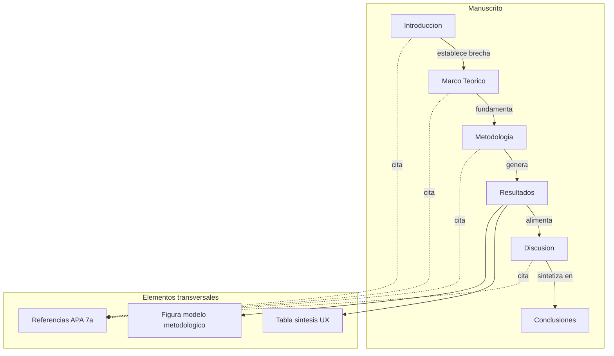
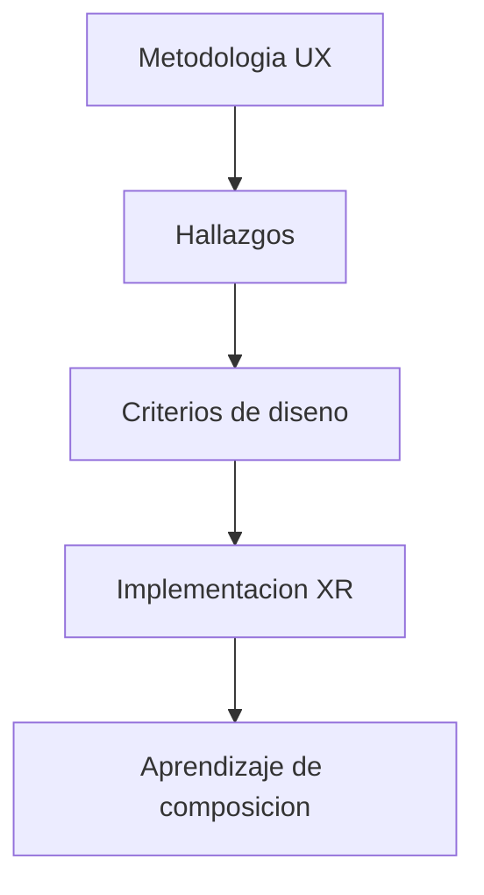

# Documento de diseño — paper-neurodivergencia-xr-sigradi

## Visión general

**Propósito**: Este artículo científico entrega un modelo metodológico UX transferible para el diseño de entornos XR inclusivos dirigidos a estudiantes neurodivergentes en formación de arquitectura y diseño.

**Usuarios**: Investigadores en educación inclusiva, diseño de entornos inmersivos y tecnologías XR aplicadas a la docencia; revisores y audiencia de SIGraDi 2026.

**Impacto**: Trasciende la descripción de un caso de estudio (DirexLab) para proponer criterios de diseño generalizables, derivados de hallazgos empíricos de un proceso UX cíclico de dos años.

### Objetivos
- Articular una contribución metodológica clara: flujo UX → Hallazgos → Criterios de diseño → Implementación XR → Aprendizaje de composición
- Cumplir con los requisitos formales de SIGraDi (2.500–3.500 palabras, español, APA 7a edición)
- Sostener cada afirmación con citación verificable
- Integrar evidencia teórica (Siervo Briones, 2026) con hallazgos empíricos del proceso de co-creación

### No-objetivos
- Describir en detalle el mundo XR construido (no es un artículo de portafolio)
- Realizar análisis estadístico cuantitativo (los datos son cualitativos de proceso UX)
- Proponer un framework tecnológico o tutorial de implementación XR
- Cubrir neurodivergencias más allá de TDAH, TEA y la comparación con neurotípicos

## Arquitectura

### Patrón argumentativo y mapa de secciones

La arquitectura del manuscrito sigue un patrón IMRaD adaptado con seis secciones secuenciales. Cada sección tiene un rol argumentativo preciso y conexiones explícitas con las adyacentes.

**Integración arquitectónica**:
- Patrón seleccionado: IMRaD adaptado con Marco Teórico separado (estándar en ciencias sociales y diseño)
- Límites de sección: cada sección tiene extensión especificada y contenido delimitado para evitar redundancia
- Elementos transversales: referencias (APA 7a), tabla síntesis y figura del modelo cruzan múltiples secciones

### Pila tecnológica

| Capa | Elección / Versión | Rol en el artículo | Notas |
|------|-------------------|---------------------|-------|
| Formato de escritura | Markdown (.md) | Redacción del manuscrito | Convertible a Quarto/LaTeX |
| Referencias | BibTeX (.bib) | Gestión bibliográfica | APA 7a edición |
| Figuras | Mermaid / PNG exportado | Diagrama del modelo metodológico | Exportar a 300 DPI para envío |
| Tablas | Markdown nativo | Tabla síntesis UX | Convertible a cualquier formato |
| Validación | Scripts del proyecto | Conteo de palabras, verificación de citas | `scripts/` existentes |

## Flujos del sistema

### Flujo de construcción del manuscrito

```mermaid
graph LR
    subgraph Fase 1 - Estructura
        F1A[Crear archivo base con secciones]
        F1B[Configurar references.bib]
    end

    subgraph Fase 2 - Contenido por seccion
        F2A[Introduccion]
        F2B[Marco Teorico]
        F2C[Metodologia]
        F2D[Resultados con tabla y figura]
        F2E[Discusion]
        F2F[Conclusiones]
    end

    subgraph Fase 3 - Validacion
        F3A[Conteo de palabras por seccion]
        F3B[Verificacion de citas]
        F3C[Coherencia argumentativa]
    end

    F1A --> F1B
    F1B --> F2A
    F2A --> F2B
    F2B --> F2C
    F2C --> F2D
    F2D --> F2E
    F2E --> F2F
    F2F --> F3A
    F3A --> F3B
    F3B --> F3C
```

**Decisiones clave del flujo**:
- La escritura es secuencial (cada sección depende de la anterior para mantener coherencia argumentativa)
- La tabla síntesis y la figura del modelo se crean en la fase de Resultados pero se referencian también en Metodología y Conclusiones
- La validación es un gate final antes de revisión humana

## Trazabilidad de requerimientos

| Requerimiento | Resumen | Componentes | Interfaces | Flujo |
|---------------|---------|-------------|------------|-------|
| 1.1–1.5 | Estructura IMRaD, extensión, idioma, palabras clave | Archivo base del manuscrito | Plantilla de secciones | Fase 1 |
| 2.1–2.7 | Introducción: problema, brecha, hipótesis, contribución | Sección Introducción | Conexión con Marco Teórico | Fase 2 |
| 3.1–3.6 | Marco Teórico: discusión 6 ejes, brecha, Siervo Briones | Sección Marco Teórico | Conexión con Metodología | Fase 2 |
| 4.1–4.8 | Metodología: DirexLab, participantes, 5 etapas UX, diagrama | Sección Metodología | Conexión con Resultados | Fase 2 |
| 5.1–5.10 | Resultados: 7 hallazgos, tabla síntesis | Sección Resultados, Tabla, Figura | Conexión con Discusión | Fase 2 |
| 6.1–6.5 | Discusión: comparación, contribución diferencial, limitaciones | Sección Discusión | Conexión con Conclusiones | Fase 2 |
| 7.1–7.4 | Conclusiones: conocimiento generado, líneas futuras | Sección Conclusiones | Cierre argumentativo | Fase 2 |
| 8.1–8.5 | Referencias APA 7a, verificabilidad | references.bib | Citaciones en texto | Transversal |
| 9.1–9.4 | Figura del modelo, tabla síntesis, referencias cruzadas | Elementos gráficos | Integración en Resultados | Fase 2 |
| 10.1–10.6 | Coherencia, terminología, calidad, no afirmaciones falsas | Validación transversal | Chequeos automáticos | Fase 3 |

## Componentes e interfaces

### Resumen de componentes

| Componente | Dominio | Propósito | Req. cubiertos | Dependencias clave | Contratos |
|-----------|---------|-----------|---------------|-------------------|-----------|
| Archivo base del manuscrito | Estructura | Plantilla con secciones y metadatos | 1.1–1.5 | Ninguna | Plantilla |
| Sección Introducción | Contenido | Problema, brecha, hipótesis, contribución | 2.1–2.7 | references.bib (P0) | Contenido, Citas |
| Sección Marco Teórico | Contenido | Discusión 6 ejes conceptuales, brecha | 3.1–3.6 | references.bib (P0), extracto-libro (P1) | Contenido, Citas |
| Sección Metodología | Contenido | Caso DirexLab, 5 etapas UX, participantes | 4.1–4.8 | Figura modelo (P1) | Contenido, Citas |
| Sección Resultados | Contenido | 7 hallazgos, criterios emergentes | 5.1–5.10 | Tabla síntesis (P0), Figura modelo (P0) | Contenido, Citas |
| Sección Discusión | Contenido | Comparación, contribución, limitaciones | 6.1–6.5 | references.bib (P0), Resultados (P0) | Contenido, Citas |
| Sección Conclusiones | Contenido | Conocimiento generado, líneas futuras | 7.1–7.4 | Discusión (P0) | Contenido |
| references.bib | Referencias | Gestión bibliográfica APA 7a | 8.1–8.5 | Bases de datos académicas (P1) | BibTeX |
| Tabla síntesis UX | Gráfico | 5 filas: Etapa UX → Hallazgo → Decisión → Resultado | 9.2 | Resultados (P0) | Markdown |
| Figura modelo metodológico | Gráfico | Flujo: UX → Hallazgos → Criterios → XR → Aprendizaje | 9.1 | Metodología (P1) | Mermaid/PNG |
| Validación | Calidad | Conteo palabras, citas, coherencia | 10.1–10.6 | Manuscrito completo (P0) | Scripts |

### Contenido — Secciones del manuscrito

#### Sección Introducción

| Campo | Detalle |
|-------|--------|
| Propósito | Establecer el problema, la brecha, la hipótesis y declarar la contribución del artículo |
| Requerimientos | 2.1, 2.2, 2.3, 2.4, 2.5, 2.6, 2.7 |

**Responsabilidades y restricciones**
- Extensión: 500–600 palabras
- Presentar el problema vinculando neurodivergencia y educación en disciplinas creativas
- Identificar brecha sobre XR en arquitectura y diseño para estudiantes neurodivergentes
- Formular hipótesis, objetivo general y pregunta de investigación
- Declarar contribución como modelo metodológico (no solo caso)
- Toda afirmación sobre estado del arte debe tener citación

**Dependencias**
- Outbound: Marco Teórico — la brecha identificada aquí se desarrolla allá (P0)
- External: references.bib — citaciones de respaldo (P0)

**Estructura interna propuesta**
1. Contextualización: convergencia digital-presencial en disciplinas creativas
2. Problema: neurodivergencia invisible en prácticas educativas con tecnología
3. XR en arquitectura: estado actual y limitaciones
4. Brecha: ausencia de modelos metodológicos para XR inclusivo con neurodivergentes
5. Hipótesis y objetivo general
6. Pregunta de investigación
7. Contribución del artículo

#### Sección Marco Teórico

| Campo | Detalle |
|-------|--------|
| Propósito | Construir discusión articulada entre 6 ejes mostrando la brecha científica |
| Requerimientos | 3.1, 3.2, 3.3, 3.4, 3.5, 3.6 |

**Responsabilidades y restricciones**
- Extensión: ~700 palabras
- Articular discusión (no definiciones enciclopédicas) entre: neurodivergencia, UX, co-creación, XR, arte, composición arquitectónica
- Incorporar neurodivergencia como marco no patologizante (Baron-Cohen, 2017; Gonzales-Otarola et al., 2023)
- Integrar Siervo Briones (2026): predictibilidad, estructura visual, autonomía
- Mostrar dónde está la brecha

**Dependencias**
- Inbound: Introducción — recoge la brecha planteada (P0)
- Outbound: Metodología — fundamenta las decisiones metodológicas (P0)
- External: extracto-libro.md — contenido de Siervo Briones (P1)
- External: references.bib (P0)

**Estrategia argumentativa**
- No presentar los 6 ejes como subsecciones independientes, sino como hilos que se entrelazan
- Eje vertebral: la tecnología XR no es inclusiva per se → requiere metodología centrada en el usuario → la co-creación con neurodivergentes revela criterios de diseño específicos → el arte media la comprensión compositiva

#### Sección Metodología

| Campo | Detalle |
|-------|--------|
| Propósito | Describir el caso DirexLab y el proceso de co-creación para que sea reproducible |
| Requerimientos | 4.1, 4.2, 4.3, 4.4, 4.5, 4.6, 4.7, 4.8 |

**Responsabilidades y restricciones**
- Extensión: ~600 palabras
- Describir: investigación aplicada, universidad pública chilena, 52 estudiantes, 2 secciones de Arquitectura, 2 años
- Detallar 5 etapas UX (empatizar, definir, idear, prototipar, testear) en ejecución cíclica
- Identificar stakeholders: investigadores, docentes, estudiantes
- Incluir o referenciar diagrama del proceso
- Reconocer límites metodológicos en perfiles de usuario

**Dependencias**
- Inbound: Marco Teórico — fundamentación (P0)
- Outbound: Resultados — los hallazgos emergen de este proceso (P0)
- Internal: Figura modelo metodológico — referenciar aquí (P1)

**Estructura interna propuesta**
1. Descripción del caso: DirexLab, contexto institucional, participantes
2. Enfoque metodológico: investigación aplicada + co-creación situada
3. Proceso UX: 5 etapas cíclicas con retroalimentación constante
4. Stakeholders y sus roles
5. Limitaciones metodológicas
6. Referencia al diagrama del proceso (Figura 1)

#### Sección Resultados

| Campo | Detalle |
|-------|--------|
| Propósito | Presentar hallazgos empíricos y criterios de diseño emergentes |
| Requerimientos | 5.1, 5.2, 5.3, 5.4, 5.5, 5.6, 5.7, 5.8, 5.9, 5.10 |

**Responsabilidades y restricciones**
- Extensión: ~900 palabras (sección más extensa)
- Presentar hallazgos, no descripciones del entorno XR
- Cubrir los 7 hallazgos como subsecciones temáticas
- Incluir tabla síntesis (Tabla 1) y referenciar figura del modelo

**Dependencias**
- Inbound: Metodología — los hallazgos derivan de las 5 etapas UX (P0)
- Outbound: Discusión — los hallazgos se comparan con literatura (P0)
- Internal: Tabla síntesis UX (P0), Figura modelo metodológico (P0)
- External: extracto-libro.md — respaldo para hallazgo de anticipación (P1)

**Estructura interna propuesta (7 subsecciones)**
1. Tipos de neurodivergencias encontradas (TDAH, TEA, neurotípicos)
2. El hiperfoco como criterio de diseño
3. Preferencias sensoriales y lenguaje visual
4. La anticipación mediante señalética (con respaldo de Siervo Briones, 2026)
5. Moodboard como herramienta metodológica de comunicación
6. El arte como mediador para comprender la composición arquitectónica
7. Criterios emergentes para el diseño de entornos XR inclusivos + Tabla 1

#### Sección Discusión

| Campo | Detalle |
|-------|--------|
| Propósito | Comparar hallazgos con literatura y explicitar contribución diferencial |
| Requerimientos | 6.1, 6.2, 6.3, 6.4, 6.5 |

**Responsabilidades y restricciones**
- Extensión: ~500 palabras
- Comparar hallazgos con investigaciones previas
- Explicar qué aporta y qué cambia este trabajo
- Discutir limitaciones: accesibilidad, costos, brechas digitales, escalabilidad
- Citar fuentes en APA 7a al contrastar

**Dependencias**
- Inbound: Resultados — hallazgos a comparar (P0)
- Outbound: Conclusiones — síntesis final (P0)
- External: references.bib — referencias adicionales para comparación (P0)

**Notas de implementación**
- Se necesitarán 3-5 referencias adicionales verificables para esta sección
- Evitar repetir hallazgos; el foco es la interpretación y el posicionamiento

#### Sección Conclusiones

| Campo | Detalle |
|-------|--------|
| Propósito | Sintetizar conocimiento generado y proponer líneas futuras |
| Requerimientos | 7.1, 7.2, 7.3, 7.4 |

**Responsabilidades y restricciones**
- Extensión: ~300 palabras
- Enfocarse en conocimiento generado, no en descripción del proyecto
- Proponer líneas de investigación futuras
- Vincular implicaciones prácticas con criterios de diseño propuestos

**Dependencias**
- Inbound: Discusión — recoge la síntesis (P0)

### Referencias

#### references.bib

| Campo | Detalle |
|-------|--------|
| Propósito | Gestionar todas las referencias en formato BibTeX compatible con APA 7a edición |
| Requerimientos | 8.1, 8.2, 8.3, 8.4, 8.5 |

**Responsabilidades y restricciones**
- Incluir como mínimo las 9 referencias validadas del resumen existente
- Toda referencia citada en texto debe existir en el .bib
- Nuevas referencias deben verificarse en CrossRef/Semantic Scholar/PubMed
- Formato APA 7a edición

**Referencias base (9 entradas obligatorias)**
1. Acosta-Silva et al. (2021) — gobernanza universitaria
2. Aguirre-Villalobos et al. (2023) — design thinking en enseñanza universitaria
3. Aguirre-Villalobos et al. (2026) — inclusión estudiantes espectro autista
4. Baron-Cohen (2017) — neurodiversidad como concepto
5. Brandenburger & Janneck (2024) — preferencias de diseño UI adaptativo
6. Brunner & Ganga-Contreras (2016) — transformación educación superior
7. Bustos-Lopez et al. (2024) — XR para diseño interactivo
8. Gonzales-Otarola et al. (2023) — neurodivergencia docentes y estudiantes
9. Siervo Briones (2026) — autismo, predictibilidad y estructura visual

### Elementos gráficos

#### Tabla síntesis UX (Tabla 1)

| Campo | Detalle |
|-------|--------|
| Propósito | Sintetizar la contribución metodológica en formato visual transferible |
| Requerimientos | 9.2 |

**Estructura definida**

| Etapa UX | Hallazgo | Decisión de diseño | Resultado |
|----------|----------|-------------------|-----------|
| Empatizar | Necesidad de anticipación | Señalética | Menor incertidumbre |
| Definir | Preferencias sensoriales | Curvas y colores suaves | Mayor comodidad |
| Idear | Referentes artísticos | Moodboard | Lenguaje visual común |
| Prototipar | Iteraciones | Ajustes espaciales | Mejor experiencia |
| Testear | Retroalimentación | Refinamiento continuo | Criterios de diseño |

#### Figura modelo metodológico (Figura 1)

| Campo | Detalle |
|-------|--------|
| Propósito | Visualizar el flujo completo del modelo propuesto |
| Requerimientos | 9.1 |

**Flujo del modelo**

**Notas de implementación**
- Exportar a PNG 300 DPI para el envío final
- Incluir descripción textual complementaria en el manuscrito (accesibilidad, req. 9.4)

### Validación

#### Chequeos automáticos

| Campo | Detalle |
|-------|--------|
| Propósito | Verificar cumplimiento de requisitos formales y de calidad |
| Requerimientos | 10.1, 10.2, 10.3, 10.4, 10.5, 10.6 |

**Lista de verificación**
1. Conteo de palabras total: 2.500–3.500 (excluyendo referencias)
2. Conteo por sección: Intro 500–600, MT ~700, Met ~600, Res ~900, Disc ~500, Conc ~300
3. Consistencia terminológica: neurodivergencia, XR, co-creación, stakeholders
4. Toda afirmación tiene citación verificable
5. Toda cita en texto tiene entrada en references.bib
6. Figuras y tablas referenciadas en el texto
7. Ortografía y gramática en español
8. No hay secciones vacías

## Estrategia de validación

### Validaciones de estructura
- Verificar presencia de todas las secciones en orden correcto
- Verificar extensión de cada sección dentro de rango especificado
- Verificar presencia de tabla síntesis y figura del modelo

### Validaciones de contenido
- Verificar que cada hallazgo en Resultados tiene respaldo metodológico
- Verificar que la Discusión compara (no repite) hallazgos
- Verificar que las Conclusiones hablan de conocimiento, no del proyecto

### Validaciones de referencias
- Verificar formato APA 7a en todas las citaciones
- Verificar que toda cita en texto tiene entrada en .bib
- Verificar que no hay afirmaciones sin citación en secciones que lo requieren
- Verificar DOI/existencia de nuevas referencias agregadas
