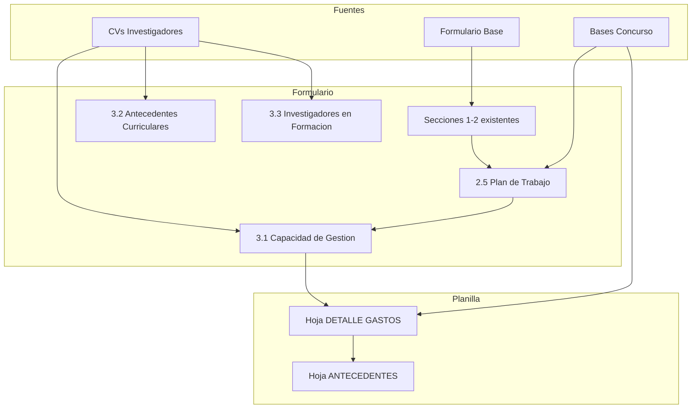
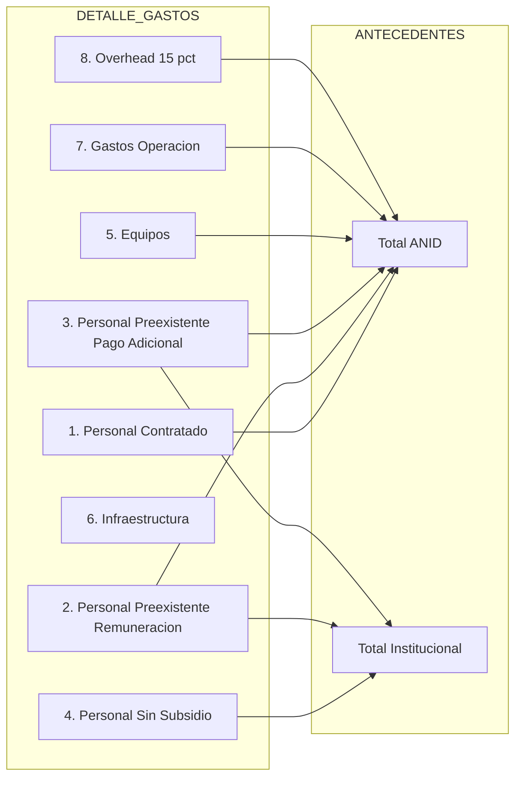

# Diseño Técnico — Postulación FONIS 2026

## Visión General

**Propósito**: Completar las secciones pendientes de la postulación al Concurso FONIS 2026 para el proyecto de intervención digital accesible en comprensión de información en salud para personas mayores.

**Usuarios**: Equipo de investigación (redacción), evaluadores ANID (revisión), administración UTEM (gestión financiera).

**Impacto**: Transforma un formulario parcialmente completo en una postulación lista para envío, agregando plan de trabajo, capacidad de gestión y presupuesto detallado.

### Objetivos
- Completar la tabla Gantt del plan de trabajo (sección 2.5) coherente con metodología y objetivos
- Completar las secciones de capacidad de gestión (3.1, 3.2, 3.3) con datos reales del equipo
- Desarrollar la planilla de costos cumpliendo todas las restricciones presupuestarias
- Asegurar coherencia cruzada entre todas las secciones

### No-Objetivos
- Modificar el título del proyecto
- Reescribir las secciones 1 y 2 ya completas (salvo ajustes menores de objetivos si fuera necesario)
- Gestionar las cartas de compromiso institucional
- Tramitar certificados de ética u otras autorizaciones

## Arquitectura del Documento

### Mapa de Componentes y Dependencias

### Flujo de Construcción

El orden de construcción respeta las dependencias entre secciones:

1. **Plan de Trabajo (2.5)** ← depende de objetivos y metodología (ya existentes)
2. **Capacidad de Gestión (3.1)** ← depende del plan de trabajo (para vincular actividades) y CVs
3. **Antecedentes Curriculares (3.2)** ← depende de CVs
4. **Investigadores en Formación (3.3)** ← depende de CVs y plan de trabajo
5. **Planilla DETALLE GASTOS** ← depende de equipo definido en 3.1 y actividades del plan
6. **Planilla ANTECEDENTES** ← depende de totales de DETALLE GASTOS
7. **Validación cruzada** ← verifica coherencia entre todos los componentes

## Trazabilidad de Requisitos

| Requisito | Resumen | Componente | Archivos de Salida |
|-----------|---------|------------|-------------------|
| 1.1–1.7 | Plan de Trabajo con Gantt 24 meses | Componente A: Plan de Trabajo | `Formulario_Postulacion_2026.docx.md` (sección 2.5) |
| 2.1–2.8 | Tabla equipo con funciones y dedicación | Componente B: Capacidad de Gestión | `Formulario_Postulacion_2026.docx.md` (sección 3.1) |
| 3.1–3.8 | Resúmenes curriculares de 5 líneas | Componente C: Antecedentes Curriculares | `Formulario_Postulacion_2026.docx.md` (sección 3.2) |
| 4.1–4.6 | Tabla de investigadores en formación | Componente D: Investigadores en Formación | `Formulario_Postulacion_2026.docx.md` (sección 3.3) |
| 5.1–5.4 | Hoja ANTECEDENTES completada | Componente E: Planilla Antecedentes | `Planilla_costos_2026.xlsx - ANTECEDENTES.csv` |
| 6.1–6.7 | Presupuesto de personal | Componente F: Planilla Personal | `Planilla_costos_2026.xlsx - DETALLE GASTOS.csv` |
| 7.1–7.7 | Presupuesto equipos/infra/operación | Componente G: Planilla Operación | `Planilla_costos_2026.xlsx - DETALLE GASTOS.csv` |
| 8.1–8.6 | Validación cruzada | Componente H: Validación | Todos los archivos |
| 9.1–9.6 | Formato y presentación | Componente I: Formato Final | Todos los archivos |

## Componentes y Contratos

### Componente A: Plan de Trabajo (Sección 2.5)

| Campo | Detalle |
|-------|---------|
| Propósito | Tabla Gantt con actividades por objetivo específico, meses 1–24 |
| Requisitos | 1.1, 1.2, 1.3, 1.4, 1.5, 1.6, 1.7 |

**Estructura de la tabla Gantt**:

| Objetivo Específico | Actividad | M1 | M2 | ... | M24 |
|---------------------|-----------|----|----|-----|-----|

**Contenido por objetivo específico**:

**OE1: Analizar barreras cognitivas y de comprensión**
- 1.1 Diseño de instrumentos cualitativos (entrevistas, guías de observación) → M1–M2
- 1.2 Gestión de autorizaciones éticas y coordinación con CESFAM → M1–M3
- 1.3 Reclutamiento de participantes para fase cualitativa → M3–M5
- 1.4 Levantamiento de información (entrevistas y observación en contexto) → M4–M6
- 1.5 Análisis de resultados cualitativos → M6–M8

**OE2: Caracterizar necesidades y condiciones de uso**
- 2.1 Sistematización de hallazgos UX (empatizar/definir) → M6–M8
- 2.2 Definición de requerimientos de diseño → M7–M9
- 2.3 Validación inicial con personas mayores y actores de salud → M8–M10

**OE3: Diseñar la intervención digital accesible**
- 3.1 Ideación de soluciones (etapa UX — idear) → M8–M10
- 3.2 Diseño de arquitectura de la información → M9–M11
- 3.3 Desarrollo del prototipo funcional inicial → M10–M13
- 3.4 Iteraciones de diseño con personas mayores → M12–M16

**OE4: Evaluar la intervención en contextos reales**
- 4.1 Diseño del estudio cuasi-experimental → M12–M14
- 4.2 Reclutamiento grupo intervención/comparación → M14–M16
- 4.3 Aplicación de la intervención (testeo controlado) → M15–M18
- 4.4 Implementación en contexto real (APS) → M17–M21
- 4.5 Recolección de datos (comprensión, usabilidad, percepción) → M16–M22
- 4.6 Análisis de datos cuantitativos y cualitativos → M20–M23
- 4.7 Elaboración de resultados finales e informe → M22–M24

**Actividades Transversales (sin OE específico)**
- T.1 Gestión administrativa y financiera del proyecto → M1–M24
- T.2 Elaboración de artículo científico → M18–M24
- T.3 Presentación en congresos nacionales/internacionales → M12, M20–M24
- T.4 Talleres de difusión (Santiago Centro, Puente Alto) → M20–M24
- T.5 Elaboración de cápsula audiovisual de difusión → M22–M24
- T.6 Formación de estudiantes y desarrollo de tesis → M3–M24

**Restricciones de formato**: Máximo 2 páginas. Usar marcadores "X" en las celdas correspondientes a los meses activos.

---

### Componente B: Capacidad de Gestión — Equipo (Sección 3.1)

| Campo | Detalle |
|-------|---------|
| Propósito | Tabla completa del equipo con funciones, dedicación y actividades |
| Requisitos | 2.1, 2.2, 2.3, 2.4, 2.5, 2.6, 2.7, 2.8 |

**Diseño de la tabla de equipo de investigación**:

| Nombre / RUT | Institución | Cargo | Funciones y capacidades críticas | HH/mes | Actividades |
|---|---|---|---|---|---|

**Asignación de roles y funciones** (basado en CVs — ver `research.md`):

| Persona | Cargo | Funciones Críticas | HH/mes | Actividades Vinculadas |
|---------|-------|-------------------|--------|----------------------|
| Erwin Aguirre | Director(a) | Coordinación general, liderazgo del diseño de la intervención, supervisión del equipo, vinculación con entidades colaboradoras, gestión de resultados tecnológicos | 48 | 1.1–1.5, 2.1–2.3, 3.1–3.4, 4.1, 4.7, T.2–T.5 |
| María Ferrer | Directora Alterna | Co-liderazgo en diseño UX accesible, supervisión del componente de accesibilidad cognitiva, coordinación del co-diseño con usuarios, dirección de estudiantes en formación | 48 | 2.1–2.3, 3.1–3.4, 4.3–4.5, T.6 |
| Sandra Cano | Investigadora | Evaluación de usabilidad e interacción persona-computador, diseño de instrumentos de evaluación UX, análisis de datos de experiencia de usuario | 48 | 3.1–3.4, 4.1–4.5, T.2 |
| Ronald Méndez | Investigador | Evaluación de usabilidad y testing UX, aplicación de Design Thinking, evaluación en contexto real con usuarios | 48 | 2.2–2.3, 3.1–3.4, 4.3–4.5, T.3 |
| Nicolás Matus | Investigador | Diseño metodológico cuantitativo, análisis estadístico, evaluación de la experiencia desde perspectiva cultural e inclusiva | 48 | 1.4–1.5, 4.1, 4.5–4.7, T.2 |
| Daniela Godoy | Investigadora | Por confirmar — perfil vinculado a salud pública o APS | Por definir | Por definir |
| Janeth Valecillos | Investigadora | Por confirmar — perfil vinculado a salud o inclusión | Por definir | Por definir |
| Cristhian Figueroa | Por definir | Por confirmar | Por definir | Por definir |

**Tabla de personal técnico y administrativo**:

| Persona | Cargo | Funciones | HH/mes | Actividades |
|---------|-------|-----------|--------|-------------|
| Boris Bustos | Desarrollador digital | Programación del prototipo funcional, desarrollo de interfaces accesibles, integración de módulos de procesamiento de documentos | Por definir | 3.3–3.4, 4.3–4.4 |
| José Cerón | Apoyo técnico | Infraestructura tecnológica, soporte técnico para implementación en terreno, configuración de sistemas | Por definir | 3.3, 4.4 |
| Ayleen Astudillo | Gestión financiera | Control de gestión y finanzas del proyecto, rendición de cuentas, gestión administrativa | Por definir | T.1 |

**Tabla de dedicación en otros proyectos** (para Director, Directora Alterna e investigadores principales):

| Nombre | 2026 HH/mes | 2027 HH/mes | 2028 HH/mes | 2029 HH/mes |
|--------|-------------|-------------|-------------|-------------|

Nota: Completar con información real de cada investigador sobre su participación en otros proyectos vigentes o comprometidos.

---

### Componente C: Antecedentes Curriculares (Sección 3.2)

| Campo | Detalle |
|-------|---------|
| Propósito | Resumen de máximo 5 líneas por investigador |
| Requisitos | 3.1, 3.2, 3.3, 3.4, 3.5, 3.6, 3.7, 3.8 |

**Plantilla de redacción por investigador** (máx. 5 líneas cada uno):

1. **Erwin Aguirre Villalobos** — Doctor en Ciencias (Mención Gerencia). Profesor Titular en la Universidad Tecnológica Metropolitana, donde se desempeña como docente e investigador en las áreas de Diseño UX, accesibilidad digital e inclusión. Cuenta con publicaciones en revistas Scopus Q1 y Q2, y es co-autor del libro "UX Una metodología de diseño eficiente" (2020). Ha dirigido proyectos de investigación en inclusión digital y neurodivergencia. Posee más de 20 años de experiencia integrando investigación, docencia y práctica profesional en diseño y comunicación visual.

2. **María de los Ángeles Ferrer Mavárez** — Doctora en Ciencias (Mención Gerencia), con más de 20 años de trayectoria en Diseño UX y Diseño Centrado en el Usuario. Académica de la UTEM con publicaciones en revistas Scopus Q1 y Q2, incluyendo "Metodología UX para la educación" (2024). Ha dirigido más de 30 tesis de pregrado y proyectos de investigación en inclusión y accesibilidad, incluyendo el proyecto ACCEX sobre inclusión de personas con discapacidad. Es co-autora del libro "UX Una metodología de diseño eficiente" (2020).

3. **Sandra Cano Mazuera** — Doctora en Ciencia de la Electrónica. Docente investigadora de tiempo completo en la Pontificia Universidad Católica de Valparaíso (PUCV). Sus líneas de investigación se centran en Interacción Humano-Robot, Computación Afectiva e Interacción Persona-Computador (HCI). Se desempeña como Jefe de Vinculación con el Medio y Jefe de Unidad de Apoyo Estudiantil en su facultad.

4. **Ronald Méndez Sánchez** — Magíster en Ingeniería de Control y Automatización de Procesos, con especialización en Experiencia de Usuario y evaluación de usabilidad. Director Académico del Diplomado en UX Design en la Universidad Finis Terrae desde 2018. Docente en UTEM y Universidad Gabriela Mistral. Co-autor de publicaciones indexadas sobre metodología UX y del libro "UX Una metodología de diseño eficiente" (2020). Director Ejecutivo de Designar Diseño Global.

5. **Nicolás Matus** — Doctor en Ingeniería Informática (PUCV) y Doctor en Estadística, Optimización y Matemática Aplicada (Universidad Miguel Hernández de Elche, España). Su investigación se centra en la evaluación de la experiencia del estudiante, factores culturales en educación e inclusión educativa. Cuenta con publicaciones en revistas y congresos internacionales, y experiencia en analítica de datos aplicada a contextos educativos y de experiencia de usuario.

**Restricciones**: Máximo 1 página total. No incluir personal técnico ni administrativo en esta sección.

---

### Componente D: Investigadores en Formación (Sección 3.3)

| Campo | Detalle |
|-------|---------|
| Propósito | Tabla de investigadores en formación con nivel, actividades y tutor |
| Requisitos | 4.1, 4.2, 4.3, 4.4, 4.5, 4.6 |

**Diseño de la tabla**:

| Nombre / RUT | Institución | Pregrado/Postgrado | Actividades | Investigador responsable | Título tesis |
|---|---|---|---|---|---|

**Investigadores en formación identificados**:

1. **José Cerón Córdova** — UTEM — Magíster en Ciencias de la Ingeniería Electrónica (en curso). Actividades: apoyo técnico en implementación de infraestructura del prototipo, participación en desarrollo de módulos tecnológicos, trabajo de tesis vinculado a soluciones IoT/digitales para salud. Tutor: Erwin Aguirre. Tesis: por definir (vinculada a tecnologías digitales accesibles en salud).

2. **Estudiante por definir 1** — UTEM — Pregrado (Diseño en Comunicación Visual o Ingeniería en Informática). Actividades: apoyo en diseño de interfaces accesibles, participación en pruebas de usabilidad, desarrollo de trabajo de titulación. Tutor: María Ferrer. Tesis: por definir al inicio de la ejecución.

3. **Estudiante por definir 2** — PUCV — Postgrado (Magíster o Doctorado en Ingeniería Informática). Actividades: apoyo en análisis de datos, evaluación de experiencia de usuario, desarrollo de tesis asociada. Tutor: Sandra Cano. Tesis: por definir al inicio de la ejecución.

**Restricciones**: Máximo 1/2 página. Las bases no exigen nombres definitivos en la postulación para estudiantes aún no incorporados.

---

### Componente E: Planilla de Costos — Hoja ANTECEDENTES

| Campo | Detalle |
|-------|---------|
| Propósito | Completar datos de identificación y totales del proyecto |
| Requisitos | 5.1, 5.2, 5.3, 5.4 |

**Campos a completar**:

| Campo | Valor |
|-------|-------|
| PLAZO EN MESES | 24 |
| DIRECTOR(A) | Erwin Robert Aguirre Villalobos |
| BENEFICIARIA PRINCIPAL | Universidad Tecnológica Metropolitana (UTEM) |
| BENEFICIARIAS SECUNDARIAS | — (ninguna) |
| ENTIDADES ASOCIADAS | Fundación Comunida, SENADIS (asesora) |
| Presupuesto Aporte ANID | Suma de DETALLE GASTOS columna ANID |
| Presupuesto Aporte Institucional | ≥ 10% del subsidio ANID |

**Validaciones**:
- Aporte ANID ≤ $72.000.000
- Aporte Institucional ≥ 10% × Aporte ANID
- Montos coherentes con DETALLE GASTOS

---

### Componente F: Planilla de Costos — Personal

| Campo | Detalle |
|-------|---------|
| Propósito | Presupuesto detallado de personal por categoría |
| Requisitos | 6.1, 6.2, 6.3, 6.4, 6.5, 6.6, 6.7 |

**Clasificación del personal en categorías de la planilla**:

#### Sección 1: Personal Contratado Exclusivamente para el Proyecto
Personal nuevo, no vinculado previamente a la beneficiaria.

| Nombre | Cargo | Entidad | HH/mes | Monto mensual | Meses | Fuente |
|--------|-------|---------|--------|---------------|-------|--------|
| Boris Bustos | Desarrollador digital | UTEM | Por definir | Por definir | 18 (M7–M24) | ANID |
| José Cerón | Apoyo técnico / IoT | UTEM | Por definir | Por definir | 16 (M9–M24) | ANID |
| Ayleen Astudillo | Gestión financiera | UTEM | Por definir | Por definir | 24 (M1–M24) | ANID |

#### Sección 3: Personal Preexistente con Pago Adicional (ex-incentivo)
Académicos de la beneficiaria con dedicación mínima 36 hrs/mes. Tope: $600.000/mes.

| Nombre | Cargo | Entidad | HH/mes | Monto ANID/mes | Monto Benef./mes | Meses |
|--------|-------|---------|--------|----------------|-----------------|-------|
| Erwin Aguirre | Director | UTEM | 48 | $600.000 | ≥ $600.000 | 24 |
| María Ferrer | Dir. Alterna | UTEM | 48 | $600.000 | ≥ $600.000 | 24 |
| Ronald Méndez | Investigador | UTEM | 48 | $600.000 | ≥ $600.000 | 24 |

Nota: El pago adicional no puede superar el monto aportado por la institución por remuneraciones.

#### Sección 4: Personal de Entidades Beneficiarias que No Recibe Subsidio
Investigadores de otras instituciones cuyo aporte es no incremental.

| Nombre | Cargo | Entidad | HH/mes | Valor hora | Monto mensual | Meses |
|--------|-------|---------|--------|-----------|---------------|-------|
| Sandra Cano | Investigadora | PUCV | 48 | Según PUCV | Según PUCV | 24 |
| Nicolás Matus | Investigador | PUCV | 48 | Según PUCV | Según PUCV | 24 |

Nota: Su aporte se contabiliza como aporte institucional no incremental de la beneficiaria o como colaboradora.

---

### Componente G: Planilla de Costos — Equipos, Infraestructura y Operación

| Campo | Detalle |
|-------|---------|
| Propósito | Presupuesto de equipamiento, infraestructura y gastos operacionales |
| Requisitos | 7.1, 7.2, 7.3, 7.4, 7.5, 7.6, 7.7 |

#### Sección 5: Equipos

| Equipo | Descripción | Objetivo | Cant. | Valor | Fuente |
|--------|------------|----------|-------|-------|--------|
| Tablets para pruebas | Tablets accesibles para testeo con personas mayores | OE3, OE4 | 5 | ~$250.000 c/u | ANID |
| Notebook desarrollo | Equipo para desarrollo del prototipo | OE3 | 1 | ~$1.200.000 | ANID |
| Equipo de grabación | Cámara/micrófono para registro de sesiones y cápsula audiovisual | OE1, T.5 | 1 | ~$500.000 | ANID |

#### Sección 7: Gastos de Operación

| Ítem | Descripción | Objetivo | Valor Total | Fuente |
|------|-------------|----------|-------------|--------|
| Gastos generales | Material de oficina, impresiones, insumos para talleres de co-diseño | OE1–OE4 | Por definir | ANID |
| Viáticos nacionales | Traslados a CESFAM para implementación en terreno | OE4 | Por definir | ANID |
| Licencias software | Herramientas de diseño UX, hosting, servicios cloud | OE3 | Por definir | ANID |
| Pasaje internacional | Congreso internacional de salud digital (1 investigador) | T.3 | Por definir | ANID |
| Viático internacional | Estadía congreso internacional | T.3 | Por definir | ANID |
| Gastos administración | Apoyo administrativo general | Transversal | Por definir | ANID |

#### Sección 8: Gastos de Administración Indirectos (Overhead)

| Entidad | Monto | Porcentaje | Máximo permitido |
|---------|-------|-----------|-----------------|
| UTEM | ≤ 15% del subsidio ANID | ≤ 15% | $10.800.000 (si subsidio = $72M) |

---

### Componente H: Validación Cruzada

| Campo | Detalle |
|-------|---------|
| Propósito | Verificar coherencia entre todas las secciones |
| Requisitos | 8.1, 8.2, 8.3, 8.4, 8.5, 8.6 |

**Checklist de validación**:

1. [ ] Actividades del plan de trabajo (2.5) coinciden con objetivos específicos (2.2.2)
2. [ ] Actividades del plan respetan las etapas de la metodología (2.3)
3. [ ] Hitos del plan coinciden con hitos de resultados tecnológicos (1.2.2)
4. [ ] Personal en tabla 3.1 = personal en planilla de costos
5. [ ] HH/mes en tabla 3.1 = HH/mes en planilla de costos
6. [ ] Suma DETALLE GASTOS = totales en ANTECEDENTES
7. [ ] Aporte ANID ≤ $72.000.000
8. [ ] Aporte institucional ≥ 10% del subsidio ANID
9. [ ] Overhead ≤ 15% del subsidio ANID
10. [ ] Personal preexistente con remuneración: ≥ 80 HH/mes, ≤ $2.700.000/mes (160h)
11. [ ] Personal preexistente con pago adicional: ≥ 36 HH/mes, ≤ $600.000/mes
12. [ ] No hay instrucciones en azul remanentes
13. [ ] No hay celdas vacías en tablas completadas
14. [ ] Montos en pesos ($), no en miles de pesos (M$)

---

### Componente I: Formato Final

| Campo | Detalle |
|-------|---------|
| Propósito | Asegurar cumplimiento de formato del concurso |
| Requisitos | 9.1, 9.2, 9.3, 9.4, 9.5, 9.6 |

**Acciones de formato**:
- Eliminar todas las instrucciones en color azul (textos entre `<` y `>`)
- Verificar extensiones: Plan de trabajo ≤ 2 páginas, Antecedentes ≤ 1 página, Formación ≤ 1/2 página
- Confirmar idioma español en todo el documento
- Verificar que planilla usa pesos ($), no miles (M$)

## Modelo de Datos

### Estructura de la Planilla de Costos

### Distribución de Columnas por Categoría de Gasto

Cada categoría de gasto distribuye el costo total entre:
- **ANID**: Subsidio solicitado
- **Beneficiaria Aporte Incremental**: Gastos nuevos de la beneficiaria para el proyecto
- **Beneficiaria Aporte No Incremental**: Recursos existentes puestos a disposición
- **Colaboradora Aporte Incremental**: Gastos nuevos de colaboradoras
- **Colaboradora Aporte No Incremental**: Recursos existentes de colaboradoras

## Estrategia de Pruebas / Validación

- **Validación de restricciones numéricas**: Verificar que todos los topes presupuestarios se cumplen (ANID ≤ $72M, overhead ≤ 15%, cofinanciamiento ≥ 10%)
- **Coherencia de personal**: Cruzar nombres y HH/mes entre formulario y planilla
- **Coherencia de actividades**: Verificar que cada actividad del plan de trabajo tiene personal asignado y presupuesto asociado
- **Completitud**: Verificar que no quedan secciones vacías ni instrucciones en azul
- **Formato**: Verificar extensiones máximas por sección

## Decisiones Pendientes (requieren input del equipo)

1. **HH/mes y montos exactos** de Boris Bustos, José Cerón y Ayleen Astudillo (personal contratado)
2. **Vínculo contractual de Ronald Méndez con UTEM**: ¿Es personal preexistente o contratado?
3. **Perfiles de Daniela Godoy, Janeth Valecillos y Cristhian Figueroa**: Se necesitan CVs para completar funciones y antecedentes
4. **Remuneración bruta mensual** de los investigadores preexistentes (para validar topes)
5. **Montos específicos** de equipamiento, viáticos y gastos de operación
6. **Participación en otros proyectos** de Director, Directora Alterna e investigadores (tabla 3.1)
7. **Nombres de estudiantes en formación** (o confirmación de que se incluyen perfiles tipo)
