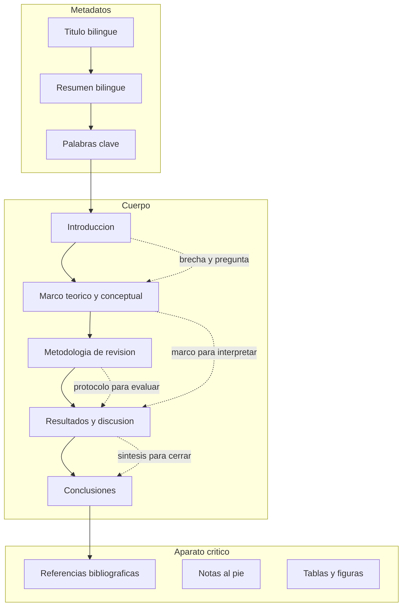
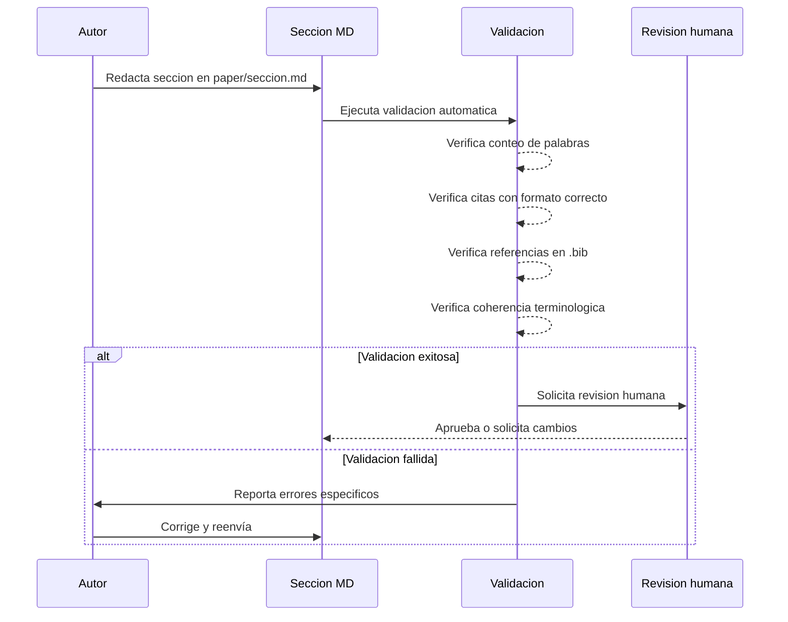

# Design Document: resignificacion-migrantes

## Overview

**Purpose**: Este paper entrega una revisión sistemática de literatura sobre cómo la experiencia migratoria resignifica el uso de redes sociales en migrantes venezolanos y colombianos en Chile, articulando una propuesta teórica original que integra capital social, familia transnacional, intimidad virtual y cultura de la conectividad.

**Users**: Investigadores en sociología, comunicación y estudios migratorios; evaluadores de REIS; los propios autores (Manuel, Erwin y colaboradores) como coautores del manuscrito.

**Impact**: Produce un manuscrito publicable que sintetiza la evidencia dispersa sobre comunicación transnacional mediada por plataformas digitales y propone una tipología de usos resignificados operacionalizable en estudios empíricos futuros.

### Goals
- Articular el concepto de "resignificación" como categoría analítica distinta de "uso" o "adopción" de tecnologías
- Sintetizar ~160 artículos de Scopus (últimos 5 años) en tres categorías de análisis coherentes
- Producir un manuscrito de máximo 9.000 palabras totales que cumpla todas las normas de REIS
- Proponer una tipología teórica original de usos resignificados de redes sociales en contexto migratorio

### Non-Goals
- Recolección de datos empíricos primarios (entrevistas, encuestas, etnografía)
- Análisis cuantitativo de métricas de uso de redes sociales
- Comparación con migraciones fuera de América Latina
- Desarrollo de instrumentos metodológicos para investigaciones futuras (solo se propone la tipología como marco)

---

## Architecture

> Notas detalladas de descubrimiento en `research.md`. Aquí se capturan todas las decisiones y contratos.

### Architecture Pattern & Boundary Map



**Architecture Integration**:
- Patrón seleccionado: IMRaD adaptado para revisión de literatura en ciencias sociales. Se separa el marco teórico como sección propia y se integran resultados con discusión.
- Límites de dominio: cada sección es un módulo de escritura atómico con presupuesto de palabras, fuentes requeridas y criterios de validación independientes.
- Flujo argumentativo: la Introducción plantea la brecha; el Marco teórico define las herramientas conceptuales; la Metodología establece el protocolo de evidencia; Resultados y discusión presenta y analiza la evidencia; las Conclusiones sintetizan y proyectan.

### Technology Stack

| Capa | Elección | Rol en el paper | Notas |
|------|----------|-----------------|-------|
| Redacción | Markdown (.md) | Formato de escritura de las secciones del paper | Archivos en `paper/` |
| Referencias | BibTeX (.bib) | Gestión de bibliografía verificable | Archivo en `references/references.bib` |
| Validación | Scripts Python/Bash | Verificación automática de estructura, conteo de palabras, citas y referencias | Directorio `scripts/` |
| Verificación de citas | CrossRef API, Semantic Scholar API | Validación de existencia de DOIs y referencias | Integrado en scripts de validación |
| Figuras | Mermaid, TIF/JPG | Diagramas de flujo y tablas de síntesis | Directorio `figures/`, 300 ppi, mín. 10 cm |

---

## System Flows

### Flujo de escritura por sección



Decisiones clave del flujo: cada sección se valida de forma independiente antes de integrarla al manuscrito completo. La validación automática cubre requisitos hard (conteo, formato, referencias); la revisión humana cubre requisitos soft (coherencia argumentativa, contribución teórica).

---

## Requirements Traceability

| Requisito | Resumen | Componentes | Contratos | Flujos |
|-----------|---------|-------------|-----------|--------|
| 1.1 | Extensión máxima 9.000 palabras totales | Todos | Presupuesto de palabras | Validación |
| 1.2 | Abstract bilingüe 100-130 palabras | Resumen | Contrato de metadatos | — |
| 1.3 | 4-8 palabras clave bilingües | Palabras clave | Contrato de metadatos | — |
| 1.4 | Estructura IMRaD adaptada | Todos | Mapa de arquitectura | — |
| 1.5 | Citación parentética (Apellido, año: página) | Todos (cuerpo) | Contrato de citación | Validación |
| 1.6 | Alerta si sección excede límite | Validación | Script de conteo | Validación |
| 2.1 | Brecha en la literatura | Introducción | — | — |
| 2.2 | Hipótesis central explícita | Introducción | — | — |
| 2.3 | Tres objetivos específicos | Introducción | — | — |
| 2.4 | Estadísticas migratorias 2020-2026 | Introducción, Contexto migratorio | Contrato de datos | — |
| 2.5 | No mencionar revista de destino | Todos | Contrato de estilo | Validación |
| 3.1 | Definición de "resignificación" | Marco teórico | — | — |
| 3.2 | Articulación de cuatro corrientes teóricas | Marco teórico | — | — |
| 3.3 | Evolución de definiciones de plataformas | Marco teórico | — | — |
| 3.4 | Coherencia terminológica | Todos | Glosario | Validación |
| 3.5 | Ecosistema de medios conectivos | Marco teórico | — | — |
| 4.1 | Protocolo de búsqueda bibliográfica | Metodología | Contrato PRISMA-like | — |
| 4.2 | Reporte de artículos (identificados, filtrados, incluidos) | Metodología | Tabla PRISMA | — |
| 4.3 | Tres categorías de análisis | Resultados y discusión | — | — |
| 4.4 | Identificación autor/año/plataforma/población | Resultados y discusión | Contrato de evidencia | — |
| 4.5 | Señalar lagunas explícitamente | Resultados y discusión | — | — |
| 5.1 | Análisis de cinco plataformas | Resultados y discusión | — | — |
| 5.2 | Cuatro funciones resignificadas | Resultados y discusión | — | — |
| 5.3 | Contraste uso migrante vs. misión institucional | Resultados y discusión | — | — |
| 5.4 | Al menos un testimonio directo | Resultados y discusión | — | — |
| 5.5 | Distinción tránsito vs. asentamiento | Resultados y discusión | — | — |
| 6.1 | Perfil demográfico Venezuela/Colombia en Chile | Introducción | Contrato de datos | — |
| 6.2 | Fuentes oficiales para estadísticas | Introducción | Contrato de datos | Validación |
| 6.3 | Señalar datos históricos pre-2020 | Introducción | Contrato de datos | — |
| 6.4 | Chile en contexto latinoamericano | Introducción | — | — |
| 7.1 | Síntesis confirma/matiza/contradice hipótesis | Conclusiones | — | — |
| 7.2 | Tres lagunas para investigación futura | Conclusiones | — | — |
| 7.3 | Contribución teórica: tipología de usos resignificados | Conclusiones | — | — |
| 7.4 | Limitaciones del enfoque | Conclusiones | — | — |
| 7.5 | Sin generalizaciones no soportadas | Conclusiones | Contrato de estilo | Validación |
| 8.1 | Formato citación parentética consistente | Todos (cuerpo) | Contrato de citación | Validación |
| 8.2 | Referencias completas y sin huérfanas | Referencias | Contrato .bib | Validación |
| 8.3 | Verificación contra CrossRef/Semantic Scholar | Referencias | Script de verificación | Validación |
| 8.4 | Marcado "pendiente de verificación" | Referencias | Contrato .bib | — |
| 8.5 | Glosario de términos clave | Marco teórico | Glosario | — |
| 9.1 | Sin guiones como separadores | Todos | Contrato de estilo | Validación |
| 9.2 | Coherencia terminológica | Todos | Glosario | Validación |
| 9.3 | Prosa continua, sin viñetas en argumentación | Todos (cuerpo) | Contrato de estilo | Validación |
| 9.4 | Traducción de citas en inglés | Todos (cuerpo) | Contrato de estilo | — |
| 9.5 | No mencionar revista de destino | Todos | Contrato de estilo | Validación |

---

## Components and Interfaces

### Resumen de componentes

| Componente | Dominio | Intent | Req Coverage | Dependencias clave | Contratos |
|------------|---------|--------|-------------|-------------------|-----------|
| Título y metadatos | Metadatos | Identificación bilingüe del paper | 1.2, 1.3 | — | Metadatos |
| Resumen bilingüe | Metadatos | Síntesis del paper en español e inglés | 1.2 | Conclusiones (P1) | Metadatos |
| Introducción | Cuerpo | Plantear brecha, hipótesis, objetivos y contexto | 2.1-2.5, 6.1-6.4 | Marco teórico (P1) | Datos, Estilo |
| Marco teórico y conceptual | Cuerpo | Definir resignificación y articular corrientes teóricas | 3.1-3.5, 8.5 | Introducción (P0) | Glosario |
| Metodología de revisión | Cuerpo | Describir protocolo de búsqueda y criterios | 4.1-4.2 | — | PRISMA |
| Resultados y discusión | Cuerpo | Presentar y analizar hallazgos por categoría | 4.3-4.5, 5.1-5.5 | Marco teórico (P0), Metodología (P0) | Evidencia, Estilo |
| Conclusiones | Cuerpo | Sintetizar, proponer tipología y agenda futura | 7.1-7.5 | Resultados y discusión (P0) | Estilo |
| Referencias bibliográficas | Aparato crítico | Listado verificado de todas las fuentes citadas | 8.1-8.4 | Todos los componentes del cuerpo (P0) | .bib |
| Validación automática | Infraestructura | Scripts de verificación de hard specs | 1.1, 1.5, 1.6, 8.1-8.3, 9.1-9.3, 9.5 | Todos los componentes (P0) | Scripts |

---

### Metadatos

#### Título y metadatos

| Campo | Detalle |
|-------|--------|
| Intent | Proveer identificación bilingüe completa del paper con palabras clave |
| Requirements | 1.2, 1.3 |

**Responsabilidades y restricciones**
- Título en español e inglés, máximo 10 palabras cada uno, sin abreviaturas
- 4 a 8 palabras clave en español con equivalente en inglés
- Nota biográfica de cada autor (máximo 150 palabras por autor, incluir ORCID, filiación, correo)

**Contracts**: State [x]

##### Contrato de metadatos

```
Título español: string (máx. 10 palabras, sin abreviaturas)
Título inglés: string (máx. 10 palabras, sin abreviaturas)
Palabras clave español: list[string] (4-8 términos)
Palabras clave inglés: list[string] (4-8 términos, equivalentes exactos)
Autores: list[Autor] (máx. 3)
  Autor:
    nombre: string
    filiación: string
    ORCID: string
    correo: string
    nota biográfica: string (máx. 150 palabras)
```

**Implementation Notes**
- Archivo: `paper/00_metadata.md`
- El título del borrador actual ("Resignificación de las comunicaciones en contextos de migración: estado del arte y perspectivas teóricas") tiene 12 palabras, excede el máximo de REIS. Requiere condensación.

---

#### Resumen bilingüe

| Campo | Detalle |
|-------|--------|
| Intent | Sintetizar el paper completo en 100-130 palabras en cada idioma |
| Requirements | 1.2 |

**Responsabilidades y restricciones**
- Contenido idéntico en ambos idiomas
- Debe incluir: objetivo, metodología (revisión sistemática), hallazgos principales y contribución teórica
- Se redacta al final, cuando el cuerpo del paper está completo

**Dependencies**
- Inbound: Conclusiones, proporciona la síntesis de hallazgos y contribución (P1)

**Contracts**: State [x]

```
Resumen español: string (100-130 palabras)
Resumen inglés: string (100-130 palabras)
Contenido: idéntico en ambos idiomas
Estructura interna: objetivo + metodología + hallazgos + contribución
```

**Implementation Notes**
- Archivo: `paper/01_abstract.md`
- Se implementa como última tarea de escritura, después de todas las secciones del cuerpo.

---

### Cuerpo del paper

#### Introducción

| Campo | Detalle |
|-------|--------|
| Intent | Establecer la brecha en la literatura, la hipótesis central, los objetivos específicos y el contexto migratorio de Chile |
| Requirements | 2.1, 2.2, 2.3, 2.4, 2.5, 6.1, 6.2, 6.3, 6.4 |

**Responsabilidades y restricciones**
- Presupuesto: ~1.000 palabras
- Articular la brecha: la literatura sobre comunicación transnacional en migrantes latinoamericanos en Chile es escasa y fragmentada
- Enunciar la hipótesis central de resignificación de forma explícita
- Presentar los tres objetivos específicos derivados de la hipótesis
- Contextualizar la migración venezolana y colombiana en Chile con estadísticas actualizadas (2020-2026)
- Situar a Chile en el contexto migratorio latinoamericano
- No mencionar la revista de destino

**Dependencies**
- Outbound: Marco teórico, establece los conceptos que la introducción anticipa (P1)
- External: INE Chile, DEM, OIM World Migration Report 2024, CEPAL (P0, fuentes de datos estadísticos)

**Contracts**: State [x]

##### Contrato de datos migratorios

```
Dato estadístico:
  valor: number
  unidad: string (personas, porcentaje, tasa)
  fuente: referencia académica o institucional verificable
  año del dato: number (preferir 2020-2026)
  señalar si es dato histórico: boolean (true si anterior a 2020)
```

**Implementation Notes**
- Archivo: `paper/02_introduction.md`
- El borrador existente contiene una introducción parcial con datos de 2017 (1.200.000 migrantes, 6,1% de la población). Estos datos deben actualizarse y señalarse como históricos si se mantienen.
- La hipótesis y los objetivos están formulados en el borrador y pueden reutilizarse con ajustes de redacción.

---

#### Marco teórico y conceptual

| Campo | Detalle |
|-------|--------|
| Intent | Definir "resignificación" como categoría analítica y articular las corrientes teóricas que sustentan el argumento central |
| Requirements | 3.1, 3.2, 3.3, 3.4, 3.5, 8.5 |

**Responsabilidades y restricciones**
- Presupuesto: ~1.800 palabras
- Subsecciones internas:
  1. El concepto de resignificación: definición desde teoría comunicacional y sociológica, distinguiéndolo de "uso" y "adopción"
  2. Corrientes teóricas integradas: capital social (Bourdieu, Putnam), familia transnacional y "familia imaginada" (Vermot, 2015), intimidad virtual y co-presencia (Katz y González, 2016), cultura de la conectividad (van Dijck, 2013)
  3. Polisemia de las plataformas: evolución de las definiciones institucionales de Facebook/Meta, WhatsApp, Instagram, TikTok y YouTube como base para la resignificación
  4. Ecosistema de medios conectivos: van Dijck (2013) como marco integrador
- Definir cada término antes de usarlo; mantener glosario de referencia

**Dependencies**
- Inbound: Introducción, define la brecha y la pregunta que el marco responde (P0)
- Outbound: Resultados y discusión, proporciona las herramientas interpretativas (P0)

**Contracts**: State [x]

##### Glosario de términos clave

```
Término: definición operacional para uso consistente en el paper
  resignificación: [definición propia articulada en esta sección]
  capital social: recurso derivado de redes de relaciones (Bourdieu); bonding vs. bridging (Putnam)
  familia transnacional: unidad familiar dispersa geográficamente que mantiene vínculos afectivos y funcionales a través de fronteras
  familia imaginada: construcción adaptativa del concepto de familia ante la distancia migratoria (Vermot, 2015)
  co-presencia: sensación de estar presente con otros mediada por tecnologías de comunicación (Katz y González, 2016)
  vínculos fuertes: lazos con familia y amigos cercanos
  vínculos débiles: conexiones con conocidos útiles para información y recursos
  vínculos latentes: conexiones potenciales que se activan a través de infraestructura digital (Haythornthwaite, 2002)
  ecosistema de medios conectivos: conjunto interrelacionado de plataformas digitales donde se desarrolla la vida social cotidiana (van Dijck, 2013)
```

**Implementation Notes**
- Archivo: `paper/03_marco_teorico.md`
- El borrador contiene material extenso sobre definiciones de plataformas (especialmente Facebook/Meta con citas de Zuckerberg desde 2006 hasta 2021). Este material debe condensarse y articularse con la tesis de resignificación, no presentarse como catálogo cronológico.
- El glosario se mantiene como archivo de referencia interna (`paper/glosario.md`) para validación de coherencia terminológica, no se publica como sección del paper.

---

#### Metodología de revisión

| Campo | Detalle |
|-------|--------|
| Intent | Describir el protocolo de búsqueda sistemática de forma transparente y reproducible |
| Requirements | 4.1, 4.2 |

**Responsabilidades y restricciones**
- Presupuesto: ~600 palabras
- Contenido mínimo obligatorio:
  - Bases de datos: Scopus (principal), con mención de fuentes complementarias si aplica
  - Período de cobertura: últimos 5 años desde la fecha de redacción (2021-2026)
  - Términos de búsqueda: combinaciones de "migration" AND "social media" AND ("resignification" OR "transnational communication" OR "digital practices") y variantes en español
  - Criterios de inclusión: artículos en inglés y español, revisados por pares, que aborden uso de redes sociales por poblaciones migrantes
  - Criterios de exclusión: estudios no revisados por pares, estudios centrados exclusivamente en aspectos técnicos de plataformas sin dimensión social, estudios sobre migración interna
  - Reporte numérico: artículos identificados → filtrados por título y abstract → incluidos tras lectura completa (~160 meta)
- Incluir tabla o diagrama tipo PRISMA simplificado con el flujo de selección

**Dependencies**
- Outbound: Resultados y discusión, el protocolo valida la evidencia presentada (P0)

**Contracts**: State [x]

##### Contrato PRISMA simplificado

```
Flujo de selección:
  identificados: number (búsqueda inicial en bases de datos)
  duplicados removidos: number
  filtrados por título y abstract: number
  excluidos tras lectura completa: number (con razón)
  incluidos en la revisión: number (~160)
Categorización de incluidos:
  por categoría de análisis: map[categoría, number]
  por plataforma estudiada: map[plataforma, number]
  por población migrante: map[nacionalidad/región, number]
```

**Implementation Notes**
- Archivo: `paper/04_methodology.md`
- Una tabla PRISMA simplificada se incluirá como figura al final del documento según normas de REIS (una tabla por página, sin líneas verticales).

---

#### Resultados y discusión

| Campo | Detalle |
|-------|--------|
| Intent | Presentar los hallazgos de la revisión organizados por categoría y discutirlos a la luz del marco teórico |
| Requirements | 4.3, 4.4, 4.5, 5.1, 5.2, 5.3, 5.4, 5.5 |

**Responsabilidades y restricciones**
- Presupuesto: ~2.800 palabras
- Tres subsecciones correspondientes a las categorías de análisis:
  1. **Conectividad y mantenimiento de vínculos transnacionales** (~900 palabras): cómo las plataformas facilitan el mantenimiento de vínculos fuertes (familia, amigos cercanos). Incluir al menos un testimonio directo (5.4). Evidencia de WhatsApp como plataforma dominante para co-presencia.
  2. **Contextos de uso de plataformas específicas** (~900 palabras): análisis diferenciado por plataforma (WhatsApp, Facebook/grupos, YouTube, Instagram, TikTok). Para cada plataforma: qué uso resignificado documentan los estudios y con qué población migrante. Distinguir contextos de tránsito vs. asentamiento (5.5).
  3. **Divergencias entre usos convencionales y usos resignificados** (~1.000 palabras): contrastación explícita entre la misión institucional de cada plataforma y el uso que los migrantes le dan (5.3). Articulación de las cuatro funciones resignificadas (5.2): vínculos fuertes, vínculos débiles, vínculos latentes, conocimiento informal. Señalar lagunas explícitas donde falte evidencia para combinaciones plataforma/población (4.5).
- Cada hallazgo citado debe identificar: autor, año, plataforma y población migrante (4.4)
- Prosa continua, sin listas con viñetas

**Dependencies**
- Inbound: Marco teórico, proporciona las categorías interpretativas (P0)
- Inbound: Metodología, valida la base de evidencia (P0)
- Outbound: Conclusiones, recibe la síntesis de hallazgos (P0)

**Contracts**: State [x]

##### Contrato de evidencia

```
Hallazgo citado:
  autor: string
  año: number
  plataforma: enum[WhatsApp, Facebook, YouTube, Instagram, TikTok, Múltiples, Otra]
  población migrante: string (nacionalidad/región + país de destino)
  categoría de análisis: enum[conectividad, contexto de uso, divergencias]
  tipo de evidencia: enum[empírica cuantitativa, empírica cualitativa, teórica, testimonial]
  hallazgo: string (descripción concisa)
```

**Implementation Notes**
- Archivo: `paper/05_results_discussion.md`
- Material reutilizable del borrador: testimonios de Cecilia y José (libro sobre migrantes colombianos en Chile), cuatro funciones de Dekker et al., análisis de Zhao sobre migrantes chinos (como punto de contraste), usos de Facebook documentados por NPR y García (Texas A&M).
- Las fuentes periodísticas (NPR, BBC, The Guardian, The Verge, TechCrunch) se usan como evidencia de definiciones institucionales en la subsección de divergencias, no como fuentes primarias de hallazgos sobre migrantes.

---

#### Conclusiones

| Campo | Detalle |
|-------|--------|
| Intent | Sintetizar hallazgos, proponer tipología teórica, identificar lagunas y reconocer limitaciones |
| Requirements | 7.1, 7.2, 7.3, 7.4, 7.5 |

**Responsabilidades y restricciones**
- Presupuesto: ~800 palabras
- Estructura interna:
  1. Síntesis de hallazgos en relación con la hipótesis (confirman, matizan o contradicen)
  2. Contribución teórica: tipología de usos resignificados de redes sociales en contexto migratorio, operacionalizable en investigaciones empíricas
  3. Lagunas identificadas (al menos tres) que justifican investigación futura
  4. Limitaciones del enfoque (sesgo de publicación, cobertura geográfica de los estudios, limitaciones de una revisión sin datos primarios)
- No formular generalizaciones no soportadas por la evidencia revisada

**Dependencies**
- Inbound: Resultados y discusión, proporciona los hallazgos sintetizados (P0)
- Outbound: Resumen bilingüe, recibe la síntesis final (P1)

**Contracts**: State [x]

**Implementation Notes**
- Archivo: `paper/06_conclusions.md`
- La tipología de usos resignificados es la contribución teórica central. Debe presentarse de forma clara y concisa, articulando los hallazgos de las tres categorías de análisis en un modelo integrado.

---

### Aparato crítico

#### Referencias bibliográficas

| Campo | Detalle |
|-------|--------|
| Intent | Mantener un registro verificado, completo y sin entradas huérfanas de todas las fuentes citadas |
| Requirements | 8.1, 8.2, 8.3, 8.4 |

**Responsabilidades y restricciones**
- Formato de bibliografía según normas REIS:
  - Libros: Apellido, Nombre (año). *Título*. Lugar: Editorial.
  - Capítulos: Apellido, Nombre (año). "Título capítulo". En: Editor (ed.). *Título libro*. Lugar: Editorial.
  - Artículos: Apellido, Nombre (año). "Título". *Revista*, volumen(número): páginas. doi: código.
  - Referencias online: incluir URL y fecha de acceso.
  - Máximo 20 autores listados; más de 20: primeros 20 + puntos suspensivos.
- Toda referencia debe ser verificada contra CrossRef o Semantic Scholar antes de validación final
- Referencias no verificables se marcan como "pendiente de verificación" en el .bib

**Dependencies**
- Inbound: Todos los componentes del cuerpo, proporcionan las citas (P0)

**Contracts**: Service [x]

##### Contrato .bib

```
Entrada BibTeX:
  type: enum[@article, @book, @incollection, @inproceedings, @misc, @online]
  campos obligatorios por tipo:
    @article: author, title, journal, year, volume, number, pages, doi
    @book: author, title, year, publisher, address
    @incollection: author, title, booktitle, editor, year, publisher, address
    @online: author, title, year, url, urldate
  verificación:
    status: enum[verificado, pendiente]
    fuente de verificación: enum[CrossRef, Semantic Scholar, DOI directo, manual]
    fecha de verificación: date
  clasificación:
    tipo de fuente: enum[académica, institucional, periodística]
```

**Implementation Notes**
- Archivo: `references/references.bib`
- El .bib actual solo contiene una entrada (Bachelard, 1957) del paper anterior. Debe poblarse con todas las referencias del paper de resignificación.
- Las referencias del borrador existente necesitan normalización: muchas son URLs sin formato BibTeX.

---

### Infraestructura

#### Validación automática

| Campo | Detalle |
|-------|--------|
| Intent | Verificar automáticamente los requisitos hard del paper antes de revisión humana |
| Requirements | 1.1, 1.5, 1.6, 2.5, 8.1, 8.2, 8.3, 9.1, 9.2, 9.3, 9.5 |

**Responsabilidades y restricciones**
- Validaciones implementadas como scripts independientes:
  1. **Conteo de palabras**: total del manuscrito ≤ 9.000; por sección dentro del presupuesto asignado (±5%)
  2. **Formato de citas**: todas las citas en texto siguen el patrón (Apellido, año) o (Apellido, año: página)
  3. **Consistencia citas-referencias**: toda cita en texto tiene entrada en .bib y viceversa
  4. **Verificación de DOI**: cada entrada .bib se valida contra CrossRef API
  5. **Estilo sin guiones**: detectar guiones usados como separadores de ideas (no en palabras compuestas)
  6. **Sin mención de revista**: buscar menciones del nombre de la revista en todo el texto
  7. **Coherencia terminológica**: verificar que los términos del glosario se usan de forma consistente
  8. **Sin viñetas en argumentación**: detectar listas con viñetas en secciones del cuerpo

**Dependencies**
- Inbound: Todos los componentes del paper (P0)
- External: CrossRef API, Semantic Scholar API (P1)

**Contracts**: Service [x]

**Implementation Notes**
- Directorio: `scripts/`
- Script principal: `scripts/validate_paper.py` o `scripts/validate_paper.sh`
- Los scripts se ejecutan como parte del flujo de validación antes de cada revisión humana.

---

## Data Models

### Domain Model

El modelo de dominio del paper se organiza en tres agregados:

1. **Manuscrito**: entidad raíz que contiene todas las secciones, metadatos y relaciones.
2. **Referencia**: entidad que representa una fuente bibliográfica verificable.
3. **Hallazgo**: value object que representa un resultado de la revisión, vinculado a una categoría de análisis, una plataforma y una población migrante.

### Logical Data Model

**Estructura de archivos del paper**:

```
paper/
  00_metadata.md          # Título, autores, palabras clave
  01_abstract.md          # Resumen bilingüe
  02_introduction.md      # Introducción (~1.000 palabras)
  03_marco_teorico.md     # Marco teórico y conceptual (~1.800 palabras)
  04_methodology.md       # Metodología de revisión (~600 palabras)
  05_results_discussion.md # Resultados y discusión (~2.800 palabras)
  06_conclusions.md       # Conclusiones (~800 palabras)
  glosario.md             # Glosario de términos (archivo de referencia interna, no publicable)
references/
  references.bib          # Todas las referencias en formato BibTeX
figures/
  prisma_flow.md          # Diagrama PRISMA de selección de artículos
scripts/
  validate_paper.py       # Script de validación automática
```

**Presupuesto de palabras**:

| Componente | Palabras | % del total | Notas |
|------------|----------|-------------|-------|
| Título (ES+EN) | ~20 | <1% | Máx. 10 palabras por idioma |
| Resumen (ES+EN) | ~260 | 3% | 100-130 por idioma |
| Palabras clave | ~50 | <1% | 4-8 por idioma |
| Introducción | ~1.000 | 11% | Brecha, hipótesis, objetivos, contexto |
| Marco teórico | ~1.800 | 20% | Resignificación, 4 corrientes, plataformas |
| Metodología | ~600 | 7% | Protocolo, PRISMA |
| Resultados y discusión | ~2.800 | 31% | 3 categorías de análisis |
| Conclusiones | ~800 | 9% | Síntesis, tipología, lagunas, limitaciones |
| Notas al pie | ~200 | 2% | Estimación |
| Bibliografía | ~1.300 | 14% | Estimación para ~80-100 refs. en texto |
| Margen | ~170 | 2% | Buffer de ajuste |
| **TOTAL** | **~9.000** | **100%** | Límite REIS |

---

## Error Handling

### Error Strategy
Cada sección pasa por validación automática antes de revisión humana. Los errores se clasifican en:

### Error Categories and Responses

**Errores de formato** (bloqueantes): conteo de palabras excedido, citas sin formato correcto, referencias huérfanas → corrección obligatoria antes de avanzar.

**Errores de contenido** (advertencias): términos del glosario usados de forma inconsistente, guiones detectados como separadores, viñetas en secciones argumentativas → señalados para corrección manual.

**Errores de verificación** (pendientes): referencias no encontradas en CrossRef → marcadas como "pendiente de verificación", no bloquean el avance pero deben resolverse antes del envío final.

---

## Testing Strategy

### Validación hard (automatizable)
- Conteo total de palabras del manuscrito ≤ 9.000
- Conteo por sección dentro del presupuesto asignado (±5%)
- Todas las citas en texto tienen formato (Apellido, año) o (Apellido, año: página)
- Toda cita en texto tiene entrada correspondiente en references.bib
- Toda entrada en references.bib es citada al menos una vez en el texto
- No hay guiones usados como separadores de ideas en el cuerpo
- No hay menciones de "REIS" o "Revista Española de Investigaciones Sociológicas" en el texto
- No hay listas con viñetas en secciones argumentativas del cuerpo

### Validación soft (revisión humana)
- Coherencia argumentativa entre la brecha (Introducción), el marco (Marco teórico), la evidencia (Resultados) y la síntesis (Conclusiones)
- La hipótesis central es abordada explícitamente en la discusión
- La tipología propuesta en Conclusiones se deriva de los hallazgos presentados
- Las limitaciones reconocidas son genuinas y relevantes
- El tono es académico formal, sin coloquialismos ni inconsistencias de registro
- Las traducciones de citas en inglés son precisas
