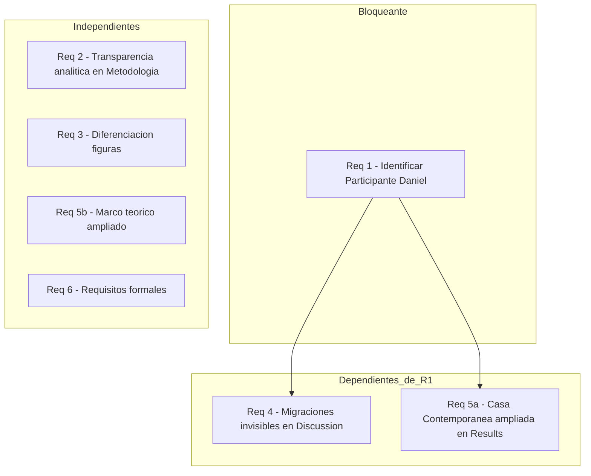
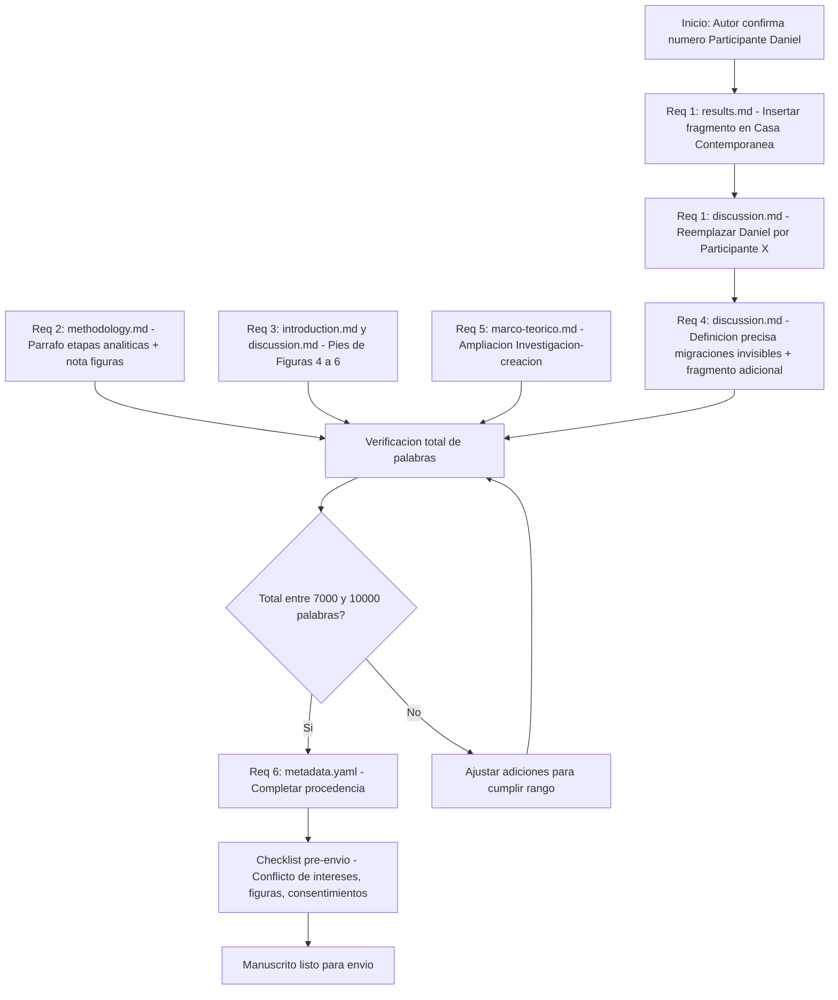
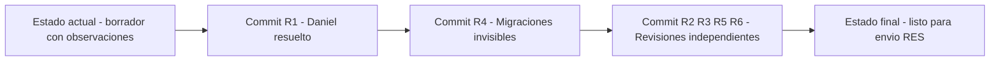

# Design — review-1: Revisión mayor del paper

## Overview

Esta revisión transforma el borrador actual de *Memorias de casas con piernas* en un manuscrito apto para envío a RES #100 resolviendo los cuatro problemas detectados en el peer-review interno (7 de abril de 2026): inconsistencia del caso "Daniel", opacidad del proceso analítico, ambigüedad epistémica de las figuras y subdesarrollo empírico del concepto "migraciones invisibles". Se suman dos mejoras menores de contenido y la verificación de requisitos formales pre-envío.

**Usuarios:** El autor Erwin y los revisores de RES #100.
**Impacto:** Modifica quirúrgicamente seis archivos del manuscrito dentro de un presupuesto de ~580 palabras adicionales, sin superar el techo de 10.000 palabras de la revista. El resto del texto aprobado permanece intacto.

### Goals
- Eliminar la inconsistencia interna entre Resultados y Discusión (caso "Daniel")
- Hacer transparente el proceso analítico para revisores de tradiciones metodológicas diversas
- Distinguir inequívocamente evidencia empírica de obra autoral en el tratamiento de figuras
- Dar soporte empírico suficiente al concepto de "migraciones invisibles"
- Cumplir los requisitos formales de RES antes del envío

### Non-Goals
- Reescribir secciones completas o cambiar el argumento central del paper
- Añadir nuevas referencias bibliográficas (salvo que el autor lo decida al ampliar el Marco teórico)
- Resolver ambigüedades del corpus de datos (transcripciones, permisos) que dependan de trabajo de campo adicional
- Convertir los archivos de figuras a formatos finales de envío (tarea del autor fuera del manuscrito `.md`)

---

## Architecture

### Existing Architecture Analysis

El manuscrito existe como conjunto de archivos Markdown en `paper/sections/`, con metadatos en `paper/metadata.yaml`, figuras en `figures/` y referencias en `references/references.bib`. Las secciones son módulos independientes con dependencias narrativas (la Discusión cita evidencia establecida en Resultados; la Metodología fundamenta el análisis de ambas).

Restricciones vigentes a respetar:
- Estilo de citas Chicago Author-Date (ya establecido en todo el manuscrito)
- Patrón de anonimización: todos los participantes citados por número (Participante N) o con pseudónimo con consentimiento explícito documentado
- Total de palabras: 7.000–10.000 (actual ~9.420; presupuesto de expansión ~580 palabras)
- Formato de pies de figura: título, autor/participante, técnica, año, nota de consentimiento o archivo

### Architecture Pattern & Boundary Map



**Orden de implementación seguro:** R1 primero → R4 y R5a en segundo lugar → R2, R3, R5b, R6 en cualquier orden (paralelizables).

### Technology Stack

| Capa | Herramienta | Rol en la revisión | Notas |
|------|-------------|-------------------|-------|
| Contenido | Markdown (.md) | Soporte de todas las secciones del manuscrito | Sin cambio de formato |
| Metadatos | YAML (.yaml) | Campos de procedencia y configuración del paper | Solo `metadata.yaml` |
| Control de versiones | Git | Trazabilidad de cada edición; rama `paper/memorias-de-casas-con-piernas-2` | Commits atómicos por requisito recomendados |
| Validación | `paper/sections/notas-revision.md` | Referencia de estado anterior para comparación post-edición | Solo lectura |

---

## Requirements Traceability

| Requisito | Resumen | Archivo(s) afectado(s) | Interfaz / Contrato de contenido | Flujo |
|-----------|---------|------------------------|----------------------------------|-------|
| 1.1 | Reemplazar "Daniel" por número de participante | `discussion.md` | Ningún nombre propio sin anonimizar | R1 → R4 |
| 1.2 | Añadir fragmento empírico en Casa Contemporánea | `results.md` | Fragmento con etiqueta de instrumento antes de Discusión | R1 → R5a |
| 1.3 | N/A — opción descartada (participante existe) | — | — | — |
| 1.4 | Sin nombres propios no anonimizados en ninguna sección | Todo el manuscrito | Coherencia de anonimización | R1 |
| 1.5 | Trazabilidad Results → Discussion | `results.md`, `discussion.md` | Toda mención en Discusión tiene referente en Resultados | R1 |
| 2.1 | Etapas del proceso analítico | `methodology.md` | 4 etapas mínimas descritas en prosa | R2 |
| 2.2 | Rol de dibujos en análisis | `methodology.md` | Relación explícita dibujos-bitácoras-diálogos | R2 |
| 2.3 | Mecanismo de reflexividad | `methodology.md` | Frase o párrafo sobre gestión de subjetividad | R2 |
| 2.4 | Reconocimiento de ausencia de triangulación | `methodology.md` o `discussion.md` | Ya existe en limitaciones; verificar cobertura | R2 |
| 2.5 | Evaluabilidad inter-paradigma | `methodology.md` | La descripción es comprensible desde tradiciones diversas | R2 |
| 2.6 | Rango de palabras Metodología: 1.500–1.700 | `methodology.md` | Conteo post-edición dentro del rango | R2 |
| 3.1 | Etiqueta en pies de Figuras 4-6 | `introduction.md`, `discussion.md` | Frase estandarizada en pie de cada figura autoral | R3 |
| 3.2 | Etiqueta en pies de Figuras 1-3 | `results.md` | Verificar que incluya "dato empírico… consentimiento informado" | R3 |
| 3.3 | Oración de encuadre al introducir figuras autorales | `introduction.md`, `discussion.md` | Cada figura autoral presentada como "archivo plástico" | R3 |
| 3.4 | Nota de doble naturaleza del material visual | `methodology.md` | 2-4 oraciones sobre evidencia vs. dispositivo artístico | R3 |
| 3.5 | Evaluar reubicación Figura 4 (condicional) | `introduction.md` | Decisión del autor; no bloqueante | R3 |
| 3.6 | Consistencia epistémica en todo el manuscrito | Todo el manuscrito | Ninguna figura sin estatuto explicitado | R3 |
| 4.1 | Fragmento empírico de migración interna en Discussion | `discussion.md` | Al menos un fragmento de bitácora/diálogo con número de participante | R4 |
| 4.2 | Definición precisa de "migraciones invisibles" | `discussion.md` | 2-3 oraciones definitoria, articulada con Grimson (2011) y De Certeau (1998) | R4 |
| 4.3 | N/A — el corpus contiene el relato (confirmado) | — | — | — |
| 4.4 | Independencia empírica de "migraciones invisibles" respecto a Daniel | `discussion.md` | El concepto no depende de un único caso | R4 |
| 4.5 | Coherencia Abstract ↔ cuerpo en "migraciones invisibles" | `abstract.md`, `discussion.md` | Abstract sigue siendo reproducible desde el cuerpo | R4 |
| 5.1 | Marco teórico ≥ 1.450 palabras | `marco-teorico.md` | Adición en "Investigación-creación" o "Vacío de investigación" | R5 |
| 5.2 | Resultados ≥ 1.900 palabras | `results.md` | Fragmento(s) adicional(es) o análisis transversal ampliado | R5 |
| 5.3 | Total manuscrito ≤ 10.000 palabras | Todos | Conteo global post-edición | R5 |
| 5.4 | Sin relleno en las adiciones | Todos | Cada palabra añadida aporta evidencia, análisis o argumentación | R5 |
| 5.5 | Patrón de citación mantenido en nuevos fragmentos | `results.md` | Formato "(Participante N, bitácora/diálogo simbólico)" | R5 |
| 6.1 | Campos de procedencia completados | `metadata.yaml` | Sin `[PENDIENTE]` en `procedencia` | R6 |
| 6.2 | Statement de conflicto de intereses | Manuscrito final | Presente en nota al pie de página 1 o sección dedicada | R6 |
| 6.3 | Figuras 1-3 convertidas a JPG/TIFF 300 dpi | `figures/` | Verificación de formato y resolución | R6 |
| 6.4 | Formularios de consentimiento como anexos | Paquete de envío | Si RES los requiere | R6 |
| 6.5 | Año de Figuras 4-6 confirmado | `figures/catalogo-figuras.md` | Sin año pendiente | R6 |

---

## Components and Interfaces

### Resumen de componentes

| Componente | Archivo | Intervención | Req. cubiertos | Palabras estimadas |
|------------|---------|--------------|----------------|--------------------|
| Casa Contemporánea | `results.md` | Inserción de fragmento Participante X (Daniel) | 1.2, 1.5, 4.1, 5.2, 5.5 | ~80-100 |
| Sección Migraciones Invisibles | `discussion.md` | Reemplazar "Daniel" + definición precisa + fragmento adicional | 1.1, 1.4, 1.5, 4.1, 4.2, 4.4, 4.5 | ~100-120 |
| Método de Análisis | `methodology.md` | Párrafo de etapas analíticas + rol de dibujos + nota figuras | 2.1, 2.2, 2.3, 2.5, 2.6, 3.4 | ~80-100 |
| Pies de Figuras 4-6 | `introduction.md`, `discussion.md` | Frase estandarizada en cada pie de figura autoral | 3.1, 3.3, 3.6 | ~30-40 |
| Pies de Figuras 1-3 | `results.md` | Verificación/refuerzo de etiqueta empírica | 3.2, 3.6 | ~0-10 |
| Marco teórico | `marco-teorico.md` | Ampliación de subsección "Investigación-creación" o "Vacío" | 5.1 | ~130-150 |
| Metadatos y pre-envío | `metadata.yaml`, `figures/catalogo-figuras.md` | Completar procedencia, confirmar años de figuras | 6.1, 6.5 | N/A |

---

### Sección de Contenido: Casa Contemporánea (results.md)

| Campo | Detalle |
|-------|---------|
| Intent | Insertar el fragmento empírico del Participante X (Daniel) que ilustra migración interna, dando trazabilidad al caso citado en Discussion |
| Requisitos | 1.2, 1.4, 1.5, 4.1, 5.2, 5.5 |

**Responsabilidades y restricciones**
- Insertar el fragmento después del último testimonio actual de Casa Contemporánea (Participante 35, bitácora) y antes del párrafo analítico que cierra la subsección.
- El fragmento debe estar etiquetado con formato `(Participante X, bitácora)` o `(Participante X, diálogo simbólico)`.
- El fragmento debe describir un desplazamiento sin cruce de frontera internacional (migración interna, cambio de barrio, desplazamiento doméstico).
- No añadir texto analítico nuevo en esta sección; el análisis del caso se desarrolla en Discussion.

**Dependencias**
- Inbound: Corpus físico del estudio — el autor debe proveer la transcripción del fragmento del Participante X (P0)
- Inbound: Número de participante confirmado por el autor (P0)
- Outbound: `discussion.md` — la mención de "El caso de la madre de la Participante X" requiere que este fragmento esté aquí primero (P0)

**Contrato de contenido**: Batch [x]

##### Contrato de Inserción

- **Posición:** Después de `"con ese mantel, ya estoy en casa" (Participante 35, bitácora).` en `results.md`
- **Volumen:** 40-80 palabras (fragmento citado en blockquote + etiqueta de instrumento)
- **Formato:**
  ```
  > "[texto del fragmento]" (Participante X, bitácora/diálogo simbólico).
  ```
- **Condición de validez:** El fragmento debe referir explícita o implícitamente un desplazamiento dentro del mismo país o ciudad.
- **Idempotencia:** Si el fragmento ya existiera en el texto, no duplicar.

---

### Sección de Contenido: Migraciones Invisibles (discussion.md)

| Campo | Detalle |
|-------|---------|
| Intent | Reemplazar "Daniel" por número de participante, añadir definición precisa del concepto y al menos un fragmento empírico de soporte |
| Requisitos | 1.1, 1.4, 1.5, 4.1, 4.2, 4.4, 4.5 |

**Responsabilidades y restricciones**
- Todas las ocurrencias de "Daniel" o "la madre de Daniel" deben quedar como "Participante X" (el número concreto lo provee el autor).
- La definición de "migraciones invisibles" debe articularse en 2-3 oraciones precisas que la distingan de la migración internacional, en diálogo con Grimson (2011) y De Certeau et al. (1998).
- El concepto debe tener al menos dos fragmentos empíricos de soporte: el del Participante X (que se inserta en Results) y al menos uno adicional tomado del corpus ya existente en Results (o del propio fragmento de Daniel si es el único caso de migración interna).
- No reescribir la subsección completa; intervenir solo los párrafos afectados.

**Dependencias**
- Inbound: `results.md` Casa Contemporánea — el fragmento debe existir allí antes de citarlo aquí (P0, bloqueado por Req 1)
- Inbound: Número de participante de "Daniel" confirmado por el autor (P0)

**Contrato de contenido**: Batch [x]

##### Contrato de Edición

- **Búsqueda y reemplazo:** `"Daniel"` → `"Participante X"` (todos los contextos en `discussion.md`)
- **Inserción de definición:** 2-3 oraciones tras la primera mención de "migraciones invisibles" (o reforzando la definición existente)
- **Fragmento adicional:** Si el corpus tiene otro participante con migración interna, añadir su fragmento en blockquote con etiqueta. Si no, usar el fragmento del Participante X y reconocer en la limitación que el concepto emerge de un único caso en este corpus.
- **Verificación post-edición:** La subsección no debe contener ningún nombre propio de participante.

---

### Sección de Contenido: Método de Análisis (methodology.md)

| Campo | Detalle |
|-------|---------|
| Intent | Hacer transparente el proceso que llevó de 60 bitácoras a 5 arquetipos, y añadir nota sobre la doble naturaleza del material visual |
| Requisitos | 2.1, 2.2, 2.3, 2.5, 2.6, 3.4 |

**Responsabilidades y restricciones**
- Insertar un párrafo de 80-120 palabras dentro de la subsección "Método de análisis: ensamblaje simbólico y sensible", después del primer párrafo de definición del método y antes del párrafo que empieza "El análisis no buscó codificar...".
- El párrafo debe cubrir al menos las etapas: (a) lectura y familiarización, (b) identificación de patrones, (c) agrupación en arquetipos provisionales, (d) revisión frente al corpus completo.
- Debe especificar cómo se integraron los dibujos proyectivos en el proceso (paralelo, integrado o secuencial respecto a las bitácoras).
- Añadir una frase sobre el mecanismo de reflexividad del investigador-creador.
- Añadir una nota de 2-4 oraciones sobre la doble naturaleza del material visual inmediatamente antes de la subsección "Consideraciones éticas".
- El conteo total de Metodología debe quedar entre 1.500 y 1.700 palabras.

**Contrato de contenido**: Batch [x]

##### Contrato de Inserción

- **Posición párrafo analítico:** Después de `...es articular esas verdades en una constelación de sentido.` en la subsección "Método de análisis".
- **Posición nota visual:** Inmediatamente antes del encabezado `## Consideraciones éticas`.
- **Volumen total:** Máximo 120 palabras (paragráfo analítico ~80 + nota visual ~40).

---

### Sección de Contenido: Pies de Figuras 4-6

| Campo | Detalle |
|-------|---------|
| Intent | Añadir frase estandarizada en cada pie de figura del autor para explicitar que no son dato empírico |
| Requisitos | 3.1, 3.3, 3.6 |

**Responsabilidades y restricciones**
- Localizar los pies de figura de Figuras 4, 5 y 6 en `introduction.md` (Fig. 4) y `discussion.md` (Fig. 5 y 6).
- Añadir al final de cada pie la frase: *"Pertenece al archivo plástico del investigador; no constituye dato empírico del trabajo de campo."*
- No modificar el resto del pie de figura.

**Contrato de contenido**: Batch [x]

##### Contrato de Edición — Figura 4 (introduction.md)

Pie actual termina en: `Archivo plástico del investigador.`
Pie nuevo termina en: `Archivo plástico del investigador. Pertenece al archivo plástico del investigador; no constituye dato empírico del trabajo de campo.`

> Nota: La frase "Archivo plástico del investigador" ya existe; la nueva frase la amplía. Si resulta redundante, simplificar a: `Archivo plástico del investigador. No constituye dato empírico del trabajo de campo.`

##### Contrato de Edición — Figuras 5 y 6 (discussion.md)

Mismo patrón que Figura 4. Verificar que los pies actuales de Figuras 5 y 6 terminen con la frase añadida.

---

### Sección de Contenido: Marco teórico (marco-teorico.md)

| Campo | Detalle |
|-------|---------|
| Intent | Ampliar de 1.323 a ≥ 1.450 palabras añadiendo contenido sustantivo en "Investigación-creación" o "Vacío de investigación" |
| Requisitos | 5.1, 5.3, 5.4 |

**Responsabilidades y restricciones**
- Añadir 130-150 palabras en la subsección "Investigación-creación como producción legítima de conocimiento" o en "Vacío de investigación".
- El contenido prioritario: estado de la investigación-creación en ciencias sociales chilenas contemporáneas (si existe bibliografía reciente), o desarrollo del argumento sobre cómo las tres vertientes teóricas del artículo (fenomenología del habitar + migración y afecto + arte como archivo) se articulan de forma novedosa en el dispositivo "casas con piernas".
- No añadir nuevas referencias bibliográficas sin verificación DOI (o marcarlas con nota para verificación posterior del autor).

**Contrato de contenido**: Batch [x]

##### Contrato de Inserción

- **Posición:** Al final de la subsección "Investigación-creación como producción legítima de conocimiento", antes de `## Vacío de investigación`, o al final de "Vacío de investigación" antes del encabezado de la siguiente sección.
- **Volumen:** 130-150 palabras.

---

### Metadatos y Pre-envío (metadata.yaml, catalogo-figuras.md)

| Campo | Detalle |
|-------|---------|
| Intent | Completar campos formales requeridos por RES antes del envío |
| Requisitos | 6.1, 6.5 |

**Responsabilidades y restricciones**
- En `metadata.yaml`: reemplazar los valores `[PENDIENTE]` en `procedencia.proyecto` e `procedencia.institucion_financiadora` con los valores reales.
- En `figures/catalogo-figuras.md`: confirmar el año de las Figuras 4, 5 y 6 y actualizar los pies de figura correspondientes si el año difiere del registrado.
- El statement de conflicto de intereses (6.2) y la conversión de figuras (6.3) son tareas para el autor fuera del manuscrito Markdown; el diseño las documenta como checklist de pre-envío.

---

## System Flows



---

## Error Handling

### Estrategia

Dado que las "operaciones" son ediciones de texto en archivos Markdown sin sistema informático, los "errores" son condiciones de bloqueo editorial que deben resolverse antes de la implementación.

### Condiciones de bloqueo y respuesta

| Condición | Tipo | Acción requerida |
|-----------|------|-----------------|
| Número de participante de "Daniel" no confirmado | Bloqueante (P0) | El autor debe confirmar antes de iniciar cualquier tarea de Req 1, 4 o 5a |
| Fragmento de Daniel no transcrito digitalmente | Bloqueante (P0) | El autor debe transcribir del corpus físico |
| Corpus no contiene un segundo caso de migración interna | Advertencia | Reconocer en limitaciones que "migraciones invisibles" emerge de un solo caso; no bloquea el envío |
| Adiciones superan presupuesto de 580 palabras | Bloqueante | Reducir palabras en secciones con mayor margen (discussion o conclusion) antes del envío |
| Campos de procedencia en metadata.yaml son confidenciales | Advertencia | El autor decide qué información publicar; puede usar denominación institucional genérica |

---

## Testing Strategy

### Checklist de validación post-edición

**Coherencia interna (Req 1 y 4)**
- [ ] Buscar "Daniel" en todo el manuscrito → resultado: cero ocurrencias
- [ ] Verificar que la subsección Casa Contemporánea en `results.md` contiene el fragmento del Participante X con etiqueta de instrumento
- [ ] Verificar que la Discusión cita "Participante X" y que ese número aparece en Resultados antes de esa mención
- [ ] Verificar que "migraciones invisibles" tiene definición de 2-3 oraciones en Discussion

**Transparencia analítica (Req 2)**
- [ ] La subsección "Método de análisis" describe al menos 4 etapas del proceso
- [ ] La subsección especifica el rol de los dibujos proyectivos en el análisis
- [ ] El conteo de palabras de `methodology.md` está entre 1.500 y 1.700

**Diferenciación epistémica (Req 3)**
- [ ] Los pies de Figuras 4, 5 y 6 terminan con "No constituye dato empírico del trabajo de campo."
- [ ] Los pies de Figuras 1, 2 y 3 incluyen "Reproducido con consentimiento informado."
- [ ] `methodology.md` contiene nota de 2-4 oraciones sobre doble naturaleza del material visual

**Ampliación de secciones (Req 5)**
- [ ] `marco-teorico.md` ≥ 1.450 palabras
- [ ] `results.md` ≥ 1.900 palabras
- [ ] Total del manuscrito ≤ 10.000 palabras

**Requisitos formales (Req 6)**
- [ ] `metadata.yaml`: sin valores `[PENDIENTE]` en `procedencia`
- [ ] `figures/catalogo-figuras.md`: año de Figuras 4-6 confirmado
- [ ] Statement de conflicto de intereses presente en el manuscrito final (nota al pie o sección)
- [ ] Figuras 1-3 disponibles en JPG o TIFF a 300 dpi (verificación fuera del manuscrito .md)

---

## Migration Strategy

No aplica (no hay cambio de esquema ni base de datos). El control de versiones Git actúa como mecanismo de rollback: cada tarea de Req 1–6 debe implementarse en commits atómicos independientes para permitir reversión quirúrgica de cualquier cambio sin afectar los demás.


