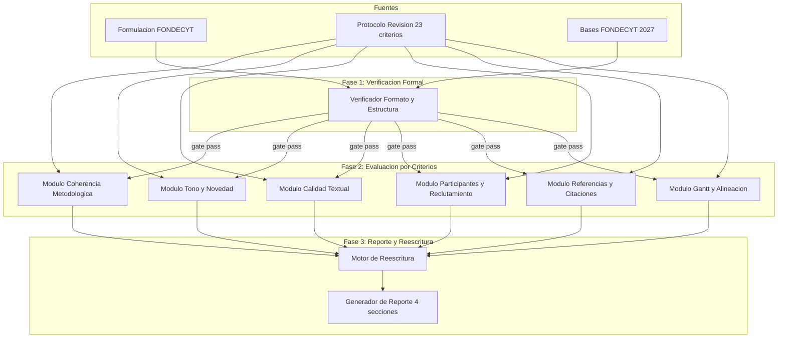
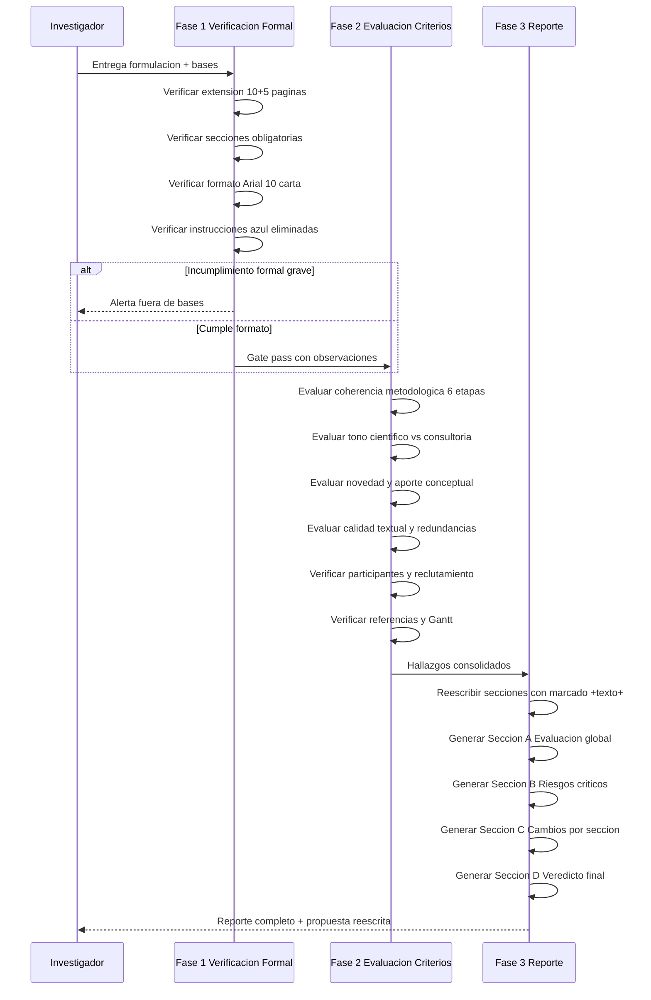

# Design Document: revision-fondecyt-cea-2027

## Overview

**Purpose**: Este diseño define el flujo de trabajo estructurado para la revisión crítica, evaluación y reescritura de la propuesta FONDECYT Regular 2027 sobre tecnologías móviles y estudiantes universitarios con CEA, integrando tres fuentes documentales de `temp_context/`.

**Users**: El investigador responsable utiliza este proceso para obtener una evaluación experta simulada que maximice la adjudicabilidad de la propuesta antes del cierre del concurso (10 junio 2026).

**Impact**: Transforma la formulación actual en una versión optimizada con cambios marcados (+texto+), señalando riesgos críticos y proponiendo reescrituras concretas.

### Goals
- Verificar cumplimiento formal de bases FONDECYT Regular 2027 (gate bloqueante)
- Evaluar la propuesta según los 23 criterios del protocolo de revisión
- Generar reescrituras concretas marcadas con +texto+ que aumenten la adjudicabilidad
- Entregar reporte estructurado en 4 secciones (evaluación global, riesgos, cambios, veredicto)

### Non-Goals
- Redactar la propuesta desde cero (se parte del documento existente)
- Verificar referencias contra bases de datos externas (CrossRef, DOI) — se limita a consistencia interna
- Generar la carta Gantt en formato visual; se evalúa la coherencia textual de la existente
- Gestionar el proceso de postulación en línea de ANID

## Architecture

### Architecture Pattern & Boundary Map

**Architecture Integration**:
- Patrón seleccionado: Pipeline híbrido con gate formal + evaluación paralela por módulos temáticos
- Límites de dominio: Fase 1 (formal/bloqueante), Fase 2 (evaluación cualitativa por dimensiones), Fase 3 (síntesis y reescritura)
- La Fase 1 actúa como gate: si la propuesta tiene incumplimientos formales graves, se reportan antes de continuar
- Los módulos de Fase 2 operan sobre dimensiones temáticas independientes, permitiendo evaluación paralela

### Technology Stack

| Layer | Choice / Version | Role in Feature | Notes |
|-------|------------------|-----------------|-------|
| Documentos fuente | Markdown (.md) | Input: formulación, protocolo, bases | Archivos en `temp_context/` |
| Proceso de revisión | Claude (LLM asistido) | Ejecuta evaluación y reescritura | Sigue protocolo de 23 criterios |
| Output | Markdown (.md) | Reporte de evaluación + propuesta reescrita | Marcado con +texto+ |
| Referencia de formato | Bases FONDECYT 2027 | Criterios formales de verificación | Gate bloqueante |

## System Flows

### Flujo principal de revisión

## Requirements Traceability

| Requirement | Summary | Components | Flows |
|-------------|---------|------------|-------|
| 1.1, 1.2, 1.3, 1.4, 1.5, 1.6 | Cumplimiento formal bases FONDECYT | Verificador Formato y Estructura | Fase 1 |
| 2.1, 2.2, 2.3, 2.4, 2.5 | Coherencia metodológica y progresión | Módulo Coherencia Metodológica | Fase 2 |
| 3.1, 3.2, 3.3, 3.4, 3.5 | Coherencia objetivos-metodología-productos | Módulo Gantt y Alineación | Fase 2 |
| 4.1, 4.2, 4.3, 4.4, 4.5, 4.6 | Tono científico y novedad | Módulo Tono y Novedad | Fase 2 |
| 5.1, 5.2, 5.3, 5.4, 5.5 | Calidad textual y extensión | Módulo Calidad Textual | Fase 2 |
| 6.1, 6.2, 6.3, 6.4 | Participantes y reclutamiento | Módulo Participantes y Reclutamiento | Fase 2 |
| 7.1, 7.2, 7.3, 7.4 | Referencias y citaciones | Módulo Referencias y Citaciones | Fase 2 |
| 8.1, 8.2, 8.3, 8.4, 8.5 | Generación del reporte de evaluación | Generador de Reporte 4 secciones | Fase 3 |
| 9.1, 9.2 | Ejemplos metodológicos del paper previo | Módulo Coherencia Metodológica | Fase 2 |

## Components and Interfaces

| Component | Domain/Layer | Intent | Req Coverage | Key Dependencies | Contracts |
|-----------|--------------|--------|--------------|------------------|-----------|
| Verificador Formato | Fase 1 | Verifica cumplimiento formal de bases FONDECYT | 1.1-1.6 | Bases FONDECYT (P0) | Checklist |
| Módulo Coherencia Metodológica | Fase 2 | Evalúa progresión y justificación de 6 etapas | 2.1-2.5, 9.1-9.2 | Formulación (P0), Protocolo (P0) | Evaluación |
| Módulo Tono y Novedad | Fase 2 | Evalúa tono científico y diferenciación | 4.1-4.6 | Formulación (P0) | Evaluación |
| Módulo Calidad Textual | Fase 2 | Identifica redundancias y optimiza extensión | 5.1-5.5 | Formulación (P0) | Evaluación |
| Módulo Participantes | Fase 2 | Verifica viabilidad del reclutamiento | 6.1-6.4 | Formulación (P0) | Evaluación |
| Módulo Referencias | Fase 2 | Verifica completitud y formato APA 7 | 7.1-7.4 | Formulación (P0) | Checklist |
| Módulo Gantt y Alineación | Fase 2 | Verifica coherencia OE-Etapa-Producto-Gantt | 3.1-3.5 | Formulación (P0), Gantt (P0) | Evaluación |
| Motor de Reescritura | Fase 3 | Genera texto corregido con marcado +texto+ | 8.3, 8.4 | Hallazgos Fase 2 (P0) | Output |
| Generador de Reporte | Fase 3 | Estructura salida en 4 secciones A-D | 8.1, 8.2, 8.5 | Motor Reescritura (P0) | Output |

### Fase 1: Verificación Formal

#### Verificador Formato y Estructura

| Field | Detail |
|-------|--------|
| Intent | Verifica que la propuesta cumple los requisitos formales de las bases FONDECYT Regular 2027 |
| Requirements | 1.1, 1.2, 1.3, 1.4, 1.5, 1.6 |

**Responsibilities & Constraints**
- Verificar extensión (10 páginas formulación + 5 referencias, formato carta, Arial 10)
- Verificar presencia de las 6 secciones obligatorias: marco teórico, hipótesis/objetivos, metodología, Gantt, antecedentes equipo, novedad
- Verificar que citas tienen entrada en referencias y viceversa
- Detectar información en anexos que debería estar en formulación
- Confirmar eliminación de instrucciones en azul
- Actúa como gate: incumplimientos graves detienen el flujo

**Checklist de verificación**:
- [ ] Extensión formulación <= 10 páginas
- [ ] Extensión referencias <= 5 páginas
- [ ] Sección (a) marco teórico presente y sustancial
- [ ] Sección (b) hipótesis + objetivo general + objetivos específicos presentes
- [ ] Sección (c) metodología presente y detallada
- [ ] Sección (d) carta Gantt presente
- [ ] Sección (e) antecedentes del equipo (nota: puede estar en otra parte del formulario)
- [ ] Sección (f) novedad científica presente
- [ ] Sin instrucciones en azul residuales
- [ ] Citaciones y referencias consistentes

### Fase 2: Evaluación por Criterios

#### Módulo Coherencia Metodológica

| Field | Detail |
|-------|--------|
| Intent | Evalúa la claridad, diferenciación y justificación de las 6 etapas metodológicas |
| Requirements | 2.1, 2.2, 2.3, 2.4, 2.5, 9.1, 9.2 |

**Responsibilities & Constraints**
- Verificar que cada etapa está claramente diferenciada de las demás
- Verificar paso a paso tipo "receta" en cada etapa: qué, con qué, quién, cómo, qué se registra, cómo se analiza
- Verificar participantes explícitos por etapa
- Evaluar justificación de cada técnica (Ketso, card sorting, heurística, think-aloud, rúbricas, grupos focales, talleres)
- Verificar referencias teóricas para cada técnica participativa
- Incorporar/verificar ejemplos concretos de procedimientos similares (etapa 3 paper previo)

**Criterios del protocolo mapeados**: 1, 2, 6, 10, 11, 16, 23

#### Módulo Tono y Novedad

| Field | Detail |
|-------|--------|
| Intent | Evalúa que el proyecto se presente como investigación científica y no consultoría |
| Requirements | 4.1, 4.2, 4.3, 4.4, 4.5, 4.6 |

**Responsibilities & Constraints**
- Detectar frases de riesgo evaluativo (diseño de app, innovación aplicada, intervención institucional, consultoría UX)
- Evaluar visibilidad del aporte conceptual y creación de conocimiento
- Proponer sección de creación de conocimiento si falta
- Verificar tono científico consistente a lo largo de todo el documento

**Criterios del protocolo mapeados**: 3, 5, 7, 13, 18, 21

#### Módulo Calidad Textual

| Field | Detail |
|-------|--------|
| Intent | Identifica redundancias, repeticiones y optimiza extensión para ajustarse a 10 páginas |
| Requirements | 5.1, 5.2, 5.3, 5.4, 5.5 |

**Responsibilities & Constraints**
- Identificar palabras, conceptos o frases repetidas en exceso
- Identificar elementos sobrantes eliminables sin pérdida de calidad
- Evaluar si el documento cabe en 10 páginas
- Proponer reducciones concretas
- Verificar ausencia de guiones (-) y guiones bajos (_) innecesarios

**Criterios del protocolo mapeados**: 8, 12, 14

#### Módulo Participantes y Reclutamiento

| Field | Detail |
|-------|--------|
| Intent | Verifica que la descripción de participantes es clara, justificada y viable |
| Requirements | 6.1, 6.2, 6.3, 6.4 |

**Responsibilities & Constraints**
- Verificar número de expertos por etapa (15-20) con justificación
- Verificar mecanismos de reclutamiento: fundación colaboradora, bola de nieve, recomendaciones, referencias de contratados
- Verificar justificación de 20 entrevistas por universidad en Etapa 1
- Evaluar viabilidad de retención longitudinal en las 6 etapas

**Criterios del protocolo mapeados**: 10, 22

#### Módulo Referencias y Citaciones

| Field | Detail |
|-------|--------|
| Intent | Verifica completitud y formato de referencias bibliográficas |
| Requirements | 7.1, 7.2, 7.3, 7.4 |

**Responsibilities & Constraints**
- Verificar presencia de Tippett (2009) en formato APA 7
- Cruzar citaciones en texto con listado de referencias
- Señalar omisiones con autor y año
- Verificar consistencia de formato APA 7

**Criterios del protocolo mapeados**: 15

#### Módulo Gantt y Alineación

| Field | Detail |
|-------|--------|
| Intent | Verifica coherencia entre objetivos, etapas, Gantt, productos y actores |
| Requirements | 3.1, 3.2, 3.3, 3.4, 3.5 |

**Responsibilities & Constraints**
- Verificar mapeo OE1-OE4 a etapas y productos
- Verificar consistencia de nombres entre Gantt y texto metodológico
- Detectar contradicciones y proponer resolución
- Verificar coherencia de hipótesis con metodología y productos
- Señalar inconsistencias en numeración de productos (salto detectado: 6 → 9, faltan 7 y 8)

**Criterios del protocolo mapeados**: 4, 9, 17

### Fase 3: Reporte y Reescritura

#### Motor de Reescritura

| Field | Detail |
|-------|--------|
| Intent | Genera texto corregido con marcado +texto nuevo+ para cambios |
| Requirements | 8.3, 8.4 |

**Responsibilities & Constraints**
- Reescribir secciones manteniendo la esencia del proyecto
- Marcar todo texto nuevo con +delante y detrás+
- Proponer cambios concretos, no comentarios generales
- Priorizar cambios que aumenten adjudicabilidad sobre mejoras estéticas
- Respetar restricción de no usar guiones (-) ni guiones bajos (_)

#### Generador de Reporte

| Field | Detail |
|-------|--------|
| Intent | Estructura la salida final en 4 secciones según protocolo |
| Requirements | 8.1, 8.2, 8.5 |

**Responsibilities & Constraints**
- Sección A: Evaluación global breve
- Sección B: Riesgos críticos de adjudicación
- Sección C: Cambios concretos sugeridos por sección (con reescrituras +marcadas+)
- Sección D: Veredicto final con fortalezas, debilidades y probabilidad de competitividad
- Tono crítico, preciso y académico
- Priorizar recomendaciones por impacto en adjudicabilidad

## Testing Strategy

### Verificación de completitud
- Confirmar que los 23 criterios del protocolo están cubiertos por al menos un módulo
- Verificar que cada requisito (1.1-9.2) tiene al menos un hallazgo o evaluación en el reporte
- Confirmar presencia de las 4 secciones (A-D) en el reporte final

### Verificación de coherencia
- Confirmar que las reescrituras no introducen contradicciones con secciones no modificadas
- Verificar que el marcado +texto+ es consistente y permite distinguir cambios
- Confirmar que la extensión total con cambios se mantiene dentro del límite de 10 páginas

### Verificación de calidad
- Confirmar que las reescrituras mantienen tono científico
- Verificar que no se introducen frases de riesgo evaluativo en el texto propuesto
- Confirmar que las referencias añadidas (si las hay) siguen formato APA 7
