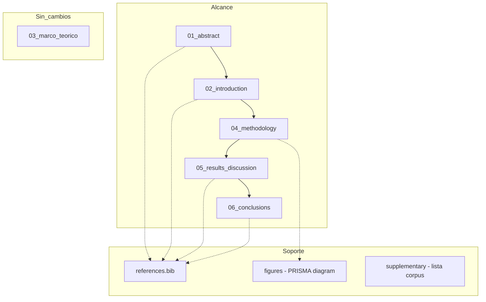
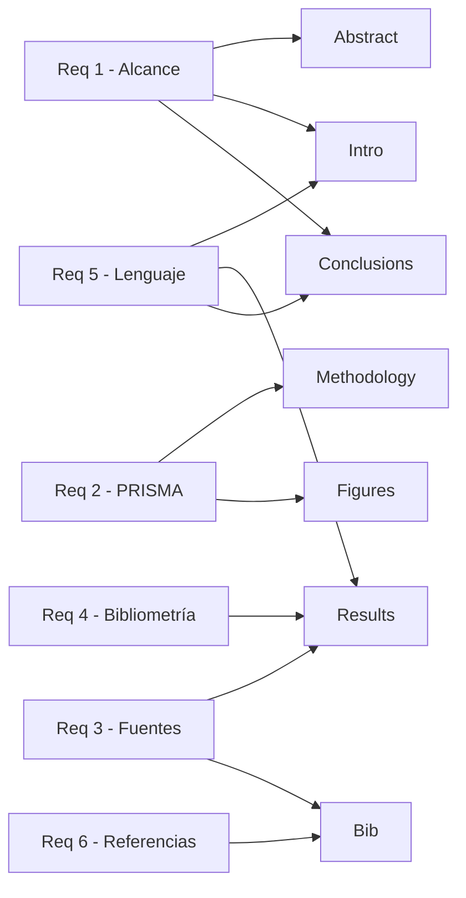

# Design Document — revision-mayor-paper

## Overview

**Purpose**: Esta revisión mayor transforma el manuscrito de un estado con debilidades metodológicas y de alcance a un paper publicable en REIS, resolviendo las 6 debilidades identificadas en el peer-review.

**Users**: Los autores (Manuel y Erwin) utilizan este diseño como guía de implementación para las modificaciones al manuscrito.

**Impact**: Modifica 5 de los 6 archivos en `paper/`, actualiza `references/references.bib`, y genera 1-2 figuras/tablas nuevas.

### Goals
- Resolver la brecha entre alcance declarado y evidencia disponible
- Cumplir estándares PRISMA 2020 para la sección metodológica
- Eliminar dependencia de fuentes no académicas para claims centrales
- Proveer análisis bibliométrico que transparente la base de evidencia
- Ajustar el registro epistemológico del paper al de una revisión de literatura
- Completar y verificar todas las entradas del .bib

### Non-Goals
- No se reescribe el marco teórico (está sólido según la revisión)
- No se cambia la estructura general del paper (IMRaD modificado)
- No se agregan nuevas secciones al paper
- No se genera un nuevo corpus de artículos (se trabaja con los 163 existentes)
- No se registra el protocolo en PROSPERO (decisión de los autores)

## Architecture

### Existing Architecture Analysis

El manuscrito actual tiene esta estructura:
- `paper/00_metadata.md` — Metadatos (título, autores, keywords)
- `paper/01_abstract.md` — Resumen bilingüe
- `paper/02_introduction.md` — Introducción con gap, hipótesis, objetivos
- `paper/03_marco_teorico.md` — Marco teórico (4 corrientes + polisemia)
- `paper/04_methodology.md` — Metodología de revisión
- `paper/05_results_discussion.md` — Resultados y discusión
- `paper/06_conclusions.md` — Conclusiones y tipología
- `references/references.bib` — 24 entradas, 4 sin verificar

**Patrones existentes a respetar**:
- Formato Markdown con encabezados jerárquicos
- Citas en formato autor-año en el texto (Harvard)
- Estructura IMRaD con marco teórico expandido
- Separación entre secciones como archivos individuales

**Constraints**:
- Máximo 8,000 palabras total (actualmente ~5,500; margen de ~2,500)
- Resumen máximo 150 palabras por idioma
- No modificar el marco teórico salvo mínimos ajustes de lenguaje

### Architecture Pattern & Boundary Map

**Architecture Integration**:
- Selected pattern: Modificación incremental por sección con validación cruzada
- Domain boundaries: Cada sección es un componente independiente, pero con dependencias de coherencia (abstract refleja conclusiones, intro alinea con resultados)
- Existing patterns preserved: Markdown, Harvard, IMRaD
- New components: diagrama PRISMA (figura), material suplementario (lista de corpus)

### Technology Stack

| Layer | Choice / Version | Role | Notes |
|-------|-----------------|------|-------|
| Formato | Markdown | Contenido del manuscrito | Sin cambios |
| Referencias | BibTeX | Gestión bibliográfica | Verificación via CrossRef API |
| Diagramas | Mermaid / PRISMA flowchart | Diagrama PRISMA 2020 | Nuevo: generar como figura |
| Validación | scripts/validate_paper.py | Checks automáticos | Existente |
| Búsqueda | Scopus, CrossRef, Semantic Scholar | Verificación de refs y búsqueda de fuentes | Via skills de citation-management |

## System Flows

## Requirements Traceability

| Requirement | Summary | Componentes afectados | Dependencias |
|-------------|---------|----------------------|--------------|
| 1.1–1.5 | Coherencia alcance/evidencia | abstract, introduction, conclusions | Debe completarse antes de R5 |
| 2.1–2.7 | PRISMA 2020 | methodology, figures/ | Independiente |
| 3.1–3.5 | Fuentes académicas | results_discussion, references.bib | Requiere búsqueda bibliográfica |
| 4.1–4.6 | Análisis bibliométrico | results_discussion | Requiere datos del corpus |
| 5.1–5.5 | Lenguaje epistemológico | introduction, results_discussion, conclusions | Depende de R1 |
| 6.1–6.5 | Verificación referencias | references.bib | Independiente, puede ser paralelo |

## Components and Interfaces

| Componente | Archivo | Intent | Req Coverage | Dependencias |
|-----------|---------|--------|--------------|--------------|
| AbstractRevision | 01_abstract.md | Reformular alcance y tono | 1.1, 1.2 | Depende de ConclusionsRevision |
| IntroRevision | 02_introduction.md | Reformular objetivos y eliminar hipótesis confirmatoria | 1.3, 5.1, 5.2 | — |
| MethodologyExpansion | 04_methodology.md | Completar PRISMA 2020 | 2.1–2.7 | — |
| ResultsRevision | 05_results_discussion.md | Reemplazar fuentes, agregar bibliometría, ajustar lenguaje | 3.1–3.5, 4.1–4.6, 5.3–5.5 | Requiere R3 y R4 |
| ConclusionsRevision | 06_conclusions.md | Eliminar lenguaje confirmatorio, reconocer brechas | 1.4, 1.5, 5.1, 5.4 | Depende de ResultsRevision |
| ReferencesVerification | references.bib | Verificar, completar DOIs, eliminar huérfanas | 6.1–6.5 | Independiente |
| PRISMADiagram | figures/prisma_flow.md | Diagrama de flujo PRISMA 2020 | 2.1 | Datos de MethodologyExpansion |

### Sección: Alcance y Tono Epistemológico

#### IntroRevision

| Field | Detail |
|-------|--------|
| Intent | Reformular objetivos y pregunta de investigación eliminando lenguaje confirmatorio |
| Requirements | 1.3, 5.1, 5.2 |

**Responsabilidades y Constraints**
- Reemplazar "hipótesis central" por "pregunta de investigación" o "proposición teórica"
- Reformular los tres objetivos para distinguir síntesis general vs. foco chileno
- Mantener la estructura de la introducción (contexto → gap → pregunta → objetivos → estructura)
- No exceder la extensión actual en más de 200 palabras

**Cambios específicos**:
1. Párrafo 3: Reformular "La hipótesis central de este trabajo sostiene que..." → "Este trabajo explora la proposición de que..."
2. Párrafo 4 (objetivos): Tercer objetivo debe reconocer que la comparación es entre usos genéricos documentados y usos migrantes documentados, no necesariamente en Chile
3. Agregar caveat: "La revisión sintetiza evidencia internacional con énfasis interpretativo en las implicaciones para el corredor migratorio Venezuela-Colombia-Chile"

#### AbstractRevision

| Field | Detail |
|-------|--------|
| Intent | Ajustar el alcance declarado y eliminar certezas excesivas |
| Requirements | 1.1, 1.2 |

**Cambios específicos**:
1. Reemplazar "analiza cómo" → "explora cómo"
2. Reemplazar "confirman que" → "sugieren que"
3. Agregar matiz: "sintetiza evidencia internacional con foco en las implicaciones para" antes de mencionar Venezuela/Colombia/Chile
4. Verificar que no exceda 150 palabras por idioma

#### ConclusionsRevision

| Field | Detail |
|-------|--------|
| Intent | Eliminar confirmación de hipótesis, reconocer brecha alcance/evidencia |
| Requirements | 1.4, 1.5, 5.1, 5.4 |

**Cambios específicos**:
1. Párrafo 1: Reemplazar "La evidencia confirma que" → "La evidencia revisada es consistente con la proposición de que"
2. Párrafo de tipología: Reemplazar "propone" con nota de que es "derivada de la síntesis"
3. Agregar párrafo breve reconociendo que la evidencia directa sobre Chile es limitada y que la tipología requiere validación empírica en ese contexto
4. Señalar explícitamente cuándo se extrapola de otros contextos

### Sección: Metodología PRISMA

#### MethodologyExpansion

| Field | Detail |
|-------|--------|
| Intent | Completar la sección metodológica con elementos PRISMA 2020 faltantes |
| Requirements | 2.1–2.7 |

**Contenido a agregar**:

1. **Subsección "Registro y protocolo"** (nueva, después del primer párrafo):
   - Declarar que el protocolo no fue pre-registrado en PROSPERO
   - Justificar: revisión de alcance exploratorio en ciencias sociales

2. **Subsección "Estrategia de búsqueda detallada"** (expandir la existente):
   - Cadenas exactas por base de datos (Scopus, WoS, Google Scholar)
   - Fechas de ejecución de las búsquedas
   - Operadores booleanos completos

3. **Subsección "Proceso de selección"** (expandir):
   - Declarar número de revisores
   - Método de resolución de discrepancias
   - Referencia al diagrama PRISMA (Figura 1)

4. **Subsección "Evaluación de calidad"** (nueva):
   - Justificar por qué no se aplicó evaluación formal de riesgo de sesgo (naturaleza heterogénea del corpus, mezcla de métodos)
   - Alternativamente: describir criterios mínimos de calidad aplicados

5. **Subsección "Método de síntesis"** (nueva):
   - Declarar que se usó análisis temático (Braun y Clarke, 2006) o framework synthesis
   - Describir proceso de codificación y categorización

6. **Material suplementario**:
   - Referir a lista completa de artículos como Apéndice o supplementary material

#### PRISMADiagram

| Field | Detail |
|-------|--------|
| Intent | Generar diagrama de flujo PRISMA 2020 con datos del paper |
| Requirements | 2.1 |

**Estructura del diagrama** (basada en datos existentes):
- Identificación: 847 registros (Scopus) + N registros (WoS, Scholar)
- Duplicados eliminados: 203
- Filtrados por título/abstract: 847-203 = 644 → 312 elegibles
- Excluidos en lectura completa: 154 (con razones)
- Bola de nieve: +5
- Incluidos en síntesis: 163

### Sección: Fuentes y Evidencia

#### ResultsRevision

| Field | Detail |
|-------|--------|
| Intent | Reemplazar fuentes no académicas, agregar bibliometría, ajustar lenguaje |
| Requirements | 3.1–3.5, 4.1–4.6, 5.3–5.5 |

**Cambios por subsección**:

**A. Conectividad y vínculos transnacionales**:
- Identificar fuente completa de testimonios (Cecilia, José) — consultar autores
- Si es estudio propio: citar como "(Autores, en preparación)" con nota al pie
- Si es de otro autor: proporcionar referencia completa

**B. Contextos de uso por plataforma**:
- Reemplazar "García, en NPR, 2021" como evidencia principal por estudios académicos sobre:
  - Uso de Facebook por migrantes para información de rutas (buscar: Dekker et al., Alencar, Gillespie et al.)
  - Documentación en YouTube de trayectos migratorios (buscar: Leurs, Smets)
- Mantener NPR solo como ilustración complementaria, no como claim principal

**C. Divergencias (nueva subsección "Análisis bibliométrico del corpus")**:
- Agregar al inicio de la sección de resultados una subsección con:
  - Tabla 1: Distribución por año (2021-2026)
  - Tabla 2: Distribución por plataforma
  - Tabla 3: Distribución por región/contexto migratorio
  - Tabla 4: Distribución por metodología
- Indicar cuántos estudios contribuyen a cada categoría de análisis

**D. Lenguaje en toda la sección**:
- Reemplazar formulaciones absolutas por cautelosas
- Agregar indicadores de fuerza de evidencia (ej: "múltiples estudios coinciden en...", "evidencia incipiente sugiere...")

### Sección: Referencias

#### ReferencesVerification

| Field | Detail |
|-------|--------|
| Intent | Verificar todas las entradas, completar DOIs, resolver pendientes |
| Requirements | 6.1–6.5 |

**Entradas a verificar**:
1. `bell2015` — "pendiente de verificación" → buscar en CrossRef por título
2. `torres2018` — "pendiente de verificación" → buscar; si no existe, reemplazar por fuente alternativa sobre uso de redes sociales en América Latina
3. `zhao2023` — "pendiente de verificación" → verificar DOI de Palgrave Macmillan
4. `eito2011` — "pendiente de verificación" → buscar en Dialnet/CrossRef

**Acciones adicionales**:
- Agregar DOI a `bourdieu1986`, `putnam2000`, `silverstone1996` si disponibles
- Verificar que no haya entradas huérfanas (en .bib pero no citadas)
- Verificar que toda cita en texto tenga entrada en .bib
- Agregar nuevas entradas para fuentes que reemplacen a NPR

## Testing Strategy

### Validaciones automáticas (post-implementación)
- Ejecutar `scripts/validate_paper.py` para verificar estructura y citas
- Verificar conteo de palabras total < 8,000
- Verificar resúmenes < 150 palabras cada uno
- Verificar que toda cita en texto tenga entrada en .bib
- Verificar que no haya entradas .bib con "pendiente de verificación"

### Validaciones manuales
- Coherencia argumentativa entre secciones reformuladas
- Lenguaje consistentemente cauteloso (sin "confirma", "demuestra", "prueba")
- Diagrama PRISMA con números correctos
- Tablas bibliométricas con datos plausibles

### Revisión final
- Ejecutar `/paper:review` tras implementación para verificar mejora
- Verificar que las debilidades marcadas como [CRÍTICO] en el review-report.md estén resueltas

## Orden de implementación recomendado

La implementación debe seguir un orden que respete las dependencias:

1. **Paralelo inicial**: ReferencesVerification + MethodologyExpansion + PRISMADiagram (independientes)
2. **Búsqueda de fuentes**: Investigar fuentes académicas para reemplazar NPR y resolver testimonios (informa a ResultsRevision)
3. **ResultsRevision**: Con fuentes encontradas y datos bibliométricos
4. **IntroRevision**: Reformular objetivos y lenguaje
5. **ConclusionsRevision**: Depende de que Results esté estable
6. **AbstractRevision**: Último, refleja el estado final del paper
7. **Validación cruzada**: Verificar coherencia entre todas las secciones modificadas
