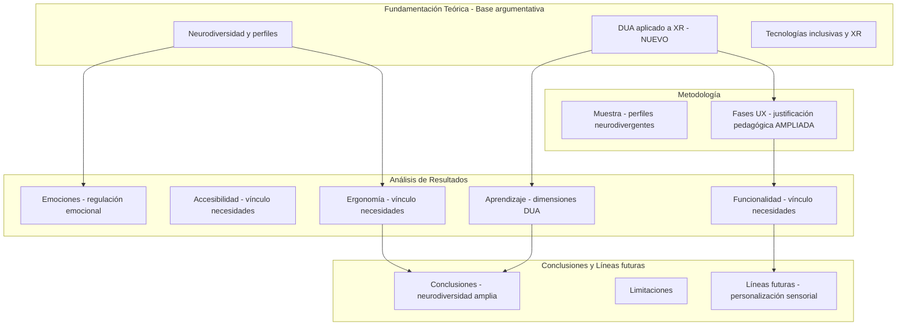
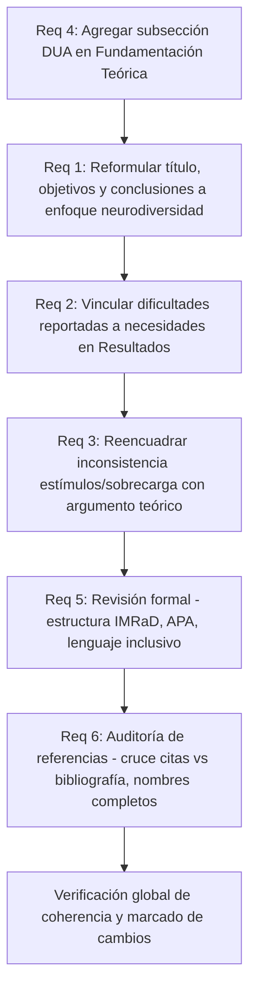
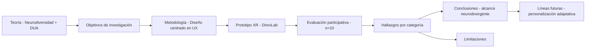
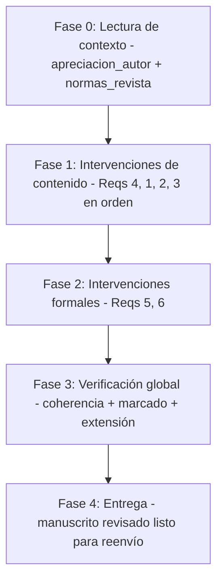

# Design Document — Revisión artículo XR para estudiantes neurodivergentes

## Overview

Este documento define el plan de revisión del artículo científico "Diseño y evaluación UX de un entorno XR inclusivo para estudiantes neurodivergentes", actualmente en segunda ronda de revisión para **Revista Gráfica (UAB)**. El manuscrito está pre-aprobado y requiere correcciones precisas para superar las cuatro observaciones de la editora (Dra. Patrícia Lázaro Pernias) y cumplir las normas formales de la revista.

El "sistema" en este contexto es el **manuscrito como documento argumentativo**: cada sección cumple una función retórica y científica que debe ser coherente con las demás. Las "interfaces" son los puntos de conexión argumentativa entre secciones (e.g., la base teórica DUA en Fundamentación sostiene las decisiones de diseño en Metodología y los análisis en Resultados).

### Goals

- Resolver las cuatro observaciones críticas del editor sin alterar la estructura metodológica ni los datos empíricos del estudio.
- Incorporar base pedagógica (DUA) que eleve el valor científico del artículo más allá del estudio de usabilidad.
- Asegurar coherencia terminológica entre el enfoque de neurodiversidad y los objetivos, resultados y conclusiones.
- Cumplir 100 % de las normas formales de Revista Gráfica (APA, IMRaD, lenguaje inclusivo, marcado de cambios).

### Non-Goals

- No se modifican los datos empíricos del estudio (muestra, porcentajes, tareas, instrumentos).
- No se cambia la metodología UX aplicada ni las fases del proceso.
- No se reestructura el artículo para convertirlo en otro tipo de investigación.
- No se añaden nuevos experimentos o participantes.

---

## Architecture

### Existing Architecture Analysis

El manuscrito sigue una estructura IMRaD adaptada a las normas de Revista Gráfica:

```
Título → Resumen/Abstract → Palabras clave/Keywords
→ Introducción → Fundamentación Teórica → Metodología
→ Análisis de Resultados → Conclusiones → Referencias
```

**Tensiones estructurales identificadas**:
- El marco teórico menciona neurodiversidad amplia pero los objetivos se anclan en TEA.
- La Fundamentación Teórica no incluye DUA como sección explícita; está disperso en la Introducción.
- La sección de Resultados mezcla análisis cualitativo y cuantitativo sin vincular explícitamente los hallazgos a necesidades neurodivergentes teorizadas.
- Las referencias cumplen APA en parte pero algunos nombres de autores están abreviados (inicial del nombre).

### Architecture Pattern & Boundary Map



**Decisiones de arquitectura**:
- DUA se incorpora como subsección propia en Fundamentación Teórica, no como párrafo disperso.
- El flujo argumental sigue: base teórica DUA → decisiones de diseño en metodología → evaluación de dimensiones pedagógicas en resultados → conclusiones con alcance en neurodiversidad.
- Las intervenciones de contenido preceden a las intervenciones formales (APA, lenguaje inclusivo).

### Technology Stack

| Capa | Elemento | Rol en la revisión | Notas |
|---|---|---|---|
| Marco teórico | DUA (CAST, 2018) | Fundamento pedagógico explícito del diseño XR | Citar CAST Guidelines 2.2 |
| Marco teórico | Variabilidad sensorial inter-perfil | Justificación de la inconsistencia estímulos/sobrecarga | Marwati et al., 2023; Gonçalves & Monteiro, 2023 |
| Formato | APA 7ª ed. | Sistema de citas y referencias | Nombres completos de autores/as |
| Formato | Normas Revista Gráfica | Estructura, extensión, lenguaje inclusivo | Sección 3 de normas: uso no sexista del lenguaje |
| Marcado de cambios | Asteriscos `*...*` | Identificación de texto nuevo o modificado | Requerimiento del editor |

---

## System Flows

### Flujo de revisión (orden de dependencia)



**Decisiones de flujo**:
- Req 4 es prerequisito para Reqs 1–3: el vocabulario DUA se necesita antes de reformular objetivos y conclusiones.
- Reqs 5–6 son independientes del contenido y pueden ejecutarse tras completar Reqs 1–4.
- La verificación global garantiza que el marcado `*...*` sea consistente y completo.

---

## Requirements Traceability

| Requisito | Resumen | Sección(es) afectada(s) | Tipo de intervención |
|---|---|---|---|
| 1.1 | Título refleja neurodiversidad amplia | Título | Reformulación textual |
| 1.2 | Objetivos alineados a perfiles neurodivergentes diversos | Introducción — párrafo objetivos | Reformulación textual |
| 1.3 | Conclusiones generalizan a neurodivergentes, no solo TEA | Conclusiones | Reformulación + supresión de afirmaciones sin respaldo |
| 1.4 | Consistencia terminológica | Todo el manuscrito | Revisión transversal |
| 2.1 | Dificultades → necesidades cognitivas/sensoriales/emocionales | Resultados (ergonomía, funcionalidad, emociones) | Adición de texto vinculante `*...*` |
| 2.2 | Cada decisión de diseño justificada por necesidad neurodivergente | Metodología — fases ideación/prototipado | Adición de argumentos pedagógicos `*...*` |
| 2.3 | Argumento explícito sobre necesidades no cubiertas | Conclusiones — limitaciones | Adición de párrafo `*...*` |
| 2.4 | Porcentajes contextualizados en perfiles | Resultados — todas las categorías | Revisión de contexto en datos cuantitativos |
| 2.5 | Respuestas emocionales vinculadas a regulación emocional neurodivergente | Resultados — emociones | Adición de cita y argumento `*...*` |
| 3.1 | Reconocimiento explícito de la contradicción | Resultados — accesibilidad/ergonomía | Adición de párrafo de discusión `*...*` |
| 3.2 | Explicación teórica de variabilidad sensorial inter-perfil | Resultados o Discusión (en Conclusiones) | Adición de argumento con citas `*...*` |
| 3.3 | Al menos 2 fuentes sobre variabilidad sensorial | Referencias + citas en texto | Verificación/adición de citas |
| 3.4 | Personalización sensorial adaptativa en Líneas futuras | Conclusiones — líneas futuras | Adición de párrafo `*...*` |
| 4.1 | Subsección DUA en Fundamentación Teórica | Fundamentación Teórica | Nueva subsección `*...*` |
| 4.2 | Justificación pedagógica de cada elemento del entorno XR | Metodología — fases ideación/prototipado | Adición de argumentos `*...*` |
| 4.3 | Diferenciación pedagógica XR vs. métodos tradicionales | Introducción o Fundamentación | Adición de párrafo `*...*` |
| 4.4 | Resultados de aprendizaje vinculados a dimensiones DUA | Resultados — experiencia de aprendizaje | Reformulación con vocabulario DUA `*...*` |
| 5.1 | Estructura IMRaD completa según normas | Todo el manuscrito | Verificación de secciones |
| 5.2 | APA completo: apellidos + nombres, citas en texto | Referencias + citas | Corrección nombres abreviados |
| 5.3 | Toda cita en texto tiene referencia y viceversa | Referencias + texto | Auditoría cruzada |
| 5.4 | Lenguaje inclusivo (sección 3 normas revista) | Todo el manuscrito | Revisión transversal |
| 5.5 | Figuras/tablas referenciadas en el texto | Resultados (Cuadro 1, Figura 1) | Verificación de menciones |
| 5.6 | Marcado `*...*` en todos los cambios | Todo el manuscrito | Aplicación sistemática |
| 6.1–6.5 | Auditoría completa de referencias | Lista de referencias | Revisión item a item |

---

## Components and Interfaces

### Resumen de componentes

| Componente | Sección manuscrito | Intención | Req. cubiertos | Dependencias |
|---|---|---|---|---|
| Subsección DUA | Fundamentación Teórica | Establecer base pedagógica explícita | 4.1, 4.3 | Prerequisito para 1.2, 2.2, 4.4 |
| Reformulación título/objetivos | Título + Introducción | Alinear enfoque declarado con muestra real | 1.1, 1.2 | Depende de subsección DUA |
| Vinculación dificultades–necesidades | Resultados (todas categorías) | Demostrar que los hallazgos responden a necesidades teorizadas | 2.1, 2.2, 2.4, 2.5 | Depende de subsección DUA |
| Reencuadre contradicción sensorial | Resultados — accesibilidad/ergonomía | Convertir la inconsistencia en hallazgo teórico | 3.1, 3.2, 3.3, 3.4 | Requiere citas verificadas |
| Reformulación conclusiones | Conclusiones | Generalizar correctamente sin afirmaciones no respaldadas | 1.3, 2.3, 3.4, 4.4 | Depende de todos los Reqs de contenido |
| Auditoría formal APA + normas | Todo el manuscrito | Cumplimiento formal de Revista Gráfica | 5.1–5.6, 6.1–6.5 | Independiente de contenido |

---

### Dominio: Fundamentación Teórica

#### Subsección DUA

| Campo | Detalle |
|---|---|
| Intención | Añadir subsección "Diseño Universal para el Aprendizaje (DUA) y entornos XR" que articule las tres dimensiones DUA con los elementos del prototipo |
| Requisitos | 4.1, 4.3 |

**Responsabilidades y restricciones**
- Definir las tres dimensiones DUA (representación, acción/expresión, participación) en 2–3 párrafos.
- Mapear cada dimensión a elementos concretos del entorno XR: contenidos 3D → representación; navegación activa → acción; co-diseño → participación.
- Articular la diferencia pedagógica respecto a métodos tradicionales (2D, verbal).
- No exceder el límite de páginas: la subsección debe integrar/reemplazar texto disperso ya existente sobre aprendizaje inclusivo.

**Dependencias**
- Inbound: Marco teórico de neurodiversidad (ya existente) — contexto para DUA en perfiles neurodivergentes (P0)
- Outbound: Metodología/fases ideación-prototipado — justificación pedagógica de decisiones de diseño (P0)
- Outbound: Resultados/experiencia de aprendizaje — vocabulario DUA para análisis (P1)
- External: CAST Guidelines 2.2 (2018) — referencia canónica DUA (P0)

**Contratos**: Sección de texto `[x]`

**Contrato de sección**
- Entrada: marco de neurodiversidad ya establecido + descripción del entorno XR en metodología
- Salida: vocabulario DUA instalado para uso en metodología, resultados y conclusiones
- Invariante: no introducir afirmaciones sobre datos empíricos del estudio (solo teoría)

**Notas de implementación**
- Citar CAST (2018) como fuente canónica; si no está en la lista de referencias, agregarla con `*`.
- Revisar si Walker & Raymaker (2021) u otras fuentes ya citadas abordan DUA para evitar citas duplicadas.
- Riesgo: extensión del artículo — verificar conteo de páginas antes y después de la adición.

---

### Dominio: Introducción

#### Reformulación título y objetivos

| Campo | Detalle |
|---|---|
| Intención | Alinear el título, la hipótesis y los objetivos con el enfoque de neurodiversidad amplio que caracteriza a la muestra real (70 % TDAH, 20 % TEA, 10 % ansiedad, 20 % sin diagnóstico) |
| Requisitos | 1.1, 1.2, 4.3 |

**Responsabilidades y restricciones**
- Evaluar si el título actual ("para estudiantes neurodivergentes") es suficiente o requiere ajuste menor.
- Reformular los objetivos específicos que mencionan "estudiantes con TEA" como foco exclusivo.
- Conservar la hipótesis; verificar que no esté anclada únicamente a TEA.
- No cambiar el título si el ajuste es mínimo: verificar primero si el problema está solo en los objetivos.

**Contratos**: Sección de texto `[x]`

**Contrato de sección**
- Entrada: definición de neurodiversidad + subsección DUA (Fundamentación)
- Salida: objetivos que nombren explícitamente "perfiles neurodivergentes diversos" y diferencien TEA como subconjunto con datos específicos
- Invariante: los objetivos deben ser alcanzables con la metodología descrita y la muestra real

---

### Dominio: Metodología

#### Justificación pedagógica en fases de ideación y prototipado

| Campo | Detalle |
|---|---|
| Intención | Añadir argumentos que expliquen por qué cada elemento del entorno XR fue seleccionado y qué competencias específicas desarrolla, conectando con los principios DUA |
| Requisitos | 2.2, 4.2 |

**Responsabilidades y restricciones**
- En la descripción de la Fase de ideación: añadir párrafo que justifique la selección de elementos (moodboards, criterios cromáticos, salas expositivas) desde una perspectiva pedagógica DUA.
- En la descripción de la Fase de prototipado: añadir justificación de por qué se incluyeron contenidos de Forma, Color y Espacio — qué objetivos de aprendizaje persiguen.
- Todo texto añadido marcado con `*...*`.

**Contratos**: Sección de texto `[x]`

---

### Dominio: Resultados

#### Vinculación dificultades–necesidades neurodivergentes

| Campo | Detalle |
|---|---|
| Intención | En cada categoría de resultados (ergonomía, funcionalidad, accesibilidad, emociones, aprendizaje), añadir texto que conecte explícitamente los hallazgos con necesidades cognitivas, sensoriales o emocionales documentadas en la fundamentación teórica |
| Requisitos | 2.1, 2.4, 2.5, 4.4 |

**Responsabilidades y restricciones**
- Ergonomía: vincular sobrecarga sensorial con perfil sensorial TDAH vs TEA.
- Funcionalidad: vincular latencia y falta de dinamismo con necesidades atencionales de estudiantes con TDAH.
- Emociones: vincular estrés inicial con la literatura sobre ansiedad en entornos nuevos para estudiantes neurodivergentes (Cage & McManemy, 2022).
- Aprendizaje: reformular análisis usando dimensiones DUA (qué dimensión se activó/no se activó en cada porcentaje de respuesta).
- No reinterpretar los datos; solo añadir la capa teórica de vinculación.

**Contratos**: Sección de texto `[x]`

#### Reencuadre de la inconsistencia control de estímulos / sobrecarga sensorial

| Campo | Detalle |
|---|---|
| Intención | Reconocer explícitamente la tensión entre el diseño de control de estímulos y el 40 % de participantes con sobrecarga, y reencuadrarla como hallazgo teórico sobre heterogeneidad sensorial inter-perfil |
| Requisitos | 3.1, 3.2, 3.3 |

**Responsabilidades y restricciones**
- Añadir en la subsección de Accesibilidad cognitiva y sensorial (ya existente) un párrafo que reconozca la tensión sin minimizarla.
- Citar explícitamente Marwati et al. (2023) y Gonçalves & Monteiro (2023) para la variabilidad de umbrales sensoriales.
- Añadir la misma justificación cuando se mencionen los colores como posible distractor (subsección Funcionalidad).
- Todo texto nuevo marcado con `*...*`.

**Contratos**: Sección de texto `[x]`

---

### Dominio: Conclusiones

#### Reformulación y líneas futuras

| Campo | Detalle |
|---|---|
| Intención | Generalizar correctamente las conclusiones a "estudiantes neurodivergentes" (no solo TEA), añadir argumento explícito sobre necesidades no cubiertas, e incorporar personalización sensorial adaptativa como línea futura prioritaria |
| Requisitos | 1.3, 2.3, 3.4, 4.4 |

**Responsabilidades y restricciones**
- Revisar cada afirmación sobre "estudiantes autistas" en las conclusiones: verificar si está respaldada por los datos o debe generalizarse a "estudiantes neurodivergentes".
- Añadir párrafo en Limitaciones que identifique al menos dos necesidades neurodivergentes no cubiertas por el prototipo.
- Ampliar Líneas futuras con personalización sensorial adaptativa como respuesta directa a Req 3.
- Vincular resultados de aprendizaje con las dimensiones DUA activadas/pendientes.

---

### Dominio: Referencias y formato

#### Auditoría formal

| Campo | Detalle |
|---|---|
| Intención | Asegurar cumplimiento íntegro de normas APA y Revista Gráfica: nombres completos, cruce citas-bibliografía, lenguaje inclusivo, marcado de cambios |
| Requisitos | 5.1–5.6, 6.1–6.5 |

**Responsabilidades y restricciones**
- Verificar que todas las citas en el texto tengan entrada en referencias y viceversa.
- Completar nombres abreviados detectados (e.g., "Wang, Z." → verificar nombre completo).
- Aplicar lenguaje inclusivo: "estudiantado", "personas neurodivergentes", eliminar masculino genérico donde aplique sin forzar sintaxis.
- Marcar todo texto nuevo o modificado con `*...*`.
- Verificar que Figura 1 y Cuadro 1 estén referenciados en el texto.

---

## Data Models

### Modelo del argumento científico

El manuscrito se estructura como una cadena argumentativa donde cada sección es un nodo que recibe y produce afirmaciones verificables:



**Invariantes del modelo**:
- Toda afirmación en Conclusiones debe estar respaldada por un hallazgo en Resultados.
- Todo elemento de diseño en Metodología debe estar justificado por teoría en Fundamentación o por DUA.
- Los objetivos deben ser alcanzables con la metodología descrita y respondidos en los resultados.

---

## Error Handling

### Estrategia de manejo de inconsistencias

**Inconsistencias de alcance** (e.g., afirmación sobre TEA sin datos de respaldo):
- Estrategia: generalizar a "estudiantes neurodivergentes" o calificar como hallazgo exploratorio con la muestra específica.
- No eliminar afirmaciones; recontextualizarlas.

**Referencias huérfanas** (en texto sin entrada en bibliografía):
- Estrategia: localizar la referencia completa y agregarla marcada con `*`.

**Citas en bibliografía sin uso en texto**:
- Estrategia: si la referencia es relevante, incorporarla en el argumento apropiado; si no, eliminarla.

**Riesgo de extensión excedida**:
- Estrategia: por cada párrafo nuevo añadido, identificar texto de menor densidad argumentativa que pueda resumirse o eliminarse en la misma sección.

---

## Testing Strategy

### Validaciones de contenido (Soft Specs — requieren revisión humana)

1. **Coherencia argumental global**: leer el artículo de principio a fin y verificar que el hilo neurodiversidad → DUA → diseño XR → hallazgos → conclusiones sea continuo y sin contradicciones.
2. **Cobertura de observaciones del editor**: verificar item a item que las 4 observaciones de la editora (carta `apreciacion_autor.md`) tienen respuesta explícita en el texto.
3. **Consistencia terminológica**: buscar todas las instancias de "TEA", "autismo", "autistas" y verificar que su uso sea específico y respaldado por datos.

### Validaciones formales (Hard Specs — verificables mecánicamente)

1. **Cruce citas vs. referencias**: cada cita en texto (Autor, año) debe tener su entrada en la lista de referencias; cada entrada de referencias debe aparecer citada al menos una vez.
2. **Nombres completos en referencias**: verificar que todas las entradas tengan nombre completo de autor/a, no solo inicial.
3. **Estructura IMRaD**: verificar que las secciones obligatorias de Revista Gráfica están presentes: introducción, objeto de estudio, fundamentación teórica, metodología (hipótesis, método, muestra), desarrollo, resultados, conclusiones.
4. **Marcado de cambios**: verificar que todo texto nuevo o modificado esté delimitado con `*...*`.
5. **Extensión**: verificar que el artículo se mantenga dentro del rango 4–8 páginas de la revista.

---

## Migration Strategy

### Fases de revisión del manuscrito



**Rollback / puntos de control**:
- Al finalizar Fase 1: verificar que no se hayan alterado datos empíricos ni la metodología descrita.
- Al finalizar Fase 2: verificar que el marcado `*...*` sea completo.
- Al finalizar Fase 3: leer el Abstract para confirmar que refleja el contenido revisado (100 palabras máximo).
