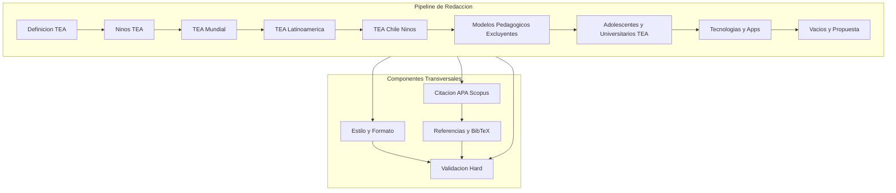
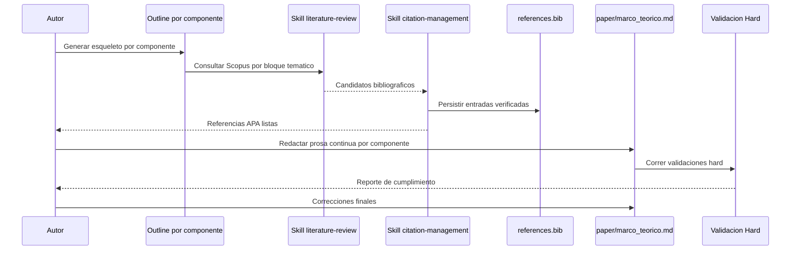

# Design Document — tea-tecnologia (Fase: Marco Teórico)

## Overview

**Purpose**: Esta fase del paper entrega un marco teórico riguroso de dos páginas sobre el Trastorno del Espectro Autista y el potencial de las tecnologías tipo app para apoyar a adolescentes TEA. El diseño traduce los requisitos aprobados en una arquitectura documental donde cada bloque argumental se trata como un componente trazable con entradas, salidas y cobertura explícita de requisitos.

**Users**: El autor del paper (investigador) lo utilizará como base conceptual para las fases posteriores del manuscrito, y los revisores académicos lo leerán como sección justificativa. Los lectores finales serán la comunidad científica interesada en educación inclusiva y tecnologías de apoyo para personas TEA.

**Impact**: Introduce un artefacto inicial en `paper/marco_teorico.md` y pobla `references/references.bib` con las fuentes Scopus utilizadas. Sienta el contrato argumental y estilístico al que deberán alinearse las fases futuras (introducción extendida, metodología, resultados, discusión, conclusiones).

### Goals
- Producir un marco teórico de dos páginas con recorrido argumental explícito de lo general a lo específico.
- Cumplir el 100% de las validaciones hard del framework (citas verificables APA, formato, estructura).
- Dejar articulados los vacíos de literatura y la pregunta que guía las fases futuras del paper.

### Non-Goals
- Redactar introducción extendida, metodología, resultados, discusión o conclusiones.
- Seleccionar la revista objetivo definitiva (se difiere a una fase futura).
- Ejecutar un estudio empírico o recolectar datos.
- Generar figuras o tablas dentro del marco teórico.

## Architecture

### Architecture Pattern & Boundary Map

Se adopta un patrón de "subsecciones como componentes narrativos" sobre un flujo lineal de redacción. Cada componente encapsula un bloque temático, una cobertura de requisitos específica y una dependencia narrativa sobre el componente previo. Las validaciones actúan como un componente transversal que fiscaliza estilo, citación y estructura.



**Architecture Integration**:
- **Selected pattern**: Subsecciones como componentes narrativos + componentes transversales de estilo y citación.
- **Domain boundaries**: Cada bloque temático es dueño de un fragmento argumental específico; los transversales son dueños de las reglas globales.
- **Existing patterns preserved**: Estructura `paper/` + `references/references.bib` + validaciones del framework Paper SDD.
- **New components rationale**: Nueve componentes narrativos para garantizar trazabilidad 1:1 con Requirement 2; cuatro transversales para separar responsabilidades globales.
- **Steering compliance**: No existe `.kiro/steering/` todavía; el diseño respeta las convenciones declaradas en `CLAUDE.md`.

### Technology Stack

| Layer | Choice / Version | Role in Feature | Notes |
|-------|------------------|-----------------|-------|
| Formato documental | Markdown (CommonMark) | Persistir el marco teórico como prosa editable | Se diferirá conversión a LaTeX hasta decidir la revista objetivo |
| Gestión de citas | BibTeX en `references/references.bib` | Almacenar las referencias Scopus verificadas | Compatible con validaciones CrossRef/DOI del framework |
| Búsqueda bibliográfica | Skills `literature-review`, `citation-management`, `research-lookup` | Ejecutar búsquedas Scopus durante la implementación | No se invocan en fase de diseño |
| Validación | Scripts del framework Paper SDD y hard checks | Validar estructura, citas y estilo | Incluye regex de detección de guiones separadores |
| Idioma | Español | Lengua del marco teórico y de las citas en el texto | Los títulos bibliográficos se mantienen en su idioma original |

## System Flows

Flujo de redacción y validación del marco teórico:



El flujo privilegia que las referencias se resuelvan antes de cerrar la prosa para evitar reescrituras por citas inválidas. La validación hard es el último gate antes de marcar la fase completada.

## Requirements Traceability

| Requirement | Summary | Components | Interfaces | Flows |
|-------------|---------|------------|------------|-------|
| 1.1 | Solo marco teórico en esta fase | Pipeline completo | Contrato de alcance | Flujo de redacción |
| 1.2 | Rechazar secciones fuera de alcance | Validación Hard | Check de alcance | Flujo de validación |
| 1.3 | Entregable en `paper/` | Pipeline + Val | Persistencia Markdown | Flujo de redacción |
| 1.4 | No reescribir destructivamente en futuras fases | Val | Política de merge aditivo | — |
| 2.1 | Definición conceptual TEA | C1 Definición TEA | Prosa + citas | Flujo de redacción |
| 2.2 | Niños TEA | C2 Niños TEA | Prosa + citas | Flujo de redacción |
| 2.3 | TEA mundial | C3 TEA Mundial | Prosa + citas | Flujo de redacción |
| 2.4 | TEA Latinoamérica | C4 TEA Latinoamérica | Prosa + citas | Flujo de redacción |
| 2.5 | TEA Chile niños | C5 TEA Chile Niños | Prosa + citas | Flujo de redacción |
| 2.6 | Modelos pedagógicos excluyentes | C6 Modelos Pedagógicos | Prosa + citas | Flujo de redacción |
| 2.7 | Adolescentes y universitarios TEA | C7 Adolescentes TEA | Prosa + citas | Flujo de redacción |
| 2.8 | Apps con tres ejemplos de tecnologías | C8 Tecnologías y Apps | Prosa + citas | Flujo de redacción |
| 2.9 | Cierre con vacíos y propuesta | C9 Vacíos y Propuesta | Prosa + citas | Flujo de redacción |
| 3.1 | Extensión 2 páginas | Val | Check de longitud | Flujo de validación |
| 3.2 | Ajuste si excede | Val | Check de longitud | Flujo de validación |
| 3.3 | Redacción en español | Todos los componentes narrativos | Contrato idioma | Flujo de redacción |
| 3.4 | Párrafos orgánicos sin guiones separadores | Estilo y Formato | Regex anti guiones | Flujo de validación |
| 3.5 | Convertir listas decorativas en prosa | Estilo y Formato | Lint de estilo | Flujo de validación |
| 3.6 | Archivo Markdown en `paper/` | Val | Persistencia | Flujo de redacción |
| 4.1 | Citas APA | Citación APA Scopus | Formato APA | Flujo de redacción |
| 4.2 | Cada afirmación con cita verificable | Citación APA Scopus | Contrato de claim→cita | Flujo de redacción |
| 4.3 | Preferir Scopus reciente | Citación APA Scopus | Política de fuentes | Flujo de redacción |
| 4.4 | Marcar pendientes si no hay verificación | Citación APA Scopus | Estado pendiente | Flujo de validación |
| 4.5 | Sección "Referencias bibliográficas" APA | Referencias y BibTeX | Exportación APA | Flujo de redacción |
| 4.6 | Persistir en `references.bib` | Referencias y BibTeX | BibTeX | Flujo de redacción |
| 5.1 | Enumerar vacíos | C9 Vacíos y Propuesta | Prosa | Flujo de redacción |
| 5.2 | Articular propuesta | C9 Vacíos y Propuesta | Prosa | Flujo de redacción |
| 5.3 | Coherencia argumental | C9 + revisión transiciones | Soft review | Flujo de validación |
| 6.1 | Ejecutar validaciones hard | Validación Hard | `/paper:validate` | Flujo de validación |
| 6.2 | Bloquear si cita no resuelve | Validación Hard | CrossRef/DOI check | Flujo de validación |
| 6.3 | Bloquear si hay guiones separadores | Validación Hard + Estilo | Regex | Flujo de validación |
| 6.4 | Reportar estado por `/paper:status` | Validación Hard | Reporting | Flujo de validación |

## Components and Interfaces

Resumen previo de componentes:

| Component | Domain/Layer | Intent | Req Coverage | Key Dependencies (P0/P1) | Contracts |
|-----------|--------------|--------|--------------|--------------------------|-----------|
| C1 Definición TEA | Narrativo | Definir qué es el TEA | 2.1 | Citación APA Scopus (P0) | State |
| C2 Niños TEA | Narrativo | Caracterizar niños TEA | 2.2 | C1 (P0) | State |
| C3 TEA Mundial | Narrativo | Prevalencia global | 2.3 | C2 (P0) | State |
| C4 TEA Latinoamérica | Narrativo | Evidencia regional | 2.4 | C3 (P0) | State |
| C5 TEA Chile Niños | Narrativo | Situación en Chile | 2.5 | C4 (P0) | State |
| C6 Modelos Pedagógicos | Narrativo | Exclusión histórica | 2.6 | C5 (P0) | State |
| C7 Adolescentes TEA | Narrativo | Adolescentes y universitarios | 2.7 | C6 (P0) | State |
| C8 Tecnologías y Apps | Narrativo | Apps con 3 ejemplos | 2.8 | C7 (P0), Citación (P0) | State |
| C9 Vacíos y Propuesta | Narrativo | Cierre vacíos y pregunta | 2.9, 5.1, 5.2, 5.3 | C1..C8 (P0) | State |
| Estilo y Formato | Transversal | Prosa orgánica, sin guiones | 3.3, 3.4, 3.5 | Pipeline (P0) | State |
| Citación APA Scopus | Transversal | Claim→cita verificable | 4.1, 4.2, 4.3, 4.4 | Referencias (P0) | Service |
| Referencias y BibTeX | Transversal | Consolidar `references.bib` y sección APA | 4.5, 4.6 | Citación (P0) | Batch |
| Validación Hard | Transversal | Gate de cierre de fase | 1.1, 1.2, 1.3, 3.1, 3.2, 3.6, 6.1, 6.2, 6.3, 6.4 | Todos (P0) | Batch |

### Dominio Narrativo

#### C1 Definición TEA

| Field | Detail |
|-------|--------|
| Intent | Definir clínica y conceptualmente el TEA como apertura del marco |
| Requirements | 2.1 |

**Responsibilities & Constraints**
- Responsable de la entrada argumental: define el objeto de estudio sin entrar en subpoblaciones.
- Debe apoyarse al menos en una fuente Scopus reciente (criterios diagnósticos y definición vigente).
- No introduce conceptos (pedagogía, apps) que pertenezcan a componentes posteriores.

**Dependencies**
- Inbound: ninguna (entrada del pipeline)
- Outbound: C2 Niños TEA — provee definición base (P0)
- External: Citación APA Scopus — fuente bibliográfica (P0)

**Contracts**: State

**Implementation Notes**
- Integración: primer párrafo del documento; debe incluir cita APA al cierre de la definición.
- Validación: claim de definición trazable a fuente.
- Riesgos: definición demasiado extensa que robe espacio a los componentes siguientes.

#### C2 Niños TEA

| Field | Detail |
|-------|--------|
| Intent | Caracterizar a la población infantil TEA y las implicancias del diagnóstico |
| Requirements | 2.2 |

**Responsibilities & Constraints**
- Explica manifestaciones y necesidades de niños TEA sin entrar en datos de prevalencia global.
- Debe enlazar con C1 sin repetir la definición.

**Dependencies**
- Inbound: C1 (P0)
- Outbound: C3 (P0)
- External: Citación APA Scopus (P0)

**Contracts**: State

**Implementation Notes**
- Integración: segundo movimiento argumental.
- Riesgos: solapamiento con C5 (Chile niños); mantener foco conceptual general.

#### C3 TEA Mundial

| Field | Detail |
|-------|--------|
| Intent | Presentar prevalencia y tendencias globales |
| Requirements | 2.3 |

**Responsibilities & Constraints**
- Incluir cifras globales respaldadas por fuentes recientes.
- Evitar listas; convertir datos en prosa.

**Dependencies**
- Inbound: C2 (P0)
- Outbound: C4 (P0)
- External: Citación APA Scopus (P0)

**Contracts**: State

**Implementation Notes**
- Riesgos: saturación numérica; priorizar 1–2 cifras claves.

#### C4 TEA Latinoamérica

| Field | Detail |
|-------|--------|
| Intent | Aterrizar la discusión al contexto latinoamericano |
| Requirements | 2.4 |

**Responsibilities & Constraints**
- Contrastar con cifras globales del componente previo.
- Señalar brechas regionales en diagnóstico y atención.

**Dependencies**
- Inbound: C3 (P0)
- Outbound: C5 (P0)
- External: Citación APA Scopus (P0)

**Contracts**: State

#### C5 TEA Chile Niños

| Field | Detail |
|-------|--------|
| Intent | Describir la situación del TEA en niños chilenos |
| Requirements | 2.5 |

**Responsibilities & Constraints**
- Foco nacional; incluye marco normativo o educativo solo si es indispensable para sostener la narrativa.

**Dependencies**
- Inbound: C4 (P0)
- Outbound: C6 (P0)
- External: Citación APA Scopus (P0)

**Contracts**: State

#### C6 Modelos Pedagógicos Excluyentes

| Field | Detail |
|-------|--------|
| Intent | Identificar modelos pedagógicos que históricamente han dejado fuera a estudiantes TEA |
| Requirements | 2.6 |

**Responsibilities & Constraints**
- Debe nombrar modelos concretos, no genéricos.
- Preparar el terreno para la transición hacia adolescentes.

**Dependencies**
- Inbound: C5 (P0)
- Outbound: C7 (P0)
- External: Citación APA Scopus (P0)

**Contracts**: State

#### C7 Adolescentes y Universitarios TEA

| Field | Detail |
|-------|--------|
| Intent | Discutir adolescentes TEA y estudiantes universitarios TEA como foco de la propuesta |
| Requirements | 2.7 |

**Responsibilities & Constraints**
- Marca el viraje de la población infantil a la adolescente y joven adulta.
- Establece por qué este grupo es el foco del estudio.

**Dependencies**
- Inbound: C6 (P0)
- Outbound: C8 (P0)
- External: Citación APA Scopus (P0)

**Contracts**: State

#### C8 Tecnologías y Apps

| Field | Detail |
|-------|--------|
| Intent | Mostrar, en un bloque breve, cómo las apps/tecnologías pueden apoyar a adolescentes TEA citando al menos tres ejemplos con resultados |
| Requirements | 2.8 |

**Responsibilities & Constraints**
- Obligatorio: tres tecnologías concretas con resultados reportados en literatura.
- No convertir en catálogo; mantener prosa.
- Evitar lenguaje promocional.

**Dependencies**
- Inbound: C7 (P0)
- Outbound: C9 (P0)
- External: Citación APA Scopus (P0)

**Contracts**: State

**Implementation Notes**
- Validación: verificar que la sección mencione exactamente al menos tres tecnologías nombradas y que cada una tenga al menos una cita.

#### C9 Vacíos y Propuesta

| Field | Detail |
|-------|--------|
| Intent | Cerrar el marco teórico enumerando vacíos percibidos y articulando la propuesta del paper |
| Requirements | 2.9, 5.1, 5.2, 5.3 |

**Responsibilities & Constraints**
- Enunciar vacíos en prosa, sin listas con viñetas.
- Conectar explícitamente con la pregunta guía: si las tecnologías tipo app podrían ayudar a adolescentes TEA.
- No introducir conceptos no discutidos previamente.

**Dependencies**
- Inbound: C1..C8 (P0)
- Outbound: ninguno (salida del pipeline)

**Contracts**: State

**Implementation Notes**
- Validación: contiene frase explícita sobre la propuesta del paper.
- Riesgos: sonar como conclusión del paper; debe sonar a justificación.

### Dominio Transversal

#### Estilo y Formato

| Field | Detail |
|-------|--------|
| Intent | Garantizar prosa orgánica en español, párrafos largos y ausencia de guiones como separadores |
| Requirements | 3.3, 3.4, 3.5 |

**Responsibilities & Constraints**
- Aplica lint de estilo al documento completo.
- No tolera guiones (-) usados para separar ideas o párrafos.
- Convierte listas decorativas en prosa continua.

**Dependencies**
- Inbound: Pipeline narrativo (P0)
- Outbound: Validación Hard (P0)

**Contracts**: State

**Implementation Notes**
- Integración: corre como paso previo a la validación hard.
- Validación: regex `(^|\n)\s*-\s` debe retornar 0 matches; permitir guiones solo dentro de palabras compuestas.
- Riesgos: falsos positivos en palabras con guion intermedio; la regex debe anclarse a inicio de línea o guion aislado entre espacios.

#### Citación APA Scopus

| Field | Detail |
|-------|--------|
| Intent | Garantizar que toda afirmación empírica tenga una cita APA verificable preferentemente de Scopus reciente |
| Requirements | 4.1, 4.2, 4.3, 4.4 |

**Responsibilities & Constraints**
- Contrato claim→cita: ningún dato empírico entra al marco sin cita.
- Prioriza fuentes Scopus de los últimos años.
- Marca como pendientes las claims sin fuente verificable y bloquea el cierre de fase mientras existan.

**Dependencies**
- Inbound: Pipeline narrativo (P0)
- Outbound: Referencias y BibTeX (P0)
- External: Skills `literature-review`, `citation-management` (P0)

**Contracts**: Service

##### Service Interface
```typescript
interface CitationService {
  verifyClaim(claim: string): Result<VerifiedCitation, CitationError>;
  listPendingClaims(): PendingClaim[];
}

type VerifiedCitation = {
  apa: string;
  bibKey: string;
  source: "Scopus" | "CrossRef" | "Other";
  year: number;
};

type CitationError =
  | { kind: "not_found" }
  | { kind: "not_scopus" }
  | { kind: "too_old"; year: number };
```
- Preconditions: la claim está expresada en una sola oración del componente narrativo.
- Postconditions: la claim queda enlazada a una `bibKey` existente en `references.bib`.
- Invariants: ninguna claim empírica aparece en el documento sin `VerifiedCitation` o estado `pending`.

#### Referencias y BibTeX

| Field | Detail |
|-------|--------|
| Intent | Consolidar la bibliografía utilizada en `references/references.bib` y generar la sección "Referencias bibliográficas" en APA al final del marco teórico |
| Requirements | 4.5, 4.6 |

**Dependencies**
- Inbound: Citación APA Scopus (P0)
- Outbound: Validación Hard (P0)

**Contracts**: Batch

##### Batch / Job Contract
- Trigger: cada vez que Citación APA Scopus añade una `VerifiedCitation`.
- Input / validación: entrada BibTeX con campos mínimos (author, year, title, journal, doi).
- Output / destination: `references/references.bib` + bloque APA renderizado al final de `paper/marco_teorico.md`.
- Idempotency & recovery: `bibKey` como llave única; reintentos sobre la misma clave sobrescriben sin duplicar.

#### Validación Hard

| Field | Detail |
|-------|--------|
| Intent | Gate automatizado que decide si la fase puede cerrarse |
| Requirements | 1.1, 1.2, 1.3, 3.1, 3.2, 3.6, 6.1, 6.2, 6.3, 6.4 |

**Dependencies**
- Inbound: Pipeline narrativo, Estilo y Formato, Referencias y BibTeX (P0)
- External: `/paper:validate`, `/paper:status`, CrossRef/DOI (P0)

**Contracts**: Batch

##### Batch / Job Contract
- Trigger: ejecución explícita de `/paper:validate` al finalizar la redacción.
- Input / validación:
  - Archivo `paper/marco_teorico.md` existe y no está vacío.
  - Conteo de páginas o palabras dentro del rango objetivo (dos páginas).
  - Toda claim tiene cita y toda cita resuelve en CrossRef/DOI.
  - Regex de estilo no detecta guiones separadores.
  - La fase no ha añadido secciones distintas al marco teórico.
- Output / destination: reporte de validación; si pasa, se actualiza `phase: completed` para esta entrega incremental.
- Idempotency & recovery: la validación puede reejecutarse sin efectos secundarios sobre el documento.

**Implementation Notes**
- Integración: último paso antes de marcar la fase completada.
- Riesgos: falsos positivos en conteo de páginas por variación de renderer; medir por palabras objetivo (aprox. 800–950 palabras como proxy de dos páginas A4).

## Data Models

### Domain Model
El dominio es documental. Las entidades relevantes son:

- **MarcoTeorico**: documento raíz con atributos `idioma`, `extensionObjetivo`, `estado`.
- **Componente**: subsección narrativa con `id`, `intent`, `requirementIds[]`, `dependsOn`, `claims[]`.
- **Claim**: afirmación empírica con `texto`, `citationKey?`, `estado` ∈ {`verified`, `pending`, `rejected`}.
- **VerifiedCitation**: referencia con `bibKey`, `apa`, `source`, `year`, `doi?`.

Invariantes:
- Todo `Componente` pertenece a exactamente un `MarcoTeorico`.
- Toda `Claim` con estado `verified` referencia una `VerifiedCitation` existente.
- `MarcoTeorico.estado = completed` requiere cero `Claim` en estado `pending` o `rejected`.

### Logical Data Model

Relaciones y cardinalidades:

- `MarcoTeorico` 1—N `Componente`
- `Componente` 1—N `Claim`
- `Claim` N—1 `VerifiedCitation` (opcional)
- `VerifiedCitation` persiste en `references/references.bib` con `bibKey` como clave natural.

Reglas de integridad:
- `bibKey` es única y case-sensitive.
- La eliminación de una `VerifiedCitation` invalida todas las `Claim` que la referenciaban (deben volver a `pending`).

## Error Handling

### Error Strategy
El marco teórico falla rápido ante problemas de citación o estilo; no hay degradación graciosa.

### Error Categories and Responses
- **Claim sin cita verificable**: la validación hard bloquea el cierre y lista cada claim pendiente con su componente.
- **Guión separador detectado**: la validación de estilo reporta línea y columna y exige reescritura en prosa.
- **Extensión fuera de rango**: reporte con conteo de palabras y sugerencia (recortar conceptos redundantes antes que eliminar citas).
- **Sección fuera de alcance introducida**: la validación hard rechaza el documento e indica que esta fase solo admite el marco teórico.

### Monitoring
Los reportes de `/paper:validate` y `/paper:status` son el mecanismo de observabilidad de esta fase.

## Testing Strategy

Dado que el artefacto es documental, las pruebas son validaciones automatizables más una revisión humana.

- **Checks automáticos**:
  1. Presencia de los nueve bloques narrativos (títulos o marcadores detectables).
  2. Conteo de palabras dentro del rango objetivo (≈800–950).
  3. Toda cita resuelve contra CrossRef/DOI.
  4. Cero matches de la regex de guiones separadores.
  5. Sección "Referencias bibliográficas" presente con formato APA.
- **Checks integrados**:
  1. `references.bib` y la sección APA están sincronizados.
  2. El componente C8 nombra al menos tres tecnologías con cita.
  3. El componente C9 contiene la frase explícita que articula la propuesta del paper.
- **Revisión humana (soft)**:
  1. Coherencia argumental entre componentes y fluidez de transiciones.
  2. Claridad y defensa de los vacíos identificados.
  3. Alineación del cierre con la pregunta guía.

## Supporting References
- `research.md` — Registro de decisiones, alternativas y riesgos detallados.
- `CLAUDE.md` — Reglas globales del framework Paper SDD.
- `temp_context/instrucciones.md` — Instrucciones originales del usuario.
