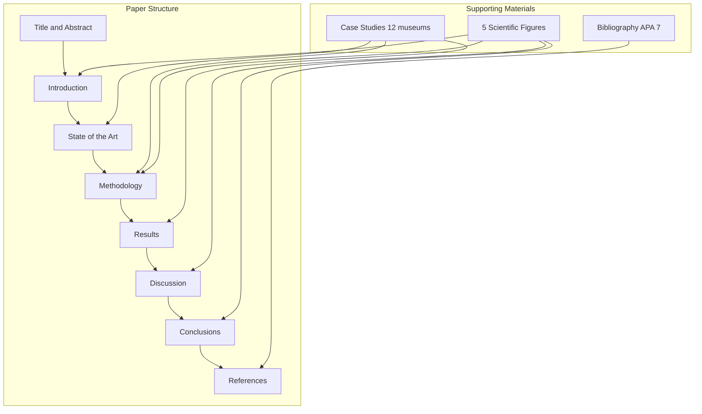

# Design Document: virtual-museum-sigradi2026

## Overview

**Purpose**: Este diseño define la arquitectura del manuscrito científico "Virtual Museum Development: Integrating UX, XR, and Digital Heritage Standards" para SIGraDi 2026. El paper propone un marco conceptual y metodológico transferible para el diseño de museos virtuales centrados en las personas.

**Users**: Investigadores, curadores, diseñadores y profesionales del patrimonio digital que buscan marcos replicables para museos virtuales. Revisores de SIGraDi 2026 como audiencia inmediata.

**Impact**: Transforma un borrador avanzado en un artículo científico de alto nivel, con estado del arte robusto, metodología reproducible y contribución transferible.

### Goals
- Producir un manuscrito de 2500-3500 palabras en inglés académico internacional
- Articular un marco conceptual transferible como contribución científica principal
- Cumplir estrictamente formato SIGraDi 2026, APA 7 y anonimato para revisión ciega
- Integrar 12 casos de estudio comparativos como evidencia empírica

### Non-Goals
- No producir un artículo completamente nuevo (se preserva la esencia del borrador)
- No inventar datos ni resultados finales inexistentes
- No incluir presupuestos, montos económicos ni información identificable
- No generar código ni prototipo funcional del museo virtual
- No diseñar las figuras gráficamente (solo describir su contenido conceptual)

## Architecture

### Architecture Pattern & Boundary Map



**Architecture Integration**:
- Patrón seleccionado: IMRaD expandido con State of the Art como sección independiente
- Límites de dominio: cada sección tiene responsabilidad argumentativa única en la progresión narrativa
- Hilo conductor: Contexto → Estado del arte → Brecha → Pregunta → Objetivo → Metodología → Hallazgos → Discusión → Contribución → Conclusiones
- Principio de coherencia: ninguna sección responde a una pregunta diferente del objetivo principal

### Technology Stack

| Capa | Herramienta | Rol | Notas |
|------|-------------|-----|-------|
| Escritura | Markdown / Quarto | Composición del manuscrito | Formato `.md` en `paper/` |
| Referencias | BibTeX + references.bib | Gestión bibliográfica APA 7 | Verificación DOI via CrossRef |
| Figuras | Mermaid / Descripción conceptual | Diagramas científicos | 5 figuras requeridas |
| Validación | Scripts en `scripts/` | Verificación automática | Word count, citas, estructura |
| Output | Quarto render | Compilación PDF/DOCX/HTML | Via `_quarto.yml` |

## System Flows

### Flujo de escritura científica

```mermaid
graph LR
    subgraph Phase 1 Diagnostico
        D1[Analizar borrador]
        D2[Identificar vacios]
        D3[Mapear contenido conservable]
    end

    subgraph Phase 2 Estado del Arte
        E1[Buscar literatura reciente]
        E2[Construir dialogo critico]
        E3[Articular brecha]
    end

    subgraph Phase 3 Reescritura
        W1[Introduccion con brecha]
        W2[Metodologia reproducible]
        W3[Resultados preliminares]
        W4[Discusion y modelo]
        W5[Conclusiones]
    end

    subgraph Phase 4 Validacion
        V1[Verificar APA 7]
        V2[Contar palabras]
        V3[Revisar anonimato]
        V4[Revision simulada]
    end

    D1 --> D2 --> D3 --> E1 --> E2 --> E3 --> W1 --> W2 --> W3 --> W4 --> W5 --> V1 --> V2 --> V3 --> V4
```



## Requirements Traceability

| Requirement | Summary | Componentes | Interfaces | Flujo |
|-------------|---------|-------------|------------|-------|
| 1.1-1.6 | Formato SIGraDi | Todas las secciones | Template check | Phase 4 |
| 2.1-2.6 | Introducción científica | Introduction | Brecha, preguntas, objetivos | Phase 3 |
| 3.1-3.6 | Estado del arte | State of the Art | Diálogo crítico, casos | Phase 2-3 |
| 4.1-4.6 | Metodología reproducible | Methodology | 6 etapas, equipo | Phase 3 |
| 5.1-5.5 | Resultados científicos | Results | Hallazgos preliminares | Phase 3 |
| 6.1-6.5 | Discusión y contribución | Discussion | Modelo HCVMF | Phase 3 |
| 7.1-7.6 | Figuras científicas | Todas las secciones | 5 figuras conceptuales | Phase 3-4 |
| 8.1-8.6 | Calidad inglés | Todas las secciones | Estilo académico | Phase 3-4 |
| 9.1-9.5 | Referencias | References / BibTeX | APA 7, DOI | Phase 2-4 |
| 10.1-10.5 | Coherencia argumentativa | Todas las secciones | Hilo narrativo | Phase 4 |

## Components and Interfaces

| Componente | Dominio | Intent | Req Coverage | Dependencias | Entregable |
|-----------|---------|--------|--------------|--------------|------------|
| Abstract | Front matter | Sintetizar problema, método, hallazgos y contribución en 250 palabras | 1.5 | Introduction, Results, Discussion | `paper/00-abstract.md` |
| Introduction | Sección IMRaD | Contextualizar, plantear brecha, preguntas y objetivos | 2.1-2.6 | State of the Art, Fig 1 | `paper/01-introduction.md` |
| State of the Art | Sección IMRaD | Diálogo crítico con literatura internacional | 3.1-3.6 | Case Studies, Bibliography | `paper/02-state-of-the-art.md` |
| Methodology | Sección IMRaD | Diseño metodológico reproducible en 6 etapas | 4.1-4.6 | Fig 2, Fig 3 | `paper/03-methodology.md` |
| Results | Sección IMRaD | Hallazgos preliminares de etapas 1-3 | 5.1-5.5 | Methodology, Case Studies | `paper/04-results.md` |
| Discussion | Sección IMRaD | Interpretación, modelo conceptual, limitaciones | 6.1-6.5 | Fig 4, State of the Art | `paper/05-discussion.md` |
| Conclusions | Sección IMRaD | Síntesis, contribución, proyecciones | 6.4, 10.2 | Fig 5 | `paper/06-conclusions.md` |
| References | Back matter | Bibliografía APA 7 verificada | 9.1-9.5 | CrossRef, Semantic Scholar | `references/references.bib` |
| Figures | Transversal | 5 figuras científicas conceptuales | 7.1-7.6 | Todas las secciones | `figures/` |

### Sección: Introduction

| Field | Detail |
|-------|--------|
| Intent | Establecer contexto internacional, articular brecha como oportunidad, declarar preguntas, objetivos y contribución |
| Requirements | 2.1, 2.2, 2.3, 2.4, 2.5, 2.6 |

**Responsabilidades y restricciones**
- Contextualizar museos virtuales y patrimonio digital internacionalmente
- Presentar la brecha como oportunidad (nunca como crítica negativa)
- Formular preguntas de investigación vinculadas a objetivos específicos
- Declarar contribución: marco conceptual y metodológico transferible
- Incluir Figura 1 (Research Context and Knowledge Gap)
- Extensión aproximada: 400-500 palabras

**Estructura interna**
1. Contexto internacional (patrimonio digital, museos virtuales)
2. Problema científico (derivado de la literatura)
3. Brecha de investigación (oportunidad integradora)
4. Preguntas de investigación
5. Objetivo general y específicos
6. Contribución científica

### Sección: State of the Art

| Field | Detail |
|-------|--------|
| Intent | Construir diálogo crítico internacional que conduzca naturalmente a la brecha |
| Requirements | 3.1, 3.2, 3.3, 3.4, 3.5, 3.6 |

**Responsabilidades y restricciones**
- Integrar 10 dominios temáticos en diálogo (no listas de autores)
- Mínimo 3 citas recientes (2021-2026) por afirmación conceptual
- Incorporar hallazgos de los 12 casos de estudio comparativos
- Mostrar evolución del conocimiento hacia la brecha
- Extensión aproximada: 700-900 palabras

**Subsecciones temáticas**
1. Virtual Museums and Digital Heritage
2. User Experience and Human-Centred Design
3. Extended Reality (XR) in Cultural Institutions
4. Accessibility and Inclusive Design
5. Metadata Standards and Interoperability
6. Community Participation and Engagement
7. Comparative Analysis of Existing Models (casos de estudio)

### Sección: Methodology

| Field | Detail |
|-------|--------|
| Intent | Presentar diseño metodológico reproducible y equipo interdisciplinario |
| Requirements | 4.1, 4.2, 4.3, 4.4, 4.5, 4.6 |

**Responsabilidades y restricciones**
- Justificar enfoque mixed-methods
- Detallar 6 etapas con participantes, instrumentos y procedimientos
- Indicar claramente etapas completadas vs. en progreso
- Presentar equipo interdisciplinario (perfiles y aportes, sin montos)
- Incluir Figura 2 (Research Design Framework) y Figura 3 (Interdisciplinary Research Ecosystem)
- Extensión aproximada: 500-600 palabras

**Estructura interna**
1. Research approach and justification
2. Research design (6 stages)
3. Participants and sampling
4. Instruments and tools
5. Data analysis procedures
6. Research team composition and roles
7. Ethical considerations and limitations

### Sección: Results

| Field | Detail |
|-------|--------|
| Intent | Presentar hallazgos preliminares de las etapas completadas |
| Requirements | 5.1, 5.2, 5.3, 5.4, 5.5 |

**Responsabilidades y restricciones**
- Solo resultados de etapas completadas (1: needs assessment, 2: comparative analysis, 3: technical framework)
- Indicar explícitamente carácter preliminar
- Vincular cada hallazgo con la pregunta de investigación correspondiente
- Incluir hallazgos del análisis comparativo de los 12 museos virtuales
- No presentar expected outcomes como resultados finales
- Extensión aproximada: 400-500 palabras

**Estructura interna**
1. Findings from needs assessment (Stage 1)
2. Findings from comparative analysis (Stage 2)
3. Technical framework design outcomes (Stage 3)
4. Preliminary patterns and synthesis

### Sección: Discussion

| Field | Detail |
|-------|--------|
| Intent | Interpretar hallazgos, presentar modelo conceptual, discutir limitaciones |
| Requirements | 6.1, 6.2, 6.3, 6.4, 6.5 |

**Responsabilidades y restricciones**
- Dialogar hallazgos con la literatura del estado del arte
- Presentar y explicar el "Human-Centred Virtual Museum Framework" (contribución principal)
- Discutir limitaciones constructivamente
- Proponer implicaciones para futuras investigaciones
- Incluir Figura 4 (Human-Centred Virtual Museum Framework)
- Extensión aproximada: 400-500 palabras

**Estructura interna**
1. Interpretation of preliminary findings
2. Dialogue with existing literature
3. Presentation of the HCVMF model
4. Limitations and scope
5. Implications for future research and practice

### Sección: Conclusions

| Field | Detail |
|-------|--------|
| Intent | Sintetizar contribución y proyectar el modelo hacia futuras aplicaciones |
| Requirements | 10.2, 6.4 |

**Responsabilidades y restricciones**
- Responder directamente a las preguntas de investigación
- Resumir contribución científica (marco transferible)
- Incluir Figura 5 (Knowledge Transfer Framework)
- No introducir información nueva
- Extensión aproximada: 200-300 palabras

### Componente: Figuras Científicas

| Field | Detail |
|-------|--------|
| Intent | Sintetizar conocimiento visualmente; cada figura aporta información que el texto solo no comunica |
| Requirements | 7.1, 7.2, 7.3, 7.4, 7.5, 7.6 |

**Especificación por figura**

| # | Título | Ubicación | Objetivo científico |
|---|--------|-----------|-------------------|
| 1 | Research Context and Knowledge Gap | Introduction | Visualizar el ecosistema de conocimiento y la oportunidad integradora |
| 2 | Research Design Framework | Methodology | Mostrar las 6 etapas, sus conexiones y flujo iterativo |
| 3 | Interdisciplinary Research Ecosystem | Methodology | Mapear perfiles del equipo y sus aportes al proceso investigativo |
| 4 | Human-Centred Virtual Museum Framework | Discussion | Presentar el modelo conceptual transferible (contribución principal) |
| 5 | Knowledge Transfer Framework | Conclusions | Ilustrar cómo el modelo se transfiere a otros contextos |

**Restricciones de diseño**
- Cada figura incluye: título, objetivo científico, descripción de contenido, explicación en texto
- Las figuras sintetizan conocimiento (no ilustran decorativamente)
- Deben ser reproducibles conceptualmente por el equipo de diseño gráfico

## Data Models

### Modelo de bibliografía (references.bib)

**Estructura BibTeX por entrada**:
- Tipo: `@article`, `@inproceedings`, `@book`, `@inbook`
- Campos obligatorios: author, title, year, journal/booktitle, doi
- Campos recomendados: volume, number, pages, publisher, url
- Formato: APA 7

**Reglas de integridad**:
- Sin duplicados (verificar por DOI)
- DOI verificable en CrossRef
- Autores reales (no inventados)
- Balance temporal: mínimo 40% literatura 2021-2026

### Modelo de word count por sección

| Sección | Mín | Máx | Target |
|---------|-----|-----|--------|
| Abstract | 150 | 250 | 200 |
| Introduction | 350 | 500 | 450 |
| State of the Art | 600 | 900 | 800 |
| Methodology | 450 | 650 | 550 |
| Results | 350 | 500 | 450 |
| Discussion | 350 | 500 | 450 |
| Conclusions | 150 | 300 | 250 |
| **Total** | **2400** | **3600** | **3150** |

## Error Handling

### Estrategia de validación

| Error | Detección | Acción |
|-------|-----------|--------|
| Exceso de palabras | Script word count | Condensar secciones más largas sin perder contenido científico |
| Referencia sin DOI | Verificación CrossRef | Buscar DOI real o marcar como [pendiente verificación] |
| Ruptura de anonimato | Búsqueda de nombres propios | Reemplazar por "Anonymous" + descriptor genérico |
| Afirmación sin cita | Revisión párrafo a párrafo | Agregar mínimo 1 referencia APA 7 verificable |
| Incoherencia argumentativa | Revisión de hilo conductor | Verificar que cada sección conecta con la anterior y siguiente |
| Traducción literal | Revisión de estilo | Reescribir usando estructuras nativas del inglés académico |

## Testing Strategy

### Validaciones automáticas (Hard specs)
1. Word count total entre 2500-3500
2. Todas las citas en texto tienen entrada correspondiente en .bib
3. Todas las entradas .bib tienen DOI verificable
4. No aparecen nombres institucionales ni personales (anonimato)
5. Estructura cumple template SIGraDi (secciones correctas en orden)
6. Abstract no excede 250 palabras
7. Keywords entre 3-5 términos

### Validaciones de revisión (Soft specs)
1. Revisión simulada como Reviewer 1 (metodología y rigor)
2. Revisión simulada como Reviewer 2 (contribución y novedad)
3. Revisión simulada como Reviewer 3 (claridad y estilo)
4. Coherencia entre preguntas de investigación, metodología y resultados
5. Brecha construida como oportunidad (no como crítica negativa)
6. Tecnología presentada como medio (no como fin)

## Supporting References

### Distribución de word count
La distribución target prioriza State of the Art (~25% del manuscrito) siguiendo la instrucción del prompt maestro de que este es "la principal oportunidad de fortalecer el artículo". Introduction y Methodology reciben asignaciones similares (~15% cada una), mientras Results, Discussion y Conclusions comparten el 35% restante.

### Progresión argumentativa obligatoria
```
Contexto internacional → Avances independientes en dominios →
Oportunidad integradora (brecha) → Preguntas específicas →
Objetivos medibles → Diseño mixto en 6 etapas →
Hallazgos preliminares → Modelo HCVMF → Transferibilidad
```

### Dominios temáticos del estado del arte
Los 10 dominios a integrar en diálogo crítico:
1. Virtual Museums
2. Digital Heritage
3. Museum Studies
4. User Experience (UX)
5. Human-Centred Design
6. Extended Reality (XR)
7. Accessibility
8. Inclusive Design
9. Metadata Standards
10. Community Participation
