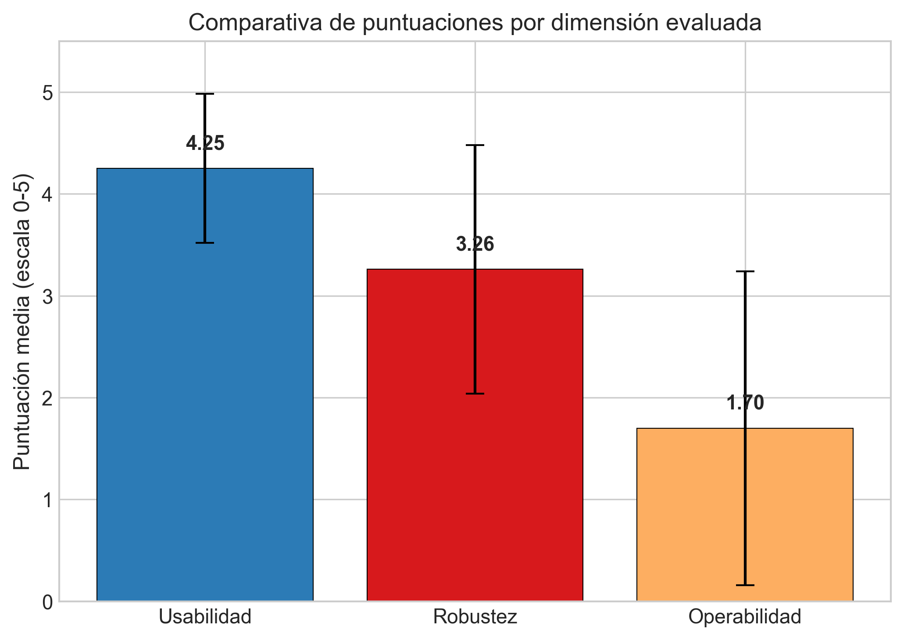

# Resultados

## Distribución de tecnologías por tipo de discapacidad

El análisis de las 41 tecnologías de IA evaluadas revela una distribución desigual en función del tipo de discapacidad atendida. Del total de la muestra, 28 tecnologías (68,3%) atienden la discapacidad motora, posicionándola como la categoría con mayor cobertura. Le sigue la discapacidad cognitiva con 16 tecnologías (39,0%), la discapacidad visual con 15 (36,6%) y, con una representación considerablemente menor, la discapacidad auditiva con solo 4 tecnologías (9,8%). La @fig-distribucion ilustra esta distribución.

{#fig-distribucion}

Cabe destacar que 17 de las 41 tecnologías (41,5%) atienden más de un tipo de discapacidad simultáneamente, lo que indica un grado moderado de versatilidad en la oferta tecnológica. Sin embargo, la sobrerrepresentación de la discapacidad motora y la subrepresentación de la discapacidad auditiva constituyen hallazgos relevantes que serán discutidos en la sección correspondiente.

La predominancia de tecnologías orientadas a la discapacidad motora se explica por la diversidad de modalidades de interacción alternativas que la IA ha posibilitado: desde interfaces cerebro-computadora y seguimiento ocular hasta control de cursor por movimiento de cabeza y navegación por voz. En contraste, las tecnologías para discapacidad auditiva se concentran exclusivamente en sistemas de subtitulado automático (Otter.ai, AVA y Web Captioner) y una herramienta de reconocimiento de voz adaptado (Voiceitt).

## Categorización por tipo de producto y tecnología de IA

La @tbl-matriz presenta la matriz cruzada de las 41 tecnologías clasificadas por tipo de discapacidad atendida, permitiendo visualizar la cobertura y las brechas existentes.



: Matriz de tecnologías de IA por tipo de discapacidad atendida. ✓ indica que la tecnología atiende esa categoría de discapacidad. {#tbl-matriz}

Las tecnologías evaluadas se distribuyen en diversos tipos de producto, con una presencia destacada de los dispositivos asistivos inteligentes (presentes en 24 tecnologías), el control de cursor alternativo (15 tecnologías), el software de comunicación asistiva (14 tecnologías) y las herramientas de simplificación de texto (9 tecnologías). En menor proporción se encuentran los asistentes por voz y las herramientas de navegación por voz (7 cada uno), las interfaces cerebro-computadora (7), los asistentes conversacionales (5), los sistemas de seguimiento ocular (5), los lectores de pantalla avanzados (4), los sistemas de subtitulado automático (3) y los generadores automáticos de descripciones de imágenes (3).

En cuanto al tipo de tecnología de IA empleada, el procesamiento de lenguaje natural es la técnica más extendida, presente en la mayoría de las tecnologías evaluadas. Le siguen la síntesis de voz, el reconocimiento de voz, el *motion tracking*, el análisis de señales EEG (*eye-tracking*) y la visión por computadora. Esta distribución refleja la madurez del procesamiento de lenguaje natural como paradigma dominante en las aplicaciones de IA para accesibilidad web.

## Análisis descriptivo de las dimensiones de evaluación

Las estadísticas descriptivas de las tres dimensiones evaluadas revelan diferencias significativas en el desempeño del conjunto de tecnologías. La @fig-comparativa presenta una comparación visual de las puntuaciones medias por dimensión con sus respectivas barras de error.

{#fig-comparativa}

La dimensión de **usabilidad** obtuvo la puntuación media más alta (*M* = 4,25; *Mdn* = 4,33; *SD* = 0,73), indicando que la mayoría de las tecnologías evaluadas alcanzan niveles satisfactorios de precisión, sensibilidad y tiempo de respuesta. La baja dispersión (*SD* = 0,73) sugiere una homogeneidad relativa en el desempeño de usabilidad del conjunto.

La dimensión de **robustez** presentó una puntuación media moderada (*M* = 3,26; *Mdn* = 3,00; *SD* = 1,22). La dispersión más elevada respecto a la usabilidad indica una mayor heterogeneidad: mientras algunas tecnologías como ChatGPT, Gemini 2.0 y Google Assistant alcanzan compatibilidad máxima multiplataforma (5,00), otras como Siri, Irisbond y EyeSpeak presentan compatibilidad limitada a un solo entorno (1,00).

La dimensión de **operabilidad** obtuvo la puntuación media más baja (*M* = 1,70; *Mdn* = 1,50; *SD* = 1,54), con la mayor dispersión del conjunto. Este resultado constituye uno de los hallazgos más relevantes del estudio: la mayoría de las tecnologías de IA evaluadas presentan limitaciones significativas en su compatibilidad con navegación por teclado y comandos de voz. Doce tecnologías obtuvieron una puntuación de operabilidad de 0,00, lo que significa ausencia total de soporte para modalidades alternativas de interacción. Este dato resulta paradójico, considerando que muchas de estas tecnologías están diseñadas para asistir a personas con discapacidad motora pero no ofrecen ellas mismas mecanismos de operación accesibles.

## Ranking global y las cinco mejores tecnologías

La aplicación del modelo de ponderación descrito en la sección de Metodología permitió calcular la puntuación global de cada tecnología y establecer un ranking ordenado. La @fig-ranking presenta las cinco tecnologías con puntuación global más alta.

{#fig-ranking}

Las cinco tecnologías mejor puntuadas son:

1. **DeepSeek** (puntuación global: 4,60). Ocupa la primera posición gracias a puntuaciones máximas en usabilidad (5,00) y operabilidad (5,00), combinadas con una robustez aceptable (3,67). Se clasifica como asistente conversacional con capacidades de comunicación asistiva y generación automática de descripciones de imágenes, empleando procesamiento de lenguaje natural, reconocimiento de voz, síntesis de voz y visión por computadora. Atiende discapacidades cognitiva y visual. Destaca por su compatibilidad total con navegación por teclado y comandos de voz, lo que la distingue de la mayoría de las tecnologías evaluadas.

2. **Grid** (puntuación global: 4,50). Software de comunicación asistiva con funcionalidades de teclado virtual predictivo y lectura de pantalla. Emplea procesamiento de lenguaje natural, síntesis de voz y reconocimiento de voz para atender discapacidades cognitiva y motora. Obtiene puntuaciones de usabilidad (5,00) y robustez (4,33) superiores a la media, y es una de las pocas tecnologías con compatibilidad total de navegación por teclado y parcial de comandos de voz (operabilidad: 4,00).

3. **ChatGPT** (puntuación global: 4,43). Asistente conversacional con capacidades de simplificación de texto y asistencia por voz. Alcanza la puntuación máxima en robustez (5,00), con compatibilidad total multiplataforma y multi-navegador. Atiende tres tipos de discapacidad (visual, cognitiva y motora), lo que le otorga la mayor cobertura de las tecnologías del top 5. Su operabilidad (4,00) refleja compatibilidad parcial con navegación por teclado y total con comandos de voz.

4. **Gemini 2.0** (puntuación global: 4,43). Comparte la tercera posición con ChatGPT. Asistente conversacional con generación automática de descripciones de imágenes, asistencia por voz y simplificación de texto, basado en procesamiento de lenguaje natural, reconocimiento de voz, síntesis de voz y visión por computadora. Atiende discapacidades visual y cognitiva. Iguala a ChatGPT en robustez (5,00) y operabilidad (4,00), con idéntica puntuación de usabilidad (4,33).

5. **Google Assistant** (puntuación global: 4,40). Asistente por voz con funcionalidades de navegación por voz y comunicación asistiva. Es la única tecnología del top 5 que alcanza puntuación máxima simultánea en usabilidad (5,00) y robustez (5,00), lo que refleja su alta precisión, rapidez de respuesta y compatibilidad total multiplataforma. Atiende tres tipos de discapacidad (motora, visual y cognitiva). Su posición en el ranking se ve limitada por una operabilidad moderada (3,00), dado que su compatibilidad con navegación por teclado es parcial.

La @tbl-comparativa presenta una comparación directa de las puntuaciones de las cinco mejores tecnologías frente al promedio general del conjunto.



: Comparación de puntuaciones de las cinco mejores tecnologías frente al promedio general del conjunto de 41 tecnologías evaluadas. {#tbl-comparativa}

El análisis comparativo revela que las cinco mejores tecnologías superan ampliamente el promedio general en todas las dimensiones. La diferencia más notable se observa en operabilidad, donde el top 5 alcanza puntuaciones entre 3,00 y 5,00 frente a una media general de 1,70. Este resultado sugiere que la operabilidad es el factor diferenciador más determinante: las tecnologías que ofrecen modalidades alternativas de interacción (navegación por teclado y comandos de voz) tienden a obtener puntuaciones globales superiores.

## Análisis de las características del top 5

Las cinco tecnologías mejor puntuadas comparten varias características que explican su posición destacada:

- **Multimodalidad de interacción**: todas ofrecen al menos compatibilidad parcial con navegación por teclado y/o comandos de voz, a diferencia de muchas tecnologías de la muestra que carecen por completo de estas modalidades.
- **Uso intensivo de procesamiento de lenguaje natural**: las cinco emplean PLN como tecnología de IA central, frecuentemente combinado con reconocimiento de voz y síntesis de voz.
- **Cobertura de múltiples discapacidades**: cada una atiende al menos dos tipos de discapacidad, y dos de ellas (ChatGPT y Google Assistant) cubren tres categorías.
- **Vinculación con principios WCAG**: las altas puntuaciones en usabilidad reflejan contribuciones al principio Perceptible (generación de alternativas textuales y síntesis de voz) y Comprensible (simplificación de texto). Las puntuaciones de robustez se vinculan con el principio Robusto (compatibilidad multiplataforma), mientras que la operabilidad se relaciona directamente con el principio Operable (accesibilidad por teclado y modalidades alternativas de navegación).

Tres de las cinco tecnologías del top 5 son asistentes conversacionales o por voz de grandes empresas tecnológicas (ChatGPT de OpenAI, Gemini 2.0 de Google, Google Assistant), lo que sugiere que los recursos de desarrollo y la escala de distribución de estas compañías favorecen tanto la compatibilidad multiplataforma como la integración de múltiples modalidades de interacción. Las dos restantes (DeepSeek y Grid) representan, respectivamente, un modelo de lenguaje emergente y un software especializado de comunicación asistiva, demostrando que el alto desempeño en accesibilidad no es exclusivo de los grandes actores del mercado.
