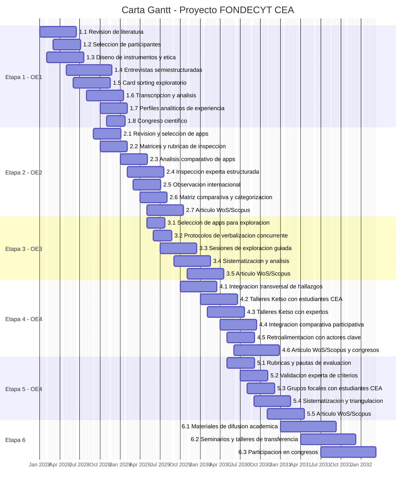

# Carta Gantt - Proyecto FONDECYT Regular 2027

```mermaid
gantt
    title Carta Gantt - Proyecto FONDECYT CEA
    dateFormat YYYY-MM-DD
    axisFormat %b %Y
    tickInterval 3month
    excludes weekends

    section Etapa 1 - OE1
    1.1 Revision de literatura                  :e1a1, 2028-01-01, 120d
    1.2 Seleccion de participantes              :e1a2, 2028-03-01, 90d
    1.3 Diseno de instrumentos y etica          :e1a3, 2028-02-01, 120d
    1.4 Entrevistas semiestructuradas            :e1a4, 2028-05-01, 150d
    1.5 Card sorting exploratorio                :e1a5, 2028-06-01, 120d
    1.6 Transcripcion y analisis                 :e1a6, 2028-08-01, 120d
    1.7 Perfiles analiticos de experiencia       :e1a7, 2028-10-01, 90d
    1.8 Congreso cientifico                      :e1a8, 2028-11-01, 60d

    section Etapa 2 - OE2
    2.1 Revision y seleccion de apps             :e2a1, 2028-09-01, 90d
    2.2 Matrices y rubricas de inspeccion        :e2a2, 2028-10-01, 90d
    2.3 Analisis comparativo de apps             :e2a3, 2029-01-01, 90d
    2.4 Inspeccion experta estructurada          :e2a4, 2029-02-01, 120d
    2.5 Observacion internacional                :e2a5, 2029-03-01, 90d
    2.6 Matriz comparativa y categorizacion      :e2a6, 2029-04-01, 90d
    2.7 Articulo WoS/Scopus                      :e2a7, 2029-05-01, 120d

    section Etapa 3 - OE3
    3.1 Seleccion de apps para exploracion       :e3a1, 2029-05-01, 60d
    3.2 Protocolos de verbalizacion concurrente   :e3a2, 2029-06-01, 60d
    3.3 Sesiones de exploracion guiada           :e3a3, 2029-07-01, 120d
    3.4 Sistematizacion y analisis               :e3a4, 2029-09-01, 120d
    3.5 Articulo WoS/Scopus                      :e3a5, 2029-11-01, 120d

    section Etapa 4 - OE4
    4.1 Integracion transversal de hallazgos     :e4a1, 2029-10-01, 120d
    4.2 Talleres Ketso con estudiantes CEA       :e4a2, 2030-01-01, 120d
    4.3 Talleres Ketso con expertos              :e4a3, 2030-02-01, 120d
    4.4 Integracion comparativa participativa    :e4a4, 2030-04-01, 120d
    4.5 Retroalimentacion con actores clave      :e4a5, 2030-05-01, 90d
    4.6 Articulo WoS/Scopus y congresos          :e4a6, 2030-06-01, 150d

    section Etapa 5 - OE4
    5.1 Rubricas y pautas de evaluacion          :e5a1, 2030-05-01, 90d
    5.2 Validacion experta de criterios          :e5a2, 2030-07-01, 90d
    5.3 Grupos focales con estudiantes CEA       :e5a3, 2030-08-01, 90d
    5.4 Sistematizacion y triangulacion          :e5a4, 2030-09-01, 120d
    5.5 Articulo WoS/Scopus                      :e5a5, 2030-11-01, 120d

    section Etapa 6
    6.1 Materiales de difusion academica         :e6a1, 2031-01-01, 180d
    6.2 Seminarios y talleres de transferencia   :e6a2, 2031-04-01, 180d
    6.3 Participacion en congresos               :e6a3, 2031-07-01, 180d
```
